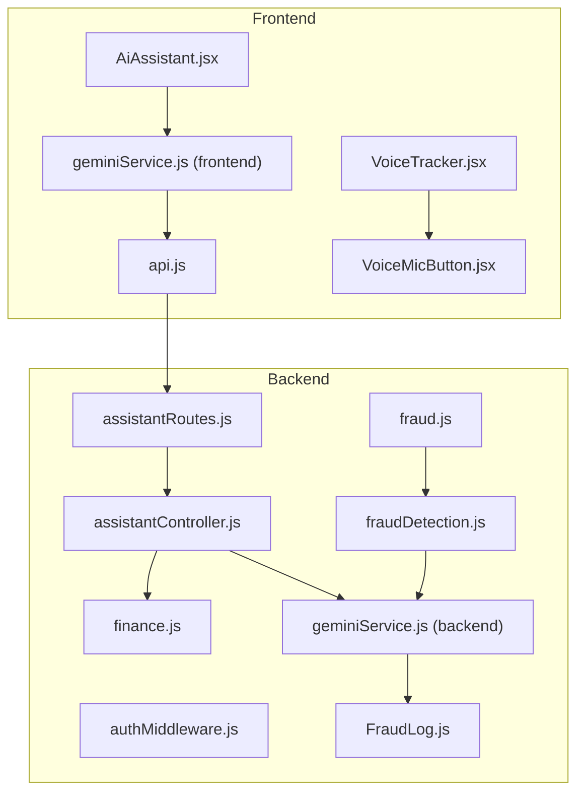
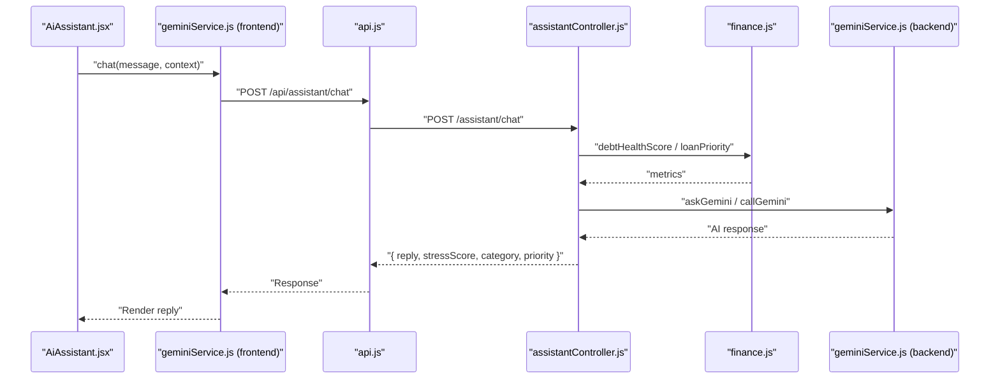
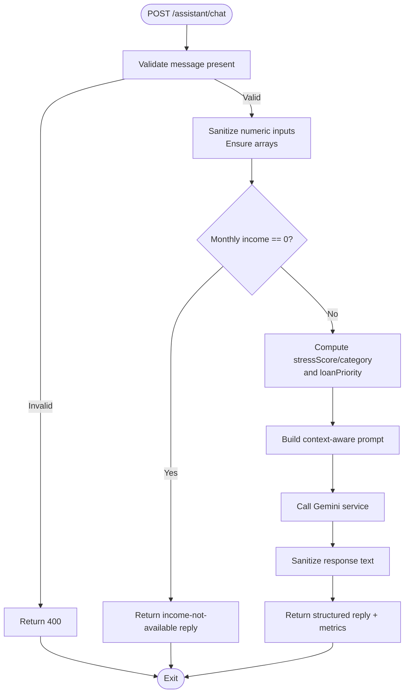
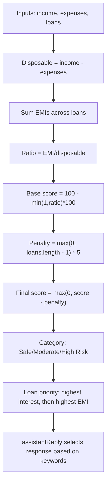
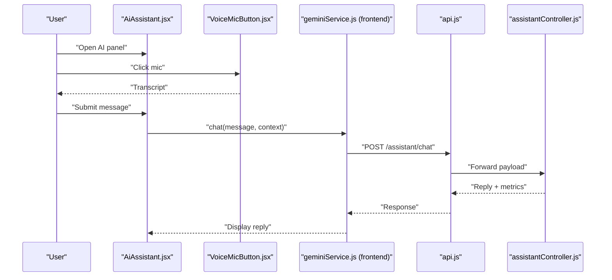
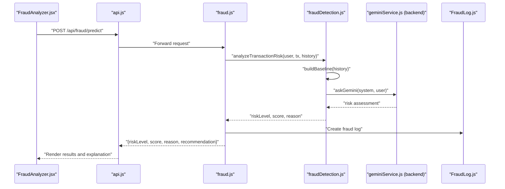
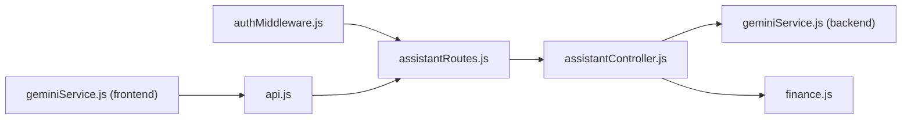
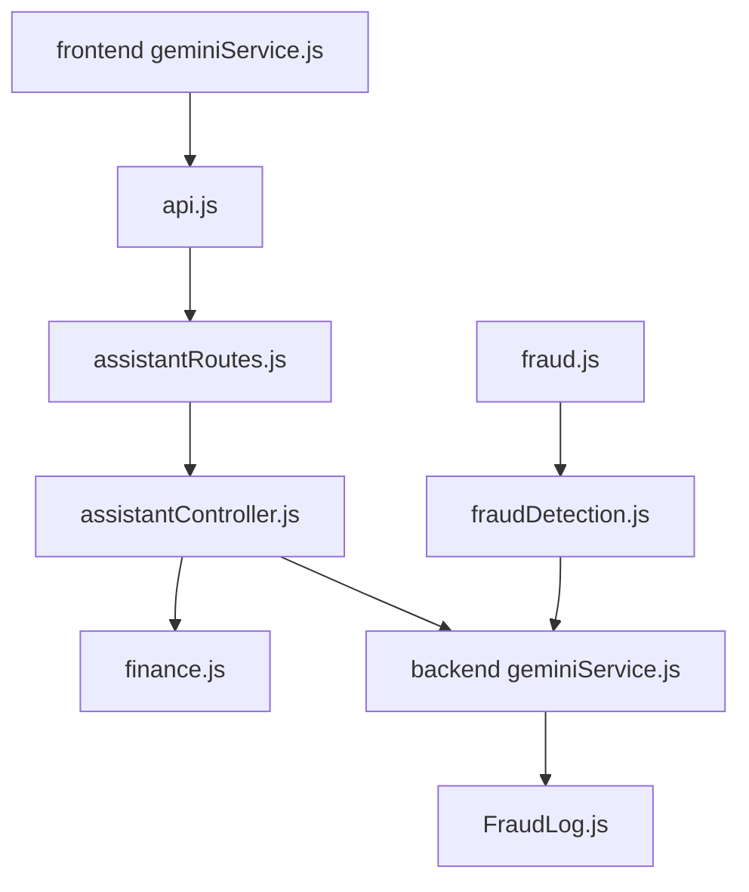

# AI Assistant Integration

<cite>
**Referenced Files in This Document**
- [assistantController.js](file://backend/controllers/assistantController.js)
- [assistantRoutes.js](file://backend/routes/assistantRoutes.js)
- [geminiService.js](file://backend/services/geminiService.js)
- [finance.js](file://backend/utils/finance.js)
- [authMiddleware.js](file://backend/middleware/authMiddleware.js)
- [AiAssistant.jsx](file://frontend/src/components/AiAssistant.jsx)
- [geminiService.js](file://frontend/src/services/geminiService.js)
- [api.js](file://frontend/src/services/api.js)
- [VoiceTracker.jsx](file://frontend/src/pages/VoiceTracker.jsx)
- [VoiceMicButton.jsx](file://frontend/src/components/VoiceMicButton.jsx)
- [fraudDetection.js](file://backend/utils/fraudDetection.js)
- [fraud.js](file://backend/routes/fraud.js)
- [FraudLog.js](file://backend/models/FraudLog.js)
- [FraudAnalyzer.jsx](file://frontend/src/pages/FraudAnalyzer.jsx)
- [FraudWarningModal.jsx](file://frontend/src/components/FraudWarningModal.jsx)
</cite>

## Table of Contents
1. [Introduction](#introduction)
2. [Project Structure](#project-structure)
3. [Core Components](#core-components)
4. [Architecture Overview](#architecture-overview)
5. [Detailed Component Analysis](#detailed-component-analysis)
6. [Dependency Analysis](#dependency-analysis)
7. [Performance Considerations](#performance-considerations)
8. [Troubleshooting Guide](#troubleshooting-guide)
9. [Conclusion](#conclusion)
10. [Appendices](#appendices)

## Introduction
This document explains the AI Assistant Integration for the Smart Loan Analyzer platform. It covers the Gemini AI service integration, the conversation flow, and the financial recommendation engine. It also documents the AI assistant’s capabilities in financial insights, fraud detection analysis, and goal planning assistance, along with the frontend AI interface components, voice interaction capabilities, and natural language processing integration. The backend AI service coordination, API proxy patterns, and external service communication are included, along with examples of AI interactions, response handling, and integration with the Gemini Generative AI platform. Performance considerations and fallback mechanisms for AI service availability are addressed.

## Project Structure
The AI Assistant spans frontend and backend components:
- Frontend: AI chat panel, voice input, and Gemini client service wrapper
- Backend: Assistant controller, route, authentication middleware, Gemini service, and fraud detection utilities
- Shared: API service layer that proxies client requests to backend endpoints

**Diagram sources**
- [AiAssistant.jsx:1-295](file://frontend/src/components/AiAssistant.jsx#L1-L295)
- [geminiService.js:1-99](file://frontend/src/services/geminiService.js#L1-L99)
- [VoiceTracker.jsx:1-214](file://frontend/src/pages/VoiceTracker.jsx#L1-L214)
- [VoiceMicButton.jsx:1-97](file://frontend/src/components/VoiceMicButton.jsx#L1-L97)
- [api.js:1-104](file://frontend/src/services/api.js#L1-L104)
- [assistantRoutes.js:1-9](file://backend/routes/assistantRoutes.js#L1-L9)
- [assistantController.js:1-73](file://backend/controllers/assistantController.js#L1-L73)
- [geminiService.js:1-29](file://backend/services/geminiService.js#L1-L29)
- [finance.js:1-117](file://backend/utils/finance.js#L1-L117)
- [authMiddleware.js:1-35](file://backend/middleware/authMiddleware.js#L1-L35)
- [fraud.js:1-55](file://backend/routes/fraud.js#L1-L55)
- [fraudDetection.js:1-83](file://backend/utils/fraudDetection.js#L1-L83)
- [FraudLog.js:1-23](file://backend/models/FraudLog.js#L1-L23)

**Section sources**
- [assistantController.js:1-73](file://backend/controllers/assistantController.js#L1-L73)
- [assistantRoutes.js:1-9](file://backend/routes/assistantRoutes.js#L1-L9)
- [geminiService.js:1-29](file://backend/services/geminiService.js#L1-L29)
- [finance.js:1-117](file://backend/utils/finance.js#L1-L117)
- [authMiddleware.js:1-35](file://backend/middleware/authMiddleware.js#L1-L35)
- [AiAssistant.jsx:1-295](file://frontend/src/components/AiAssistant.jsx#L1-L295)
- [geminiService.js:1-99](file://frontend/src/services/geminiService.js#L1-L99)
- [api.js:1-104](file://frontend/src/services/api.js#L1-L104)
- [VoiceTracker.jsx:1-214](file://frontend/src/pages/VoiceTracker.jsx#L1-L214)
- [VoiceMicButton.jsx:1-97](file://frontend/src/components/VoiceMicButton.jsx#L1-L97)
- [fraudDetection.js:1-83](file://backend/utils/fraudDetection.js#L1-L83)
- [fraud.js:1-55](file://backend/routes/fraud.js#L1-L55)
- [FraudLog.js:1-23](file://backend/models/FraudLog.js#L1-L23)

## Core Components
- Assistant Controller: Validates inputs, computes financial metrics, orchestrates AI replies, and sanitizes outputs.
- Finance Utilities: Provides EMI calculations, debt health scoring, loan prioritization, and assistant reply generation.
- Gemini Service (Backend): Wraps the Gemini Generative AI SDK, handles errors, and returns sanitized text.
- Frontend Gemini Service Wrapper: Proxies chat requests via the backend, enriches prompts for specialized tasks, and cleans responses.
- AI Assistant UI: Chat drawer with voice input, suggested prompts, and real-time feedback.
- Voice Tracker: Speech-to-text input for expense narration and NLP parsing.
- Fraud Detection Pipeline: Risk analysis using Gemini with user transaction history and model-backed recommendations.

**Section sources**
- [assistantController.js:1-73](file://backend/controllers/assistantController.js#L1-L73)
- [finance.js:1-117](file://backend/utils/finance.js#L1-L117)
- [geminiService.js:1-29](file://backend/services/geminiService.js#L1-L29)
- [geminiService.js:1-99](file://frontend/src/services/geminiService.js#L1-L99)
- [AiAssistant.jsx:1-295](file://frontend/src/components/AiAssistant.jsx#L1-L295)
- [VoiceTracker.jsx:1-214](file://frontend/src/pages/VoiceTracker.jsx#L1-L214)
- [VoiceMicButton.jsx:1-97](file://frontend/src/components/VoiceMicButton.jsx#L1-L97)
- [fraudDetection.js:1-83](file://backend/utils/fraudDetection.js#L1-L83)

## Architecture Overview
The AI Assistant follows a secure, proxy-based architecture:
- Frontend clients send requests to backend endpoints via a shared API service.
- Authentication middleware enforces token validation.
- Assistant controller computes financial context and delegates to the Gemini service.
- Finance utilities calculate stress scores and loan priorities for contextual advice.
- Fraud detection routes analyze transactions against user history and Gemini predictions.

**Diagram sources**
- [AiAssistant.jsx:90-121](file://frontend/src/components/AiAssistant.jsx#L90-L121)
- [geminiService.js:12-44](file://frontend/src/services/geminiService.js#L12-L44)
- [api.js:52-55](file://frontend/src/services/api.js#L52-L55)
- [assistantRoutes.js](file://backend/routes/assistantRoutes.js#L6)
- [assistantController.js:3-70](file://backend/controllers/assistantController.js#L3-L70)
- [finance.js:21-114](file://backend/utils/finance.js#L21-L114)
- [geminiService.js:17-26](file://backend/services/geminiService.js#L17-L26)

## Detailed Component Analysis

### Assistant Controller and Conversation Flow
The assistant endpoint validates inputs, computes financial context, and generates a tailored reply. It supports optional precomputed stress scores and loan lists, sanitizes outputs, and returns structured data.

**Diagram sources**
- [assistantController.js:3-70](file://backend/controllers/assistantController.js#L3-L70)
- [finance.js:21-43](file://backend/utils/finance.js#L21-L43)
- [geminiService.js:17-26](file://backend/services/geminiService.js#L17-L26)

**Section sources**
- [assistantController.js:1-73](file://backend/controllers/assistantController.js#L1-L73)
- [finance.js:1-117](file://backend/utils/finance.js#L1-L117)
- [geminiService.js:1-29](file://backend/services/geminiService.js#L1-L29)

### Finance Recommendation Engine
The engine calculates debt stress ratios, determines loan priorities, and generates contextual advice. It integrates with the assistant to provide prioritization and explanations.

**Diagram sources**
- [finance.js:21-114](file://backend/utils/finance.js#L21-L114)

**Section sources**
- [finance.js:1-117](file://backend/utils/finance.js#L1-L117)

### Frontend AI Interface and Voice Interaction
The AI assistant UI provides a floating drawer with:
- Real-time chat messages and typing indicators
- Suggested prompts for quick actions
- Voice input via Web Speech API with microphone toggle
- Safe rendering of formatted AI replies

Voice Tracker complements this with:
- Speech-to-text transcription
- Parsing and confirmation of expenses
- History of parsed logs

**Diagram sources**
- [AiAssistant.jsx:45-121](file://frontend/src/components/AiAssistant.jsx#L45-L121)
- [VoiceMicButton.jsx:16-37](file://frontend/src/components/VoiceMicButton.jsx#L16-L37)
- [geminiService.js:12-44](file://frontend/src/services/geminiService.js#L12-L44)
- [api.js:52-55](file://frontend/src/services/api.js#L52-L55)
- [assistantController.js:3-70](file://backend/controllers/assistantController.js#L3-L70)

**Section sources**
- [AiAssistant.jsx:1-295](file://frontend/src/components/AiAssistant.jsx#L1-L295)
- [VoiceTracker.jsx:1-214](file://frontend/src/pages/VoiceTracker.jsx#L1-L214)
- [VoiceMicButton.jsx:1-97](file://frontend/src/components/VoiceMicButton.jsx#L1-L97)
- [geminiService.js:1-99](file://frontend/src/services/geminiService.js#L1-L99)
- [api.js:1-104](file://frontend/src/services/api.js#L1-L104)

### Fraud Detection Analysis and AI Integration
The fraud detection pipeline:
- Collects recent transaction history for the user
- Builds a baseline profile (categories, merchants, hours)
- Sends a structured prompt to Gemini to assess risk
- Parses the response into a risk level and score
- Stores the result in a fraud log with recommendations

**Diagram sources**
- [FraudAnalyzer.jsx:30-69](file://frontend/src/pages/FraudAnalyzer.jsx#L30-L69)
- [api.js:68-71](file://frontend/src/services/api.js#L68-L71)
- [fraud.js:12-52](file://backend/routes/fraud.js#L12-L52)
- [fraudDetection.js:9-30](file://backend/utils/fraudDetection.js#L9-L30)
- [geminiService.js:17-26](file://backend/services/geminiService.js#L17-L26)
- [FraudLog.js:3-18](file://backend/models/FraudLog.js#L3-L18)

**Section sources**
- [fraudDetection.js:1-83](file://backend/utils/fraudDetection.js#L1-L83)
- [fraud.js:1-55](file://backend/routes/fraud.js#L1-L55)
- [FraudAnalyzer.jsx:1-250](file://frontend/src/pages/FraudAnalyzer.jsx#L1-L250)
- [FraudWarningModal.jsx:1-45](file://frontend/src/components/FraudWarningModal.jsx#L1-L45)
- [FraudLog.js:1-23](file://backend/models/FraudLog.js#L1-L23)

### Backend AI Service Coordination and API Proxy Patterns
- Authentication middleware secures endpoints and injects user context.
- Assistant route enforces auth and forwards to controller.
- Gemini service encapsulates SDK usage and error handling.
- Frontend service wrappers proxy requests through the backend to avoid exposing API keys.

**Diagram sources**
- [authMiddleware.js:4-32](file://backend/middleware/authMiddleware.js#L4-L32)
- [assistantRoutes.js](file://backend/routes/assistantRoutes.js#L6)
- [assistantController.js:3-70](file://backend/controllers/assistantController.js#L3-L70)
- [geminiService.js:1-29](file://backend/services/geminiService.js#L1-L29)
- [finance.js:1-117](file://backend/utils/finance.js#L1-L117)
- [geminiService.js:1-99](file://frontend/src/services/geminiService.js#L1-L99)
- [api.js:52-55](file://frontend/src/services/api.js#L52-L55)

**Section sources**
- [authMiddleware.js:1-35](file://backend/middleware/authMiddleware.js#L1-L35)
- [assistantRoutes.js:1-9](file://backend/routes/assistantRoutes.js#L1-L9)
- [geminiService.js:1-29](file://backend/services/geminiService.js#L1-L29)
- [geminiService.js:1-99](file://frontend/src/services/geminiService.js#L1-L99)
- [api.js:1-104](file://frontend/src/services/api.js#L1-L104)

## Dependency Analysis
- Frontend depends on the shared API service for backend communication.
- Assistant controller depends on finance utilities and the backend Gemini service.
- Fraud detection depends on transaction history, baseline building, and Gemini for risk assessment.
- Authentication middleware is a cross-cutting concern for protected routes.

**Diagram sources**
- [geminiService.js:1-99](file://frontend/src/services/geminiService.js#L1-L99)
- [api.js:52-55](file://frontend/src/services/api.js#L52-L55)
- [assistantRoutes.js](file://backend/routes/assistantRoutes.js#L6)
- [assistantController.js:3-70](file://backend/controllers/assistantController.js#L3-L70)
- [finance.js:1-117](file://backend/utils/finance.js#L1-L117)
- [geminiService.js:1-29](file://backend/services/geminiService.js#L1-L29)
- [fraud.js:12-52](file://backend/routes/fraud.js#L12-L52)
- [fraudDetection.js:1-83](file://backend/utils/fraudDetection.js#L1-L83)
- [FraudLog.js:1-23](file://backend/models/FraudLog.js#L1-L23)

**Section sources**
- [geminiService.js:1-99](file://frontend/src/services/geminiService.js#L1-L99)
- [api.js:1-104](file://frontend/src/services/api.js#L1-L104)
- [assistantController.js:1-73](file://backend/controllers/assistantController.js#L1-L73)
- [finance.js:1-117](file://backend/utils/finance.js#L1-L117)
- [fraudDetection.js:1-83](file://backend/utils/fraudDetection.js#L1-L83)

## Performance Considerations
- Input sanitization prevents invalid computations and reduces downstream errors.
- Precomputed stress scores from the frontend avoid redundant backend calculations.
- Gemini service returns fallback text on errors to maintain UX continuity.
- Voice recognition is browser-dependent; graceful degradation informs users when unsupported.
- Fraud analysis limits history window and token counts to keep prompts concise.

[No sources needed since this section provides general guidance]

## Troubleshooting Guide
Common issues and remedies:
- Missing message in assistant chat: Returns a 400-style error; ensure the message field is present.
- Income not configured: Assistant responds with guidance to set financial info first.
- Gemini API failures: Backend returns a safe fallback message; frontend displays a user-friendly error and suggests retry.
- Voice recognition unsupported: UI shows a browser compatibility notice; users are encouraged to switch to supported browsers.
- Fraud prediction timeouts: Backend catches errors and returns a default LOW risk; UI still attempts a Gemini explanation for clarity.

**Section sources**
- [assistantController.js:6-28](file://backend/controllers/assistantController.js#L6-L28)
- [geminiService.js:11-15](file://backend/services/geminiService.js#L11-L15)
- [AiAssistant.jsx:78-88](file://frontend/src/components/AiAssistant.jsx#L78-L88)
- [FraudAnalyzer.jsx:44-51](file://frontend/src/pages/FraudAnalyzer.jsx#L44-L51)

## Conclusion
The AI Assistant Integration leverages a secure, proxy-based architecture to deliver financial insights, fraud risk analysis, and conversational guidance. The frontend provides an intuitive chat and voice interface, while the backend coordinates financial computations and Gemini-powered reasoning. Robust error handling and fallbacks ensure reliability, and specialized services enable fraud detection and goal planning assistance.

[No sources needed since this section summarizes without analyzing specific files]

## Appendices

### Example AI Interactions
- Financial health explanation: “Explain my stress score.”
- Loan prioritization: “Which loan should I pay off first?”
- Savings suggestions: “Suggest savings strategies.”
- Goal timeline prediction: “Predict when I can save for a new bike.”

[No sources needed since this section provides general examples]