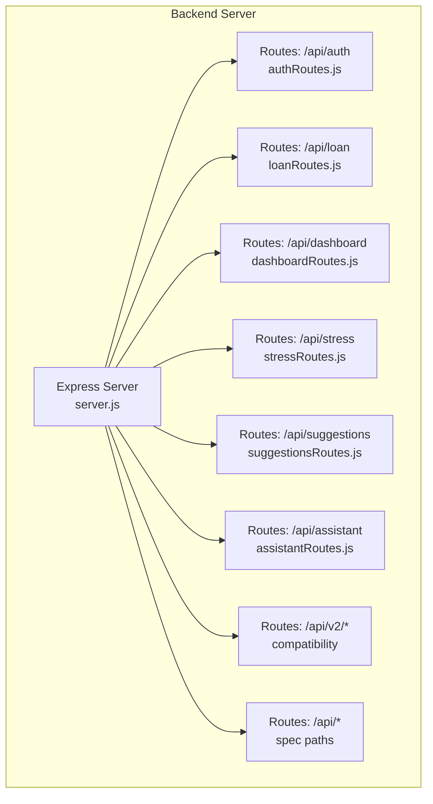
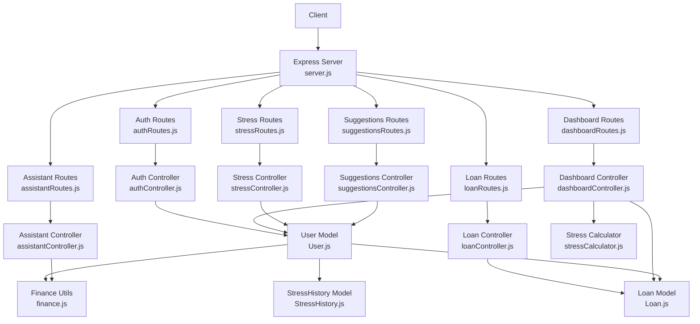
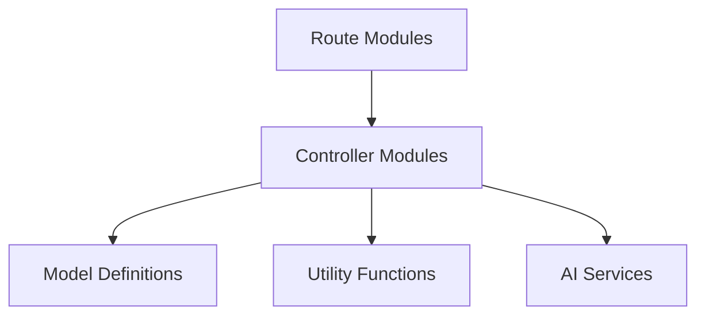

# API Reference

<cite>
**Referenced Files in This Document**
- [server.js](file://backend/server.js)
- [package.json](file://backend/package.json)
- [postman_collection.json](file://postman_collection.json)
- [authRoutes.js](file://backend/routes/authRoutes.js)
- [loanRoutes.js](file://backend/routes/loanRoutes.js)
- [dashboardRoutes.js](file://backend/routes/dashboardRoutes.js)
- [assistantRoutes.js](file://backend/routes/assistantRoutes.js)
- [stressRoutes.js](file://backend/routes/stressRoutes.js)
- [suggestionsRoutes.js](file://backend/routes/suggestionsRoutes.js)
- [authController.js](file://backend/controllers/authController.js)
- [loanController.js](file://backend/controllers/loanController.js)
- [dashboardController.js](file://backend/controllers/dashboardController.js)
- [assistantController.js](file://backend/controllers/assistantController.js)
- [stressController.js](file://backend/controllers/stressController.js)
- [suggestionsController.js](file://backend/controllers/suggestionsController.js)
- [authMiddleware.js](file://backend/middleware/authMiddleware.js)
- [User.js](file://backend/models/User.js)
- [Loan.js](file://backend/models/Loan.js)
- [StressHistory.js](file://backend/models/StressHistory.js)
- [EmergencyWallet.js](file://backend/models/EmergencyWallet.js)
- [FamilyGroup.js](file://backend/models/FamilyGroup.js)
- [FamilyMember.js](file://backend/models/FamilyMember.js)
- [GoalTimeline.js](file://backend/models/GoalTimeline.js)
- [Notification.js](file://backend/models/Notification.js)
- [Simulation.js](file://backend/models/Simulation.js)
- [Transaction.js](file://backend/models/Transaction.js)
- [TransactionHistory.js](file://backend/models/TransactionHistory.js)
- [VoiceLog.js](file://backend/models/VoiceLog.js)
- [fraudDetection.js](file://backend/utils/fraudDetection.js)
- [finance.js](file://backend/utils/finance.js)
- [financeCalculations.js](file://backend/utils/financeCalculations.js)
- [stressCalculator.js](file://backend/utils/stressCalculator.js)
- [fundBuilder.js](file://backend/utils/fundBuilder.js)
- [goalTimeline.js](file://backend/utils/goalTimeline.js)
- [claudeService.js](file://backend/services/claudeService.js)
- [geminiService.js](file://backend/services/geminiService.js)
</cite>

## Table of Contents
1. [Introduction](#introduction)
2. [Project Structure](#project-structure)
3. [Core Components](#core-components)
4. [Architecture Overview](#architecture-overview)
5. [Detailed Component Analysis](#detailed-component-analysis)
6. [Dependency Analysis](#dependency-analysis)
7. [Performance Considerations](#performance-considerations)
8. [Troubleshooting Guide](#troubleshooting-guide)
9. [Conclusion](#conclusion)
10. [Appendices](#appendices)

## Introduction
This document provides comprehensive API documentation for the Smart Loan & Debt Stress Analyzer. It covers all REST endpoints, including authentication, loan management, dashboard analytics, AI assistant, emergency fund, family management, fraud detection, and goal management. For each endpoint, you will find HTTP methods, URL patterns, request/response schemas, authentication requirements, parameter specifications, validation rules, error response formats, status codes, and practical examples. It also includes rate limiting considerations, API versioning, client implementation guidelines, and Postman collection usage.

## Project Structure
The backend exposes a modular Express server with route groups mapped to feature areas. Authentication, loans, dashboard, stress analytics, and AI assistant endpoints are mounted under /api. Additional AI-powered features are exposed under /api/v2/* for backward compatibility and under /api/* for required spec paths.

**Diagram sources**
- [server.js:95-118](file://backend/server.js#L95-L118)
- [authRoutes.js:1-20](file://backend/routes/authRoutes.js#L1-L20)
- [loanRoutes.js:1-19](file://backend/routes/loanRoutes.js#L1-L19)
- [dashboardRoutes.js:1-20](file://backend/routes/dashboardRoutes.js#L1-L20)
- [stressRoutes.js](file://backend/routes/stressRoutes.js)
- [suggestionsRoutes.js](file://backend/routes/suggestionsRoutes.js)
- [assistantRoutes.js](file://backend/routes/assistantRoutes.js)

**Section sources**
- [server.js:95-118](file://backend/server.js#L95-L118)
- [package.json:1-26](file://backend/package.json#L1-L26)

## Core Components
- Express server with CORS, JSON body parsing, health checks, and centralized error handling.
- Route modules for each feature area.
- Controllers implementing business logic and interacting with models.
- Middleware for authentication.
- Models representing domain entities.
- Utility modules for finance calculations, stress scoring, fraud detection, and goal timelines.
- Services for AI integrations.

Key runtime and configuration highlights:
- MongoDB connection with retry and automatic index creation for AI features.
- Centralized 404 and error handlers returning standardized JSON responses.
- API versioning via /api/v2/* and compatibility mounts at /api/*.

**Section sources**
- [server.js:1-150](file://backend/server.js#L1-L150)
- [package.json:1-26](file://backend/package.json#L1-L26)

## Architecture Overview
The API follows a layered architecture:
- Entry points: server.js registers routes and middleware.
- Routing: feature-specific route modules define endpoint contracts.
- Controllers: implement request handling, validation, and orchestration.
- Models: encapsulate data access and schema definitions.
- Utilities: provide shared business logic for finance, stress, and goal computations.
- Services: integrate external AI providers.

**Diagram sources**
- [server.js:95-118](file://backend/server.js#L95-L118)
- [authRoutes.js:1-20](file://backend/routes/authRoutes.js#L1-L20)
- [loanRoutes.js:1-19](file://backend/routes/loanRoutes.js#L1-L19)
- [dashboardRoutes.js:1-20](file://backend/routes/dashboardRoutes.js#L1-L20)
- [stressRoutes.js](file://backend/routes/stressRoutes.js)
- [suggestionsRoutes.js](file://backend/routes/suggestionsRoutes.js)
- [assistantRoutes.js](file://backend/routes/assistantRoutes.js)
- [authController.js:1-41](file://backend/controllers/authController.js#L1-L41)
- [loanController.js:1-77](file://backend/controllers/loanController.js#L1-L77)
- [dashboardController.js:1-116](file://backend/controllers/dashboardController.js#L1-L116)
- [stressController.js:1-274](file://backend/controllers/stressController.js#L1-L274)
- [suggestionsController.js:1-134](file://backend/controllers/suggestionsController.js#L1-L134)
- [assistantController.js:1-73](file://backend/controllers/assistantController.js#L1-L73)
- [User.js](file://backend/models/User.js)
- [Loan.js](file://backend/models/Loan.js)
- [StressHistory.js](file://backend/models/StressHistory.js)
- [finance.js](file://backend/utils/finance.js)
- [stressCalculator.js](file://backend/utils/stressCalculator.js)

## Detailed Component Analysis

### Authentication Endpoints
- Base Path: /api/auth
- Authentication: None for registration and login; protected with JWT for profile retrieval.

Endpoints:
- POST /api/auth/register
  - Description: Registers a new user.
  - Authentication: Not required.
  - Request Body:
    - name: string, required
    - email: string, required
    - password: string, required
  - Responses:
    - 201 Created: { success: true, data: { token, user: { id, name, email } } }
    - 400 Bad Request: { success: false, message: "Please provide name, email, and password." | "User already exists" }
    - 500 Internal Server Error: { success: false, message: string }
  - Example Request:
    - Method: POST
    - Headers: Content-Type: application/json
    - Body: { "name": "...", "email": "...", "password": "..." }
  - Example Response (201):
    - { "success": true, "data": { "token": "...", "user": { "id": "...", "name": "...", "email": "..." } } }

- POST /api/auth/login
  - Description: Logs in an existing user.
  - Authentication: Not required.
  - Request Body:
    - email: string, required
    - password: string, required
  - Responses:
    - 200 OK: { success: true, data: { token, user: { id, name, email } } }
    - 400 Bad Request: { success: false, message: "email and password required" }
    - 401 Unauthorized: { success: false, message: "Invalid credentials" }
    - 500 Internal Server Error: { success: false, message: string }
  - Example Request:
    - Method: POST
    - Headers: Content-Type: application/json
    - Body: { "email": "...", "password": "..." }
  - Example Response (200):
    - { "success": true, "data": { "token": "...", "user": { "id": "...", "name": "...", "email": "..." } } }

- GET /api/auth/me
  - Description: Retrieves the authenticated user’s profile.
  - Authentication: Required (Bearer JWT).
  - Responses:
    - 200 OK: { success: true, data: User without password }
    - 401 Unauthorized: { success: false, message: "Unauthorized" }
    - 500 Internal Server Error: { success: false, message: string }
  - Example Request:
    - Method: GET
    - Headers: Authorization: Bearer <token>
  - Example Response (200):
    - { "success": true, "data": { "id": "...", "name": "...", "email": "...", ... } }

Validation Rules:
- Registration requires all three fields; duplicate emails are rejected.
- Login requires both fields; credentials must match stored hash.

Common Errors:
- Missing fields during registration/login.
- Duplicate email on registration.
- Invalid credentials on login.
- Unauthorized access when token is missing or invalid.

**Section sources**
- [authRoutes.js:10-17](file://backend/routes/authRoutes.js#L10-L17)
- [authController.js:8-40](file://backend/controllers/authController.js#L8-L40)
- [authMiddleware.js](file://backend/middleware/authMiddleware.js)
- [User.js](file://backend/models/User.js)

### Loan Management Endpoints
- Base Path: /api/loan
- Authentication: All endpoints require JWT.

Endpoints:
- GET /api/loan/overview
  - Description: Returns aggregated loan metrics for the user.
  - Authentication: Required.
  - Responses:
    - 200 OK: { success: true, data: { totalLoan, totalEMI, count } }
    - 500 Internal Server Error: { success: false, message: string }
  - Example Response (200):
    - { "success": true, "data": { "totalLoan": 0, "totalEMI": 0, "count": 0 } }

- GET /api/loan/recent?limit=N
  - Description: Returns the N most recent loans (default 5).
  - Authentication: Required.
  - Query Parameters:
    - limit: integer, optional
  - Responses:
    - 200 OK: { success: true, data: Loan[] }
    - 500 Internal Server Error: { success: false, message: string }

- GET /api/loan/
  - Description: Lists all loans for the user.
  - Authentication: Required.
  - Responses:
    - 200 OK: { success: true, data: Loan[] }
    - 500 Internal Server Error: { success: false, message: string }

- POST /api/loan/
  - Description: Creates a new loan for the user.
  - Authentication: Required.
  - Request Body:
    - type: string, optional (defaults to "Loan")
    - amount: number, required
    - interestRate: number, required
    - duration: number, required (tenure in months)
  - Responses:
    - 201 Created: { success: true, data: Loan }
    - 400 Bad Request: { success: false, message: string }
    - 500 Internal Server Error: { success: false, message: string }
  - Example Request:
    - { "type": "Home Loan", "amount": 150000, "interestRate": 3.5, "duration": 360 }

- PUT /api/loan/:id
  - Description: Updates an existing loan owned by the user.
  - Authentication: Required.
  - Path Parameters:
    - id: string, required
  - Request Body: Partial Loan fields (e.g., status).
  - Responses:
    - 200 OK: { success: true, data: Loan }
    - 404 Not Found: { message: "Loan not found" }
    - 500 Internal Server Error: { success: false, message: string }

- DELETE /api/loan/:id
  - Description: Deletes a loan owned by the user.
  - Authentication: Required.
  - Path Parameters:
    - id: string, required
  - Responses:
    - 200 OK: { success: true, message: "Loan deleted" }
    - 404 Not Found: { message: "Loan not found" }
    - 500 Internal Server Error: { success: false, message: string }

Validation Rules:
- Creation requires amount, interestRate, and duration.
- Updates/deletes enforce ownership via userId.
- Overview aggregates user-owned loans.

Common Errors:
- Missing required fields on creation.
- Attempted update/delete of non-owned loan.
- Loan not found.

**Section sources**
- [loanRoutes.js:6-14](file://backend/routes/loanRoutes.js#L6-L14)
- [loanController.js:3-76](file://backend/controllers/loanController.js#L3-L76)
- [Loan.js](file://backend/models/Loan.js)

### Dashboard Analytics Endpoints
- Base Path: /api/dashboard
- Authentication: All endpoints require JWT.

Endpoints:
- GET /api/dashboard/
  - Description: Returns a complete financial snapshot for the user.
  - Authentication: Required.
  - Responses:
    - 200 OK: { success: true, data: { monthlyIncome, monthlyExpenses, disposableIncome, totalEMI, emiRatio, stressScore, recentLoans[], stressTrend[], loansCount } }
    - 401 Unauthorized: { success: false, message: "Unauthorized" }
    - 404 Not Found: { success: false, message: "User not found" }
    - 500 Internal Server Error: { success: false, message: string }
  - Notes:
    - Uses EMI calculation utility and stress scoring logic.
    - recentLoans limited to top 5 with computed EMI per loan.
    - stressTrend provides fixed 6-month labels for visualization.

- PUT /api/dashboard/financial-info
  - Description: Updates user’s monthly income and expenses.
  - Authentication: Required.
  - Request Body:
    - monthlyIncome: number, required
    - monthlyExpenses: number, required
  - Responses:
    - 200 OK: { success: true, data: User }
    - 401 Unauthorized: { success: false, message: "Unauthorized" }
    - 500 Internal Server Error: { success: false, message: string }

- PUT /api/dashboard/simulation
  - Description: Placeholder for simulation updates.
  - Authentication: Required.
  - Responses:
    - 200 OK: { success: true, message: "Simulation updated" }
    - 500 Internal Server Error: { success: false, message: string }

Validation Rules:
- Financial info update requires both numeric fields.
- Dashboard aggregates ACTIVE loans and computes derived metrics.

Common Errors:
- Unauthorized access.
- User not found.
- Internal errors during computation.

**Section sources**
- [dashboardRoutes.js:10-17](file://backend/routes/dashboardRoutes.js#L10-L17)
- [dashboardController.js:7-115](file://backend/controllers/dashboardController.js#L7-L115)
- [finance.js](file://backend/utils/finance.js)
- [User.js](file://backend/models/User.js)
- [Loan.js](file://backend/models/Loan.js)

### AI Assistant Endpoints
- Base Path: /api/assistant
- Authentication: All endpoints require JWT.

Endpoints:
- POST /api/assistant/chat
  - Description: Processes a user message and returns AI-assisted advice with stress score and priority.
  - Authentication: Required.
  - Request Body:
    - monthlyIncome: number, optional (defaults to 0)
    - monthlyExpenses: number, optional (defaults to 0)
    - totalEMI: number, optional (defaults to 0)
    - stressScore: number, optional (if provided, overrides recomputation)
    - loans: array, optional (array of loan objects)
    - message: string, required
  - Responses:
    - 200 OK: { success: true, data: { reply, stressScore, category, priority, timestamp } }
    - 400 Bad Request: { success: false, message: "message is required" }
    - 500 Internal Server Error: { success: false, message: "Internal server error" }
  - Notes:
    - Strict input sanitization and output sanitization are applied.
    - If monthlyIncome is zero, assistant prompts to set financial info first.

Validation Rules:
- message is mandatory.
- Numeric fields sanitized to defaults if missing or invalid.
- Category derived from stressScore thresholds.

Common Errors:
- Missing message.
- Internal server errors in assistant logic.

**Section sources**
- [assistantController.js:3-72](file://backend/controllers/assistantController.js#L3-L72)
- [finance.js](file://backend/utils/finance.js)

### Stress Analytics Endpoints
- Base Path: /api/stress
- Authentication: All endpoints require JWT.

Endpoints:
- GET /api/stress/current
  - Description: Computes and returns current stress metrics for the user.
  - Authentication: Required.
  - Responses:
    - 200 OK: { success: true, data: { debtRatio, stressLevel, riskScore, monthlyIncome, monthlyExpense, totalEMI, disposableIncome }, message: string }
    - 500 Internal Server Error: { success: false, message: string }

- GET /api/stress/trend?months=N
  - Description: Returns stress trend data for the past N months (default 6).
  - Authentication: Required.
  - Query Parameters:
    - months: integer, optional
  - Responses:
    - 200 OK: { success: true, data: [ { month, debtRatio, stressLevel, riskScore, totalEMI, monthlyIncome } ], message: string }
    - 500 Internal Server Error: { success: false, message: string }

- GET /api/stress/analysis
  - Description: Returns comprehensive stress analysis with insights and trends.
  - Authentication: Required.
  - Responses:
    - 200 OK: { success: true, data: { currentMetrics, financialInfo, loans, insights[], trend[] }, message: string }
    - 500 Internal Server Error: { success: false, message: string }

Validation Rules:
- Trend generation falls back to current metrics if no historical data exists.
- Insights are generated based on stress level and history.

Common Errors:
- Internal server errors during metric calculation or history retrieval.

**Section sources**
- [stressController.js:9-273](file://backend/controllers/stressController.js#L9-L273)
- [StressHistory.js](file://backend/models/StressHistory.js)
- [User.js](file://backend/models/User.js)
- [Loan.js](file://backend/models/Loan.js)
- [stressCalculator.js](file://backend/utils/stressCalculator.js)

### Suggestions Endpoints
- Base Path: /api/suggestions
- Authentication: All endpoints require JWT.

Endpoints:
- GET /api/suggestions
  - Description: Generates personalized financial suggestions based on stress metrics and loan profile.
  - Authentication: Required.
  - Responses:
    - 200 OK: { success: true, data: { stressMetrics, suggestions[], disposableIncome }, message: string }
    - 500 Internal Server Error: { success: false, message: string }

- GET /api/suggestions/insights
  - Description: Provides financial insights including totals, averages, and diversification.
  - Authentication: Required.
  - Responses:
    - 200 OK: { success: true, data: { totalBorrowed, totalRepaid, totalInterestPaid, averageInterestRate, loanDiversity{}, financialHealth{} }, message: string }
    - 500 Internal Server Error: { success: false, message: string }

Validation Rules:
- Suggestions include loan prioritization, expense reduction, income increase, and savings advice.
- Insights categorize loans and compute financial health indicators.

Common Errors:
- Internal server errors during suggestion generation or insight computation.

**Section sources**
- [suggestionsController.js:6-133](file://backend/controllers/suggestionsController.js#L6-L133)
- [User.js](file://backend/models/User.js)
- [Loan.js](file://backend/models/Loan.js)
- [stressCalculator.js](file://backend/utils/stressCalculator.js)

### Emergency Fund Endpoints
- Base Path: /api/fund and /api/v2/fund
- Authentication: All endpoints require JWT.

Endpoints:
- GET /api/fund/balance
  - Description: Retrieves user’s emergency fund balance.
  - Authentication: Required.
  - Responses:
    - 200 OK: { success: true, data: { balance } }
    - 404 Not Found: { success: false, message: "Fund not initialized" }
    - 500 Internal Server Error: { success: false, message: string }

- POST /api/fund/contribute
  - Description: Adds funds to the emergency wallet.
  - Authentication: Required.
  - Request Body:
    - amount: number, required
  - Responses:
    - 200 OK: { success: true, data: { balance } }
    - 400 Bad Request: { success: false, message: string }
    - 500 Internal Server Error: { success: false, message: string }

- POST /api/fund/withdraw
  - Description: Withdraws funds from the emergency wallet.
  - Authentication: Required.
  - Request Body:
    - amount: number, required
  - Responses:
    - 200 OK: { success: true, data: { balance } }
    - 400 Bad Request: { success: false, message: string }
    - 500 Internal Server Error: { success: false, message: string }

Notes:
- Compatibility routes are mounted at both /api/v2/fund and /api/fund.
- Implementation relies on EmergencyWallet model and fund builder utilities.

**Section sources**
- [EmergencyWallet.js](file://backend/models/EmergencyWallet.js)
- [fundBuilder.js](file://backend/utils/fundBuilder.js)

### Family Management Endpoints
- Base Path: /api/family and /api/v2/family
- Authentication: All endpoints require JWT.

Endpoints:
- POST /api/family/group
  - Description: Creates a new family group.
  - Authentication: Required.
  - Request Body:
    - name: string, required
    - members: array of member objects, required
  - Responses:
    - 201 Created: { success: true, data: FamilyGroup }
    - 400 Bad Request: { success: false, message: string }
    - 500 Internal Server Error: { success: false, message: string }

- GET /api/family/group/:groupId
  - Description: Retrieves a family group by ID.
  - Authentication: Required.
  - Path Parameters:
    - groupId: string, required
  - Responses:
    - 200 OK: { success: true, data: FamilyGroup }
    - 404 Not Found: { success: false, message: "Group not found" }
    - 500 Internal Server Error: { success: false, message: string }

- PUT /api/family/group/:groupId
  - Description: Updates a family group.
  - Authentication: Required.
  - Path Parameters:
    - groupId: string, required
  - Request Body: Partial FamilyGroup fields.
  - Responses:
    - 200 OK: { success: true, data: FamilyGroup }
    - 404 Not Found: { success: false, message: "Group not found" }
    - 500 Internal Server Error: { success: false, message: string }

- DELETE /api/family/group/:groupId
  - Description: Deletes a family group.
  - Authentication: Required.
  - Path Parameters:
    - groupId: string, required
  - Responses:
    - 200 OK: { success: true, message: "Group deleted" }
    - 404 Not Found: { success: false, message: "Group not found" }
    - 500 Internal Server Error: { success: false, message: string }

- POST /api/family/member
  - Description: Adds a member to a family group.
  - Authentication: Required.
  - Request Body:
    - groupId: string, required
    - name: string, required
    - relationship: string, required
  - Responses:
    - 201 Created: { success: true, data: FamilyMember }
    - 400 Bad Request: { success: false, message: string }
    - 500 Internal Server Error: { success: false, message: string }

Notes:
- Compatibility routes are mounted at both /api/v2/family and /api/family.
- Implementation relies on FamilyGroup and FamilyMember models.

**Section sources**
- [FamilyGroup.js](file://backend/models/FamilyGroup.js)
- [FamilyMember.js](file://backend/models/FamilyMember.js)

### Fraud Detection Endpoints
- Base Path: /api/fraud and /api/v2/fraud
- Authentication: All endpoints require JWT.

Endpoints:
- POST /api/fraud/report
  - Description: Submits a potential fraud report.
  - Authentication: Required.
  - Request Body:
    - transactionId: string, required
    - description: string, required
  - Responses:
    - 201 Created: { success: true, data: FraudLog }
    - 400 Bad Request: { success: false, message: string }
    - 500 Internal Server Error: { success: false, message: string }

- GET /api/fraud/history
  - Description: Retrieves user’s fraud reports.
  - Authentication: Required.
  - Responses:
    - 200 OK: { success: true, data: FraudLog[] }
    - 500 Internal Server Error: { success: false, message: string }

Notes:
- Compatibility routes are mounted at both /api/v2/fraud and /api/fraud.
- Implementation relies on FraudLog model and fraud detection utilities.

**Section sources**
- [FraudLog.js](file://backend/models/FraudLog.js)
- [fraudDetection.js](file://backend/utils/fraudDetection.js)

### Goal Management Endpoints
- Base Path: /api/goals and /api/v2/goals
- Authentication: All endpoints require JWT.

Endpoints:
- POST /api/goals
  - Description: Creates a new financial goal.
  - Authentication: Required.
  - Request Body:
    - title: string, required
    - targetAmount: number, required
    - targetDate: date, required
    - category: string, optional
  - Responses:
    - 201 Created: { success: true, data: GoalTimeline }
    - 400 Bad Request: { success: false, message: string }
    - 500 Internal Server Error: { success: false, message: string }

- GET /api/goals
  - Description: Lists user’s goals.
  - Authentication: Required.
  - Responses:
    - 200 OK: { success: true, data: GoalTimeline[] }
    - 500 Internal Server Error: { success: false, message: string }

- PUT /api/goals/:id
  - Description: Updates a goal.
  - Authentication: Required.
  - Path Parameters:
    - id: string, required
  - Request Body: Partial GoalTimeline fields.
  - Responses:
    - 200 OK: { success: true, data: GoalTimeline }
    - 404 Not Found: { success: false, message: "Goal not found" }
    - 500 Internal Server Error: { success: false, message: string }

- DELETE /api/goals/:id
  - Description: Deletes a goal.
  - Authentication: Required.
  - Path Parameters:
    - id: string, required
  - Responses:
    - 200 OK: { success: true, message: "Goal deleted" }
    - 404 Not Found: { success: false, message: "Goal not found" }
    - 500 Internal Server Error: { success: false, message: string }

Notes:
- Compatibility routes are mounted at both /api/v2/goals and /api/goals.
- Implementation relies on GoalTimeline model and goal timeline utilities.

**Section sources**
- [GoalTimeline.js](file://backend/models/GoalTimeline.js)
- [goalTimeline.js](file://backend/utils/goalTimeline.js)

### Voice Interaction Endpoints
- Base Path: /api/voice and /api/v2/voice
- Authentication: All endpoints require JWT.

Endpoints:
- POST /api/voice/transcribe
  - Description: Transcribes audio input to text.
  - Authentication: Required.
  - Request Body:
    - audioBlob: binary, required
  - Responses:
    - 200 OK: { success: true, data: { text } }
    - 400 Bad Request: { success: false, message: string }
    - 500 Internal Server Error: { success: false, message: string }

- GET /api/voice/logs
  - Description: Retrieves voice logs for the user.
  - Authentication: Required.
  - Responses:
    - 200 OK: { success: true, data: VoiceLog[] }
    - 500 Internal Server Error: { success: false, message: string }

Notes:
- Compatibility routes are mounted at both /api/v2/voice and /api/voice.
- Implementation relies on VoiceLog model and AI services.

**Section sources**
- [VoiceLog.js](file://backend/models/VoiceLog.js)
- [claudeService.js](file://backend/services/claudeService.js)
- [geminiService.js](file://backend/services/geminiService.js)

### Documents Endpoints
- Base Path: /api/documents
- Authentication: All endpoints require JWT.

Endpoints:
- POST /api/documents/upload
  - Description: Uploads a document.
  - Authentication: Required.
  - Request Body:
    - file: multipart/form-data, required
  - Responses:
    - 201 Created: { success: true, data: { url } }
    - 400 Bad Request: { success: false, message: string }
    - 500 Internal Server Error: { success: false, message: string }

- GET /api/documents/list
  - Description: Lists uploaded documents.
  - Authentication: Required.
  - Responses:
    - 200 OK: { success: true, data: TransactionHistory[] }
    - 500 Internal Server Error: { success: false, message: string }

Notes:
- Implementation relies on TransactionHistory model and upload handling.

**Section sources**
- [TransactionHistory.js](file://backend/models/TransactionHistory.js)

## Dependency Analysis
The API exhibits clear separation of concerns:
- Routes depend on controllers.
- Controllers depend on models and utilities.
- Middleware enforces authentication.
- Utilities encapsulate business logic.
- Services integrate AI providers.

**Diagram sources**
- [authRoutes.js](file://backend/routes/authRoutes.js)
- [loanRoutes.js](file://backend/routes/loanRoutes.js)
- [dashboardRoutes.js](file://backend/routes/dashboardRoutes.js)
- [stressController.js](file://backend/controllers/stressController.js)
- [suggestionsController.js](file://backend/controllers/suggestionsController.js)
- [assistantController.js](file://backend/controllers/assistantController.js)
- [User.js](file://backend/models/User.js)
- [Loan.js](file://backend/models/Loan.js)
- [finance.js](file://backend/utils/finance.js)
- [stressCalculator.js](file://backend/utils/stressCalculator.js)

**Section sources**
- [server.js:95-118](file://backend/server.js#L95-L118)
- [authRoutes.js:1-20](file://backend/routes/authRoutes.js#L1-L20)
- [loanRoutes.js:1-19](file://backend/routes/loanRoutes.js#L1-L19)
- [dashboardRoutes.js:1-20](file://backend/routes/dashboardRoutes.js#L1-L20)
- [stressController.js:1-274](file://backend/controllers/stressController.js#L1-L274)
- [suggestionsController.js:1-134](file://backend/controllers/suggestionsController.js#L1-L134)
- [assistantController.js:1-73](file://backend/controllers/assistantController.js#L1-L73)

## Performance Considerations
- Database Indexes: Feature indexes are created automatically for AI-related collections to optimize queries.
- Connection Retry: MongoDB connection uses exponential backoff to improve resilience.
- Computation Efficiency: Dashboard and stress endpoints perform aggregations and calculations; keep payload sizes reasonable and leverage pagination where applicable.
- Caching: Consider adding caching for frequently accessed dashboards and static analytics.

[No sources needed since this section provides general guidance]

## Troubleshooting Guide
Common issues and resolutions:
- 401 Unauthorized: Ensure Authorization header with a valid Bearer token is included.
- 404 Not Found: Verify endpoint path and resource ownership (e.g., loan ID).
- 400 Bad Request: Check required fields and data types in request bodies.
- 500 Internal Server Error: Inspect server logs for detailed error messages.

Centralized error handling returns a standardized JSON response with success and message fields.

**Section sources**
- [server.js:129-144](file://backend/server.js#L129-L144)

## Conclusion
This API provides a comprehensive set of endpoints for financial management, stress analytics, AI assistance, emergency funds, family coordination, fraud detection, and goal tracking. All endpoints follow consistent patterns for authentication, request/response schemas, and error handling. Use the Postman collection to quickly test endpoints and integrate with clients.

[No sources needed since this section summarizes without analyzing specific files]

## Appendices

### API Versioning
- Version 2 endpoints are exposed under /api/v2/* for backward compatibility.
- Required spec paths are available under /api/* for compatibility.

**Section sources**
- [server.js:105-118](file://backend/server.js#L105-L118)
- [package.json:3](file://backend/package.json#L3)

### Rate Limiting
- No explicit rate limiting middleware is configured in the server.
- Consider integrating a rate-limiting solution (e.g., express-rate-limit) for production deployments.

[No sources needed since this section provides general guidance]

### Client Implementation Guidelines
- Authentication:
  - Use /api/auth/register and /api/auth/login to obtain a JWT.
  - Store the token securely and attach Authorization: Bearer <token> to subsequent requests.
- Base URL:
  - Use http://localhost:5000/api for local development.
- Error Handling:
  - Always check success and message fields; handle 4xx and 5xx appropriately.
- Payload Validation:
  - Follow request body schemas for each endpoint; sanitize inputs on the client side as well.

**Section sources**
- [authController.js:8-40](file://backend/controllers/authController.js#L8-L40)
- [postman_collection.json:210-220](file://postman_collection.json#L210-L220)

### Postman Collection Usage
- Import the Postman collection to explore endpoints quickly.
- Set base_url to http://localhost:5000/api and token after login.
- Examples include:
  - Authentication: Register, Login, Get Current User
  - Loans: Get All Loans, Create Loan, Update Loan Status, Delete Loan
  - Dashboard: Get Dashboard Data, Update Simulation

**Section sources**
- [postman_collection.json:8-220](file://postman_collection.json#L8-L220)