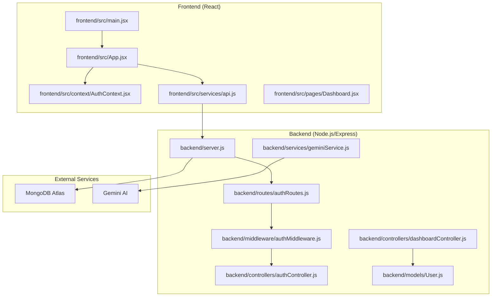
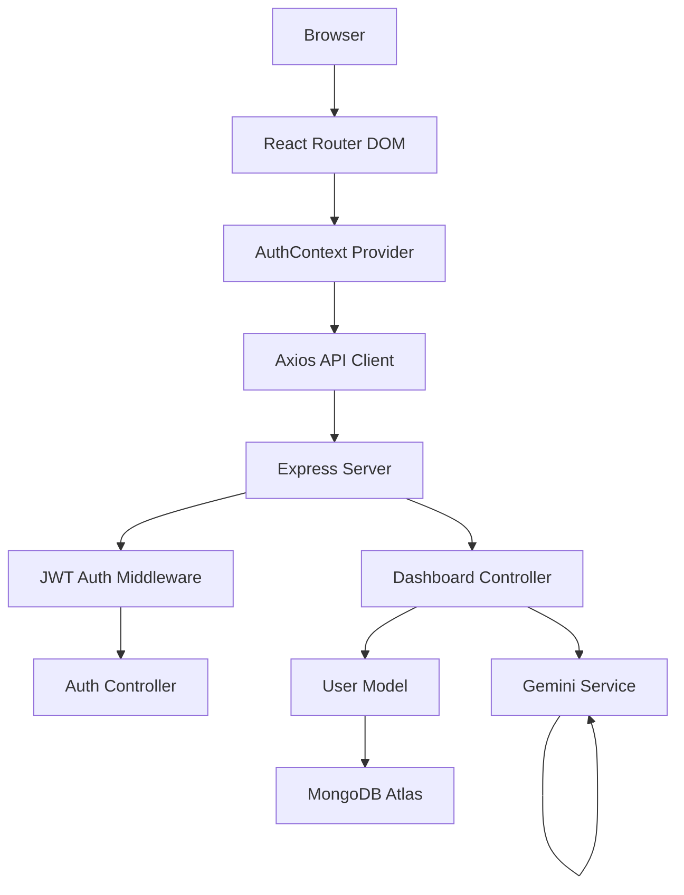
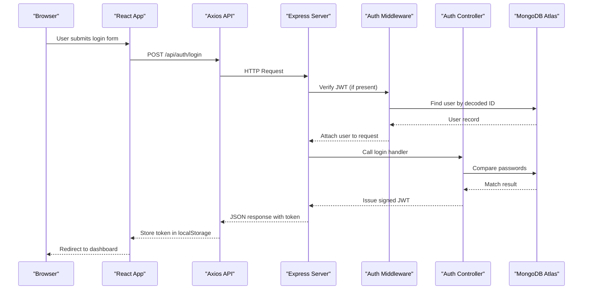
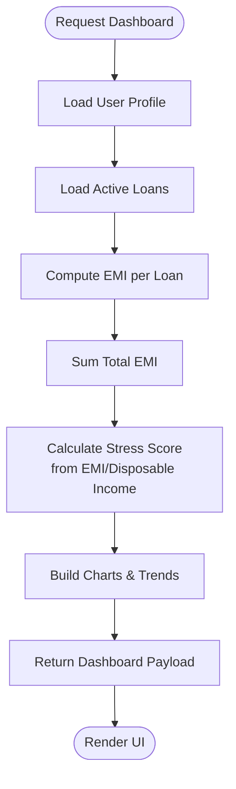
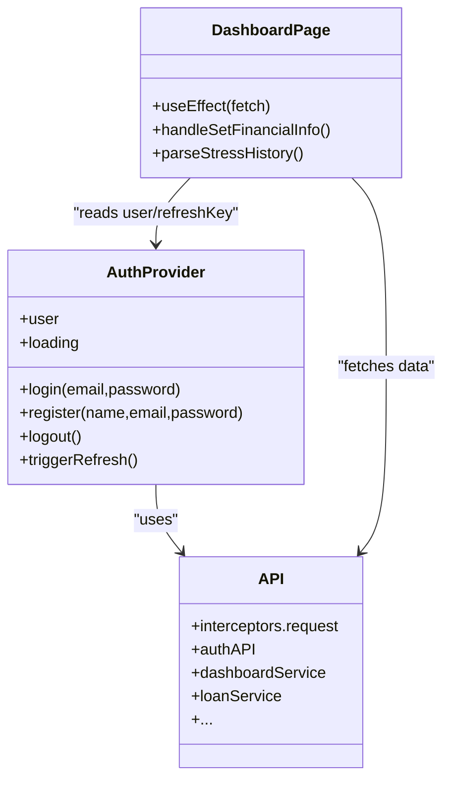
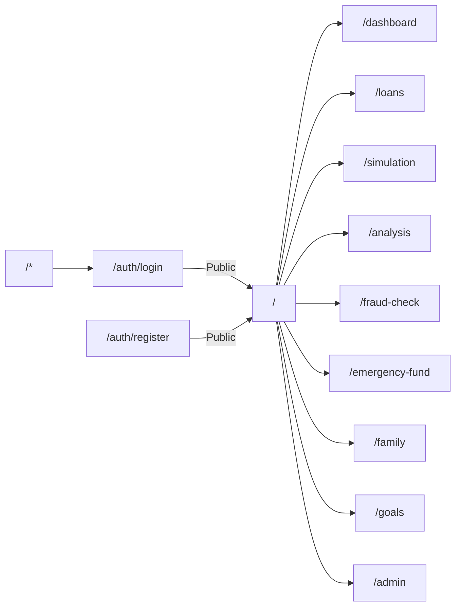
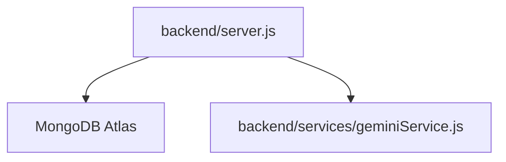
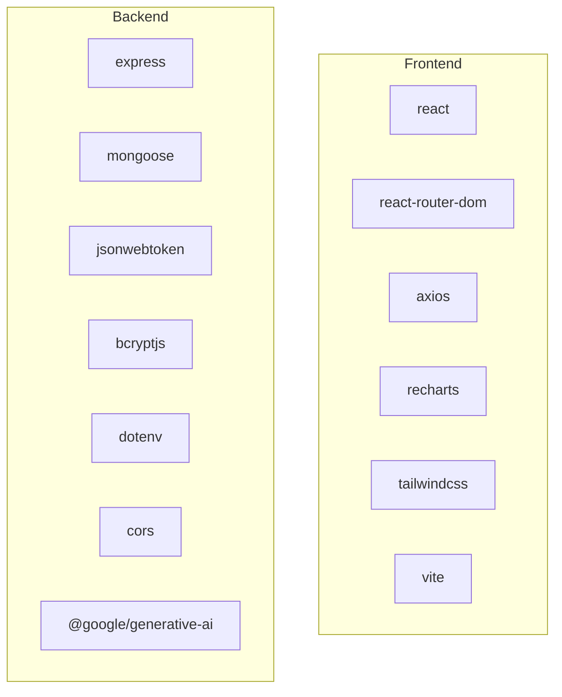

# Architecture Overview

<cite>
**Referenced Files in This Document**
- [README.md](file://README.md)
- [backend/package.json](file://backend/package.json)
- [frontend/package.json](file://frontend/package.json)
- [backend/server.js](file://backend/server.js)
- [backend/routes/authRoutes.js](file://backend/routes/authRoutes.js)
- [backend/controllers/authController.js](file://backend/controllers/authController.js)
- [backend/middleware/authMiddleware.js](file://backend/middleware/authMiddleware.js)
- [backend/models/User.js](file://backend/models/User.js)
- [backend/services/geminiService.js](file://backend/services/geminiService.js)
- [backend/controllers/dashboardController.js](file://backend/controllers/dashboardController.js)
- [frontend/src/main.jsx](file://frontend/src/main.jsx)
- [frontend/src/App.jsx](file://frontend/src/App.jsx)
- [frontend/src/context/AuthContext.jsx](file://frontend/src/context/AuthContext.jsx)
- [frontend/src/services/api.js](file://frontend/src/services/api.js)
- [frontend/src/pages/Dashboard.jsx](file://frontend/src/pages/Dashboard.jsx)
</cite>

## Table of Contents
1. [Introduction](#introduction)
2. [Project Structure](#project-structure)
3. [Core Components](#core-components)
4. [Architecture Overview](#architecture-overview)
5. [Detailed Component Analysis](#detailed-component-analysis)
6. [Dependency Analysis](#dependency-analysis)
7. [Performance Considerations](#performance-considerations)
8. [Troubleshooting Guide](#troubleshooting-guide)
9. [Conclusion](#conclusion)
10. [Appendices](#appendices)

## Introduction
This document presents the architecture of the Smart Loan & Debt Stress Analyzer, a modern MERN stack application designed to help users track loans, compute financial stress, simulate scenarios, and receive AI-driven insights. The system separates concerns across a React frontend and a Node.js/Express backend, integrating MongoDB Atlas for persistence and the Gemini AI service for intelligent assistance. It emphasizes clear separation of concerns, predictable data flows, and scalable patterns suitable for production deployments.

## Project Structure
The repository follows a classic MERN layout:
- backend: Node.js/Express server, routes, controllers, models, middleware, services, and jobs
- frontend: React SPA with components, pages, context providers, and services
- shared documentation and scripts for local development and deployment preparation

**Diagram sources**
- [backend/server.js:1-150](file://backend/server.js#L1-L150)
- [backend/routes/authRoutes.js:1-20](file://backend/routes/authRoutes.js#L1-L20)
- [backend/controllers/authController.js:1-41](file://backend/controllers/authController.js#L1-L41)
- [backend/middleware/authMiddleware.js:1-35](file://backend/middleware/authMiddleware.js#L1-L35)
- [backend/models/User.js:1-31](file://backend/models/User.js#L1-L31)
- [backend/services/geminiService.js:1-29](file://backend/services/geminiService.js#L1-L29)
- [backend/controllers/dashboardController.js:1-116](file://backend/controllers/dashboardController.js#L1-L116)
- [frontend/src/main.jsx:1-14](file://frontend/src/main.jsx#L1-L14)
- [frontend/src/App.jsx:1-58](file://frontend/src/App.jsx#L1-L58)
- [frontend/src/context/AuthContext.jsx:1-67](file://frontend/src/context/AuthContext.jsx#L1-L67)
- [frontend/src/services/api.js:1-104](file://frontend/src/services/api.js#L1-L104)
- [frontend/src/pages/Dashboard.jsx:1-474](file://frontend/src/pages/Dashboard.jsx#L1-L474)

**Section sources**
- [README.md:487-545](file://README.md#L487-L545)
- [backend/server.js:95-120](file://backend/server.js#L95-L120)
- [frontend/src/App.jsx:21-55](file://frontend/src/App.jsx#L21-L55)

## Core Components
- Frontend (React)
  - Entry point mounts the app inside strict mode
  - Routing with React Router DOM
  - Context providers for authentication, dashboard, and language
  - Service layer encapsulates API calls with automatic token injection
- Backend (Node.js/Express)
  - Central server wiring CORS, JSON parsing, MongoDB connection with retry, and route registration
  - Modular routes for auth, finance, loan simulation, dashboard, stress, suggestions, and AI features
  - Authentication middleware validates JWT and attaches user to request
  - Controllers implement business logic for dashboards and user operations
  - Models define schema and hooks for user financial profiles
  - Services integrate with Gemini AI for assistant capabilities

**Section sources**
- [frontend/src/main.jsx:6-12](file://frontend/src/main.jsx#L6-L12)
- [frontend/src/App.jsx:21-55](file://frontend/src/App.jsx#L21-L55)
- [frontend/src/context/AuthContext.jsx:6-34](file://frontend/src/context/AuthContext.jsx#L6-L34)
- [frontend/src/services/api.js:4-19](file://frontend/src/services/api.js#L4-L19)
- [backend/server.js:8-19](file://backend/server.js#L8-L19)
- [backend/server.js:95-120](file://backend/server.js#L95-L120)
- [backend/middleware/authMiddleware.js:4-32](file://backend/middleware/authMiddleware.js#L4-L32)
- [backend/controllers/dashboardController.js:7-84](file://backend/controllers/dashboardController.js#L7-L84)
- [backend/models/User.js:4-28](file://backend/models/User.js#L4-L28)
- [backend/services/geminiService.js:1-29](file://backend/services/geminiService.js#L1-L29)

## Architecture Overview
The system adheres to a layered architecture:
- Presentation Layer (React): Renders UI, manages state via Context API, and orchestrates user interactions
- Application Layer (Express): Defines routes, applies middleware, and delegates to controllers
- Domain Layer (Controllers): Implements business logic for dashboards, authentication, and financial computations
- Persistence Layer (MongoDB Atlas): Stores user profiles, loans, and related entities
- Integration Layer (Gemini AI): Provides AI-assisted insights and responses

**Diagram sources**
- [frontend/src/App.jsx:21-55](file://frontend/src/App.jsx#L21-L55)
- [frontend/src/context/AuthContext.jsx:6-34](file://frontend/src/context/AuthContext.jsx#L6-L34)
- [frontend/src/services/api.js:4-19](file://frontend/src/services/api.js#L4-L19)
- [backend/server.js:95-120](file://backend/server.js#L95-L120)
- [backend/middleware/authMiddleware.js:4-32](file://backend/middleware/authMiddleware.js#L4-L32)
- [backend/controllers/authController.js:8-40](file://backend/controllers/authController.js#L8-L40)
- [backend/controllers/dashboardController.js:7-84](file://backend/controllers/dashboardController.js#L7-L84)
- [backend/models/User.js:4-28](file://backend/models/User.js#L4-L28)
- [backend/services/geminiService.js:1-29](file://backend/services/geminiService.js#L1-L29)

## Detailed Component Analysis

### Authentication Flow (JWT)
The authentication flow demonstrates MVC-like separation:
- Routes define endpoints for register, login, and current user
- Middleware verifies JWT and enriches requests with user identity
- Controller handles user creation, credential validation, and profile retrieval
- Frontend stores tokens in localStorage and injects Authorization headers automatically

**Diagram sources**
- [backend/routes/authRoutes.js:10-17](file://backend/routes/authRoutes.js#L10-L17)
- [backend/middleware/authMiddleware.js:4-32](file://backend/middleware/authMiddleware.js#L4-L32)
- [backend/controllers/authController.js:22-40](file://backend/controllers/authController.js#L22-L40)
- [frontend/src/services/api.js:22-26](file://frontend/src/services/api.js#L22-L26)
- [frontend/src/context/AuthContext.jsx:36-53](file://frontend/src/context/AuthContext.jsx#L36-L53)

**Section sources**
- [backend/routes/authRoutes.js:1-20](file://backend/routes/authRoutes.js#L1-L20)
- [backend/middleware/authMiddleware.js:1-35](file://backend/middleware/authMiddleware.js#L1-L35)
- [backend/controllers/authController.js:1-41](file://backend/controllers/authController.js#L1-L41)
- [frontend/src/context/AuthContext.jsx:1-67](file://frontend/src/context/AuthContext.jsx#L1-L67)
- [frontend/src/services/api.js:1-104](file://frontend/src/services/api.js#L1-L104)

### Dashboard Data Pipeline
The dashboard pipeline aggregates financial data, computes stress metrics, and prepares visualization-ready structures. It leverages the controller to fetch user and loan data, calculates EMI and stress, and returns a consolidated payload.

**Diagram sources**
- [backend/controllers/dashboardController.js:7-84](file://backend/controllers/dashboardController.js#L7-L84)

**Section sources**
- [backend/controllers/dashboardController.js:1-116](file://backend/controllers/dashboardController.js#L1-L116)
- [frontend/src/pages/Dashboard.jsx:45-47](file://frontend/src/pages/Dashboard.jsx#L45-L47)

### Context API and State Management
The frontend employs three providers:
- AuthProvider: Manages login state, persists tokens, and synchronizes user sessions
- DashboardProvider: Centralizes dashboard data fetching and refresh triggers
- LanguageProvider: Supports localization toggling

**Diagram sources**
- [frontend/src/context/AuthContext.jsx:6-64](file://frontend/src/context/AuthContext.jsx#L6-L64)
- [frontend/src/services/api.js:4-103](file://frontend/src/services/api.js#L4-L103)
- [frontend/src/pages/Dashboard.jsx:36-130](file://frontend/src/pages/Dashboard.jsx#L36-L130)

**Section sources**
- [frontend/src/context/AuthContext.jsx:1-67](file://frontend/src/context/AuthContext.jsx#L1-L67)
- [frontend/src/services/api.js:1-104](file://frontend/src/services/api.js#L1-L104)
- [frontend/src/pages/Dashboard.jsx:1-474](file://frontend/src/pages/Dashboard.jsx#L1-L474)

### Routing Architecture
Routing is organized under a base path with protected and public routes:
- Public: Login and Register
- Protected: Dashboard, Loans, Simulation, Stress Analysis, Fraud Analyzer, Emergency Fund, Family, Goals, Admin
- Defaults: Catch-all redirects to login

**Diagram sources**
- [frontend/src/App.jsx:34-48](file://frontend/src/App.jsx#L34-L48)

**Section sources**
- [frontend/src/App.jsx:1-58](file://frontend/src/App.jsx#L1-L58)

### External Integrations
- MongoDB Atlas: Centralized persistence for user profiles, loans, and related entities
- Gemini AI: Assistant responses for financial insights and guidance

**Diagram sources**
- [backend/server.js:20-85](file://backend/server.js#L20-L85)
- [backend/services/geminiService.js:1-29](file://backend/services/geminiService.js#L1-L29)

**Section sources**
- [backend/server.js:20-85](file://backend/server.js#L20-L85)
- [backend/services/geminiService.js:1-29](file://backend/services/geminiService.js#L1-L29)

## Dependency Analysis
- Frontend dependencies include React, React Router DOM, Axios, Recharts, Tailwind CSS, and Vite for development
- Backend dependencies include Express, Mongoose, jsonwebtoken, bcryptjs, dotenv, cors, and @google/generative-ai

**Diagram sources**
- [frontend/package.json:5-13](file://frontend/package.json#L5-L13)
- [backend/package.json:12-21](file://backend/package.json#L12-L21)

**Section sources**
- [frontend/package.json:1-40](file://frontend/package.json#L1-L40)
- [backend/package.json:1-26](file://backend/package.json#L1-L26)

## Performance Considerations
- Database connectivity: The server implements retry logic and index creation for AI-related collections to improve query performance
- Caching: Consider adding in-memory caching for dashboard data and token verification results to reduce load
- Network: Use pagination for large datasets and lazy-load heavy charts
- Scalability: Horizontal scaling of the backend behind a reverse proxy, and sharding/partitioning of user data on MongoDB Atlas for high concurrency
- Observability: Add structured logging, metrics, and tracing for latency and error rates

[No sources needed since this section provides general guidance]

## Troubleshooting Guide
Common issues and remedies:
- MongoDB connection errors: Verify MONGO_URI, network access settings, and retry logic
- Port conflicts: Kill processes bound to ports 5000 (backend) and 3000 (frontend)
- CORS errors: Ensure FRONTEND_URL is configured correctly and restart the backend
- Token expiration: Default 7-day expiry requires re-authentication; adjust JWT_SECRET and expiry as needed

**Section sources**
- [README.md:574-598](file://README.md#L574-L598)
- [backend/server.js:67-84](file://backend/server.js#L67-L84)

## Conclusion
The Smart Loan & Debt Stress Analyzer follows a clean MERN architecture with clear separation between presentation, application, domain, and persistence layers. The use of Context API simplifies state management, while JWT-based authentication secures protected routes. Integrations with MongoDB Atlas and Gemini AI enable robust data persistence and intelligent insights. The documented patterns and diagrams provide a blueprint for extending features, improving performance, and deploying at scale.

[No sources needed since this section summarizes without analyzing specific files]

## Appendices
- API base URL: http://localhost:5000/api
- Frontend base URL: http://localhost:5173
- Environment variables: Configure MONGO_URI, JWT_SECRET, FRONTEND_URL, and GEMINI_API_KEY as needed

**Section sources**
- [README.md:235-240](file://README.md#L235-L240)
- [README.md:124-132](file://README.md#L124-L132)
- [backend/server.js:124-127](file://backend/server.js#L124-L127)