# Database Schema Design

<cite>
**Referenced Files in This Document**
- [User.js](file://backend/models/User.js)
- [Loan.js](file://backend/models/Loan.js)
- [Transaction.js](file://backend/models/Transaction.js)
- [TransactionHistory.js](file://backend/models/TransactionHistory.js)
- [StressHistory.js](file://backend/models/StressHistory.js)
- [Simulation.js](file://backend/models/Simulation.js)
- [EmergencyWallet.js](file://backend/models/EmergencyWallet.js)
- [GoalTimeline.js](file://backend/models/GoalTimeline.js)
- [Notification.js](file://backend/models/Notification.js)
- [VoiceLog.js](file://backend/models/VoiceLog.js)
- [FraudLog.js](file://backend/models/FraudLog.js)
- [FamilyGroup.js](file://backend/models/FamilyGroup.js)
- [FamilyMember.js](file://backend/models/FamilyMember.js)
- [server.js](file://backend/server.js)
</cite>

## Table of Contents
1. [Introduction](#introduction)
2. [Project Structure](#project-structure)
3. [Core Components](#core-components)
4. [Architecture Overview](#architecture-overview)
5. [Detailed Component Analysis](#detailed-component-analysis)
6. [Dependency Analysis](#dependency-analysis)
7. [Performance Considerations](#performance-considerations)
8. [Troubleshooting Guide](#troubleshooting-guide)
9. [Conclusion](#conclusion)
10. [Appendices](#appendices)

## Introduction
This document describes the Smart Loan & Debt Stress Analyzer database schema built with MongoDB and Mongoose. It covers entity definitions, relationships, indexes, constraints, validation rules, and operational aspects such as data lifecycle, security, and schema evolution. The focus is on the core domain entities: Users, Loans, Transactions, Stress History, Simulations, Emergency Wallets, Goals, Notifications, Voice Logs, Fraud Logs, and Family Groups/Members.

## Project Structure
The schema is implemented as Mongoose models under backend/models. The server initializes connections and creates indexes for AI-related collections during startup. Routes expose CRUD and analytics endpoints for each domain.

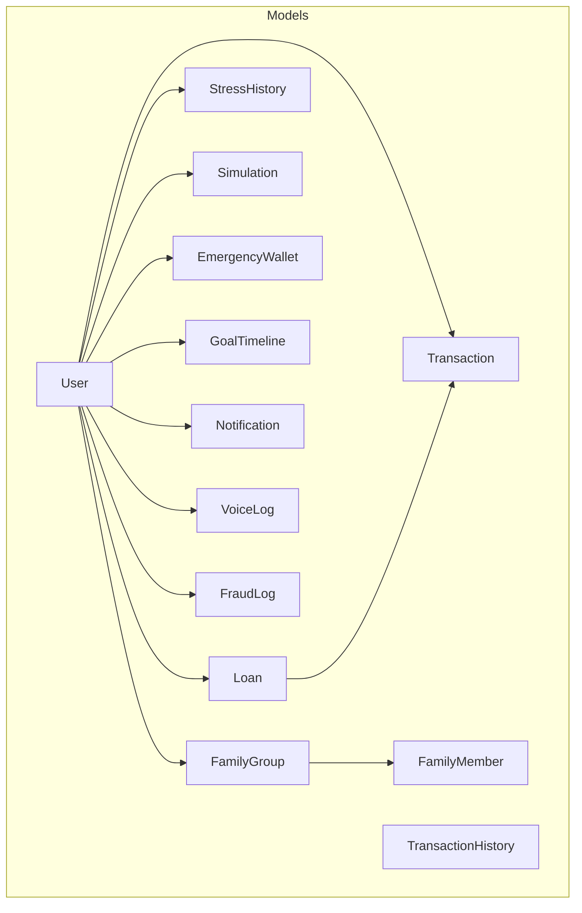

**Diagram sources**
- [User.js:1-31](file://backend/models/User.js#L1-L31)
- [Loan.js:1-18](file://backend/models/Loan.js#L1-L18)
- [Transaction.js:1-49](file://backend/models/Transaction.js#L1-L49)
- [TransactionHistory.js:1-19](file://backend/models/TransactionHistory.js#L1-L19)
- [StressHistory.js:1-49](file://backend/models/StressHistory.js#L1-L49)
- [Simulation.js:1-31](file://backend/models/Simulation.js#L1-L31)
- [EmergencyWallet.js:1-21](file://backend/models/EmergencyWallet.js#L1-L21)
- [GoalTimeline.js:1-19](file://backend/models/GoalTimeline.js#L1-L19)
- [Notification.js:1-47](file://backend/models/Notification.js#L1-L47)
- [VoiceLog.js:1-20](file://backend/models/VoiceLog.js#L1-L20)
- [FraudLog.js:1-23](file://backend/models/FraudLog.js#L1-L23)
- [FamilyGroup.js:1-51](file://backend/models/FamilyGroup.js#L1-L51)
- [FamilyMember.js:1-14](file://backend/models/FamilyMember.js#L1-L14)

**Section sources**
- [server.js:26-52](file://backend/server.js#L26-L52)
- [server.js:67-84](file://backend/server.js#L67-L84)

## Core Components
This section defines each entity, its fields, types, constraints, and relationships.

- User
  - Purpose: Authentication and financial profile storage.
  - Fields: name, email (unique, lowercase), password, role (enum), monthlyIncome, monthlyExpenses, totalEMI, debtHealthScore.
  - Constraints: Required fields, numeric minima, role enum, timestamps.
  - Security: Pre-save hashing via bcrypt; password comparison method.
  - Relationships: One-to-many with Loan, Transaction, StressHistory, Simulation, EmergencyWallet, GoalTimeline, Notification, VoiceLog, FraudLog, FamilyGroup, FamilyMember.

- Loan
  - Purpose: Track individual loans per user.
  - Fields: userId (refers to User), type, name, amount, interestRate, tenureMonths, status (enum), startDate.
  - Constraints: Required fields, positive amounts/rates, minimum tenure, timestamps.
  - Relationships: One-to-many with Transaction.

- Transaction
  - Purpose: Record EMI payments against a specific loan.
  - Fields: userId, loanId, amount, date, method (enum), status (enum), note.
  - Constraints: Required fields, positive amount, enums, note length limit, timestamps.
  - Indexes: userId, loanId, date composite; individual indices on userId, loanId, date.

- TransactionHistory
  - Purpose: Store raw transaction events for fraud detection and analytics.
  - Fields: userId, amount, category, merchant, timestamp, location, deviceId, flagged, riskScore.
  - Constraints: Required fields, riskScore range, timestamps.
  - Indexes: userId+timestamp desc; userId+category.

- StressHistory
  - Purpose: Historical stress metrics per user-month.
  - Fields: userId, monthlyIncome, monthlyExpense, totalLoanEMI, debtRatio, stressLevel (enum), riskScore, month.
  - Constraints: Required fields, riskScore range, timestamps.
  - Indexes: userId+month desc.

- Simulation
  - Purpose: Store scenario simulations for stress analysis.
  - Fields: userId, newIncome, newExpenses, adjustEMI, stressScore.
  - Constraints: Required fields, timestamps.

- EmergencyWallet
  - Purpose: Personal emergency savings account per user.
  - Fields: userId (unique), balance, targetAmount, transactions (embedded), isActive, savingMode (enum), totalSaved.
  - Constraints: Unique user, savingMode enum, numeric defaults.
  - Relationships: One-to-one with User.

- GoalTimeline
  - Purpose: Track personal financial goals with timelines.
  - Fields: userId, goalName, targetAmount, currentSaved, monthlySavingCapacity, linkedExpenseCategories, emoji, category (enum), createdAt, achievedAt.
  - Constraints: Required fields, timestamps.
  - Indexes: userId.

- Notification
  - Purpose: In-app/email/SMS notifications for users.
  - Fields: userId, type (enum), channel (enum), content, sentAt, read, meta.
  - Constraints: Required fields, content length limit, timestamps.
  - Indexes: userId+read+createdAt desc; read indexed.

- VoiceLog
  - Purpose: Store voice-to-text logs for expense parsing.
  - Fields: userId, transcript, parsedExpense (embedded), confidence, rawResponse, createdAt.
  - Constraints: Required fields, timestamps.
  - Indexes: userId+createdAt desc.

- FraudLog
  - Purpose: Log detected or predicted fraud attempts.
  - Fields: userId, transaction (embedded), predictedRisk (enum), score, reason, recommendation, actualOutcome, createdAt.
  - Constraints: Required fields, timestamps.
  - Indexes: userId.

- FamilyGroup
  - Purpose: Group financial collaboration among users.
  - Fields: groupName, adminUserId (refers to User), members (embedded array), sharedWallet (embedded), goals (embedded array), createdAt.
  - Embedded subdocuments: GroupTransaction, Goal, FamilyMember.
  - Indexes: members.userId, adminUserId.

- FamilyMember
  - Purpose: Link users to groups with roles and limits.
  - Fields: groupId, userId, role (enum), nickname, monthlyLimit.
  - Constraints: Required fields, role enum.
  - Indexes: userId+groupId.

**Section sources**
- [User.js:4-31](file://backend/models/User.js#L4-L31)
- [Loan.js:3-15](file://backend/models/Loan.js#L3-L15)
- [Transaction.js:3-44](file://backend/models/Transaction.js#L3-L44)
- [TransactionHistory.js:3-18](file://backend/models/TransactionHistory.js#L3-L18)
- [StressHistory.js:3-43](file://backend/models/StressHistory.js#L3-L43)
- [Simulation.js:3-28](file://backend/models/Simulation.js#L3-L28)
- [EmergencyWallet.js:10-18](file://backend/models/EmergencyWallet.js#L10-L18)
- [GoalTimeline.js:3-14](file://backend/models/GoalTimeline.js#L3-L14)
- [Notification.js:3-42](file://backend/models/Notification.js#L3-L42)
- [VoiceLog.js:3-15](file://backend/models/VoiceLog.js#L3-L15)
- [FraudLog.js:3-18](file://backend/models/FraudLog.js#L3-L18)
- [FamilyGroup.js:25-45](file://backend/models/FamilyGroup.js#L25-L45)
- [FamilyMember.js:3-9](file://backend/models/FamilyMember.js#L3-L9)

## Architecture Overview
The schema follows a document-oriented design with explicit references for relationships and embedded subdocuments for composition. Collections are indexed strategically to support frequent queries (e.g., user-centric analytics, time-series stress metrics).

```mermaid
erDiagram
USER {
ObjectId _id PK
string name
string email UK
string password
string role
number monthlyIncome
number monthlyExpenses
number totalEMI
number debtHealthScore
timestamp createdAt
timestamp updatedAt
}
LOAN {
ObjectId _id PK
ObjectId userId FK
string type
string name
number amount
number interestRate
number tenureMonths
string status
date startDate
timestamp createdAt
timestamp updatedAt
}
TRANSACTION {
ObjectId _id PK
ObjectId userId FK
ObjectId loanId FK
number amount
date date
string method
string status
string note
timestamp createdAt
timestamp updatedAt
}
TRANSACTION_HISTORY {
ObjectId _id PK
ObjectId userId FK
number amount
string category
string merchant
date timestamp
string location
string deviceId
boolean flagged
number riskScore
timestamp createdAt
timestamp updatedAt
}
STRESS_HISTORY {
ObjectId _id PK
ObjectId userId FK
number monthlyIncome
number monthlyExpense
number totalLoanEMI
number debtRatio
string stressLevel
number riskScore
date month
timestamp createdAt
timestamp updatedAt
}
SIMULATION {
ObjectId _id PK
ObjectId userId FK
number newIncome
number newExpenses
number adjustEMI
number stressScore
timestamp createdAt
timestamp updatedAt
}
EMERGENCY_WALLET {
ObjectId _id PK
ObjectId userId UK FK
number balance
number targetAmount
array transactions
boolean isActive
string savingMode
number totalSaved
timestamp createdAt
timestamp updatedAt
}
GOAL_TIMELINE {
ObjectId _id PK
ObjectId userId FK
string goalName
number targetAmount
number currentSaved
number monthlySavingCapacity
array linkedExpenseCategories
string emoji
string category
date createdAt
date achievedAt
timestamp createdAt
timestamp updatedAt
}
NOTIFICATION {
ObjectId _id PK
ObjectId userId FK
string type
string channel
string content
date sentAt
boolean read
object meta
timestamp createdAt
timestamp updatedAt
}
VOICE_LOG {
ObjectId _id PK
ObjectId userId FK
string transcript
object parsedExpense
number confidence
string rawResponse
date createdAt
timestamp createdAt
timestamp updatedAt
}
FRAUD_LOG {
ObjectId _id PK
ObjectId userId FK
object transaction
string predictedRisk
number score
string reason
string recommendation
string actualOutcome
date createdAt
timestamp createdAt
timestamp updatedAt
}
FAMILY_GROUP {
ObjectId _id PK
string groupName
ObjectId adminUserId FK
array members
object sharedWallet
array goals
date createdAt
timestamp createdAt
timestamp updatedAt
}
FAMILY_MEMBER {
ObjectId _id PK
ObjectId groupId FK
ObjectId userId FK
string role
string nickname
number monthlyLimit
timestamp createdAt
timestamp updatedAt
}
USER ||--o{ LOAN : "has many"
USER ||--o{ TRANSACTION : "has many"
USER ||--o{ TRANSACTION_HISTORY : "has many"
USER ||--o{ STRESS_HISTORY : "has many"
USER ||--o{ SIMULATION : "has many"
USER ||--o{ EMERGENCY_WALLET : "has one"
USER ||--o{ GOAL_TIMELINE : "has many"
USER ||--o{ NOTIFICATION : "has many"
USER ||--o{ VOICE_LOG : "has many"
USER ||--o{ FRAUD_LOG : "has many"
USER ||--o{ FAMILY_GROUP : "admin of"
USER ||--o{ FAMILY_MEMBER : "belongs to"
LOAN ||--o{ TRANSACTION : "payments"
FAMILY_GROUP ||--o{ FAMILY_MEMBER : "includes"
```

**Diagram sources**
- [User.js:4-31](file://backend/models/User.js#L4-L31)
- [Loan.js:3-15](file://backend/models/Loan.js#L3-L15)
- [Transaction.js:3-44](file://backend/models/Transaction.js#L3-L44)
- [TransactionHistory.js:3-18](file://backend/models/TransactionHistory.js#L3-L18)
- [StressHistory.js:3-43](file://backend/models/StressHistory.js#L3-L43)
- [Simulation.js:3-28](file://backend/models/Simulation.js#L3-L28)
- [EmergencyWallet.js:10-18](file://backend/models/EmergencyWallet.js#L10-L18)
- [GoalTimeline.js:3-14](file://backend/models/GoalTimeline.js#L3-L14)
- [Notification.js:3-42](file://backend/models/Notification.js#L3-L42)
- [VoiceLog.js:3-15](file://backend/models/VoiceLog.js#L3-L15)
- [FraudLog.js:3-18](file://backend/models/FraudLog.js#L3-L18)
- [FamilyGroup.js:25-45](file://backend/models/FamilyGroup.js#L25-L45)
- [FamilyMember.js:3-9](file://backend/models/FamilyMember.js#L3-L9)

## Detailed Component Analysis

### User Model
- Responsibilities: Authentication, financial profile, role-based access.
- Validation: Enumerations, numeric bounds, required fields, unique email.
- Security: Password hashing on save; password comparison method.
- Relationships: Central hub for all user-associated entities.

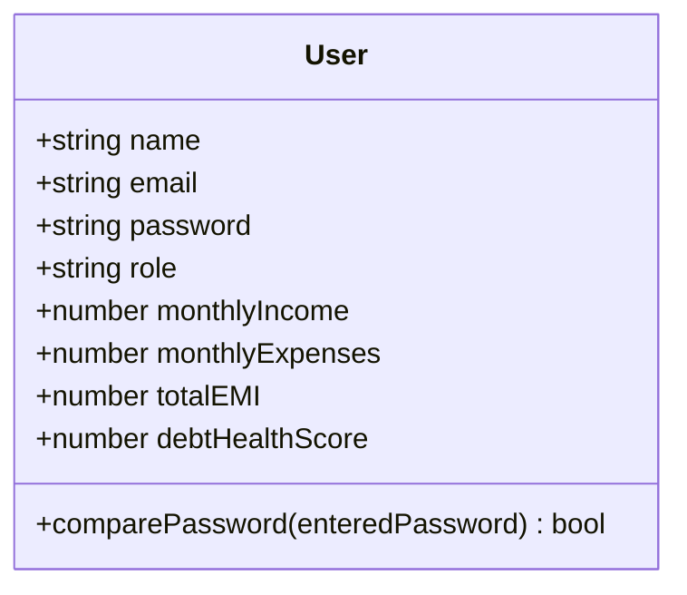

**Diagram sources**
- [User.js:4-31](file://backend/models/User.js#L4-L31)

**Section sources**
- [User.js:19-28](file://backend/models/User.js#L19-L28)

### Loan Model
- Responsibilities: Loan lifecycle tracking.
- Validation: Positive amount/rate, minimum tenure, status enum.
- Relationships: Payments recorded in Transaction.

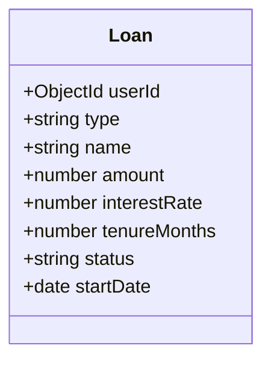

**Diagram sources**
- [Loan.js:3-15](file://backend/models/Loan.js#L3-L15)

**Section sources**
- [Loan.js:5-11](file://backend/models/Loan.js#L5-L11)

### Transaction Model
- Responsibilities: Payment records for loans.
- Validation: Enums, positive amount, note limits, date indexing.
- Indexing: userId, loanId, date composite for analytics.

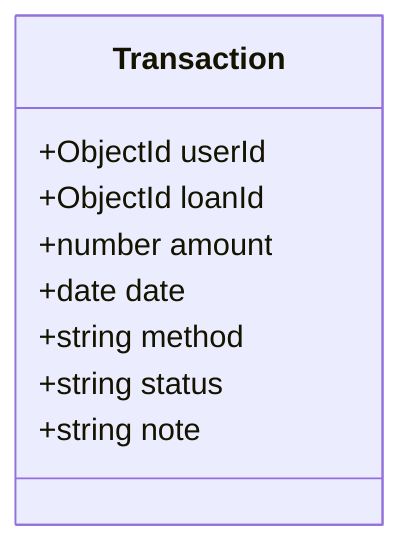

**Diagram sources**
- [Transaction.js:3-44](file://backend/models/Transaction.js#L3-L44)

**Section sources**
- [Transaction.js:9-46](file://backend/models/Transaction.js#L9-L46)

### TransactionHistory Model
- Responsibilities: Raw transaction events for fraud and analytics.
- Indexing: userId+timestamp desc; userId+category.

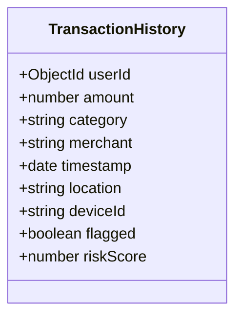

**Diagram sources**
- [TransactionHistory.js:3-18](file://backend/models/TransactionHistory.js#L3-L18)

**Section sources**
- [TransactionHistory.js:15-16](file://backend/models/TransactionHistory.js#L15-L16)

### StressHistory Model
- Responsibilities: Monthly stress metrics.
- Indexing: userId+month desc.

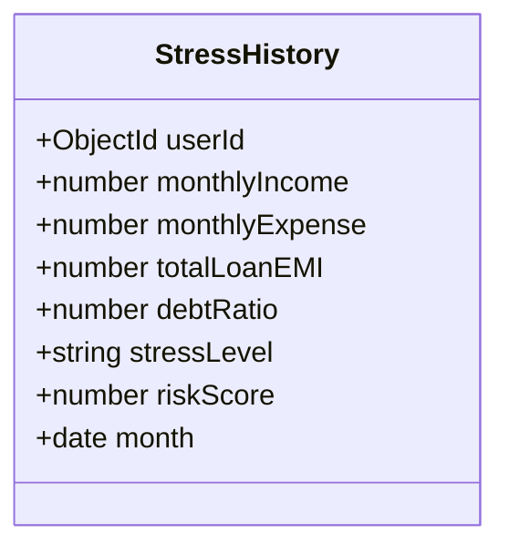

**Diagram sources**
- [StressHistory.js:3-43](file://backend/models/StressHistory.js#L3-L43)

**Section sources**
- [StressHistory.js:46](file://backend/models/StressHistory.js#L46)

### Simulation Model
- Responsibilities: Scenario modeling for stress analysis.

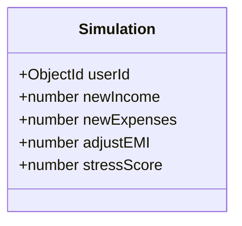

**Diagram sources**
- [Simulation.js:3-28](file://backend/models/Simulation.js#L3-L28)

**Section sources**
- [Simulation.js:22](file://backend/models/Simulation.js#L22)

### EmergencyWallet Model
- Responsibilities: Personal emergency savings.
- Uniqueness: One wallet per user enforced by unique index.

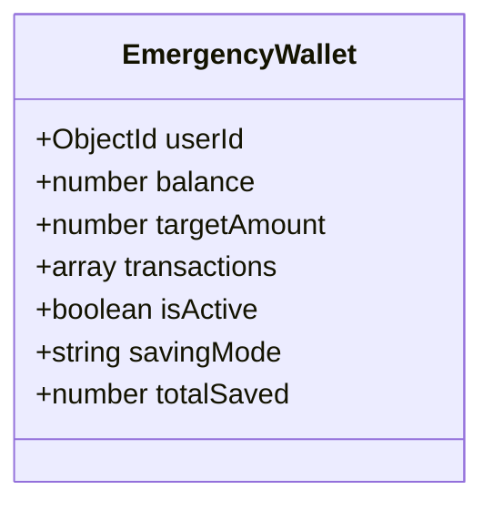

**Diagram sources**
- [EmergencyWallet.js:10-18](file://backend/models/EmergencyWallet.js#L10-L18)

**Section sources**
- [EmergencyWallet.js:11](file://backend/models/EmergencyWallet.js#L11)

### GoalTimeline Model
- Responsibilities: Personal financial goals.
- Indexing: userId.

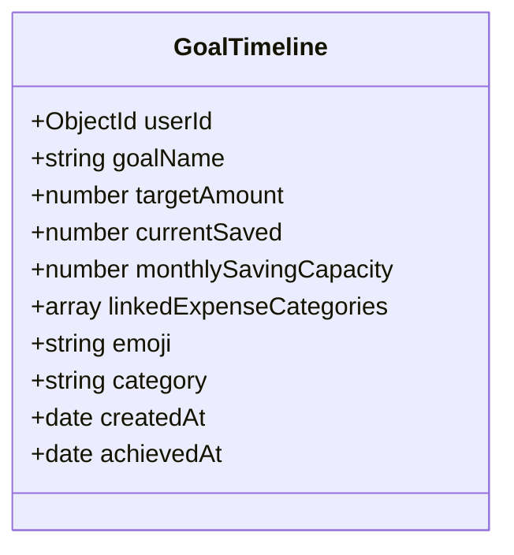

**Diagram sources**
- [GoalTimeline.js:3-14](file://backend/models/GoalTimeline.js#L3-L14)

**Section sources**
- [GoalTimeline.js:16](file://backend/models/GoalTimeline.js#L16)

### Notification Model
- Responsibilities: User notifications across channels.
- Indexing: userId+read+createdAt desc; read indexed.

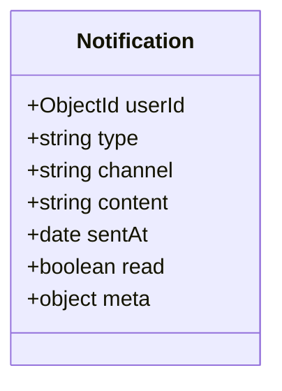

**Diagram sources**
- [Notification.js:3-42](file://backend/models/Notification.js#L3-L42)

**Section sources**
- [Notification.js:44](file://backend/models/Notification.js#L44)

### VoiceLog Model
- Responsibilities: Voice-to-text logs for expenses.
- Indexing: userId+createdAt desc.

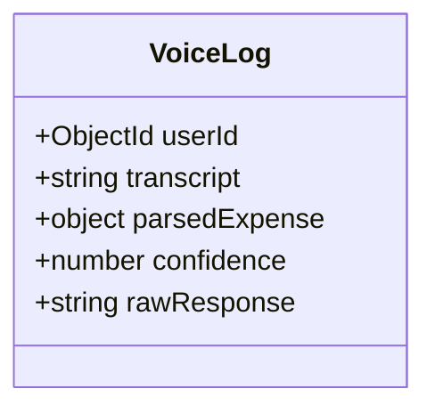

**Diagram sources**
- [VoiceLog.js:3-15](file://backend/models/VoiceLog.js#L3-L15)

**Section sources**
- [VoiceLog.js:17](file://backend/models/VoiceLog.js#L17)

### FraudLog Model
- Responsibilities: Fraud detection logs.
- Indexing: userId.

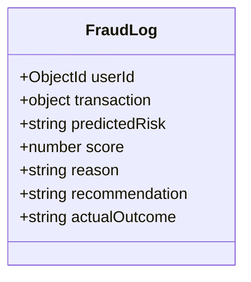

**Diagram sources**
- [FraudLog.js:3-18](file://backend/models/FraudLog.js#L3-L18)

**Section sources**
- [FraudLog.js:20](file://backend/models/FraudLog.js#L20)

### FamilyGroup and FamilyMember Models
- Responsibilities: Group financial collaboration and member roles.
- Indexing: FamilyGroup members.userId, adminUserId; FamilyMember userId+groupId.

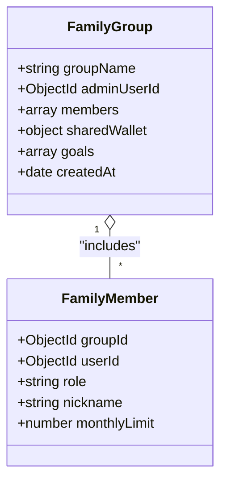

**Diagram sources**
- [FamilyGroup.js:25-45](file://backend/models/FamilyGroup.js#L25-L45)
- [FamilyMember.js:3-9](file://backend/models/FamilyMember.js#L3-L9)

**Section sources**
- [FamilyGroup.js:47-48](file://backend/models/FamilyGroup.js#L47-L48)
- [FamilyMember.js:11](file://backend/models/FamilyMember.js#L11)

## Dependency Analysis
- Referential Integrity: Implemented via ObjectId references (e.g., Loan.userId, Transaction.userId, FamilyMember.groupId).
- Embedded Composition: FamilyGroup.sharedWallet.transactions, FamilyGroup.goals, FamilyMember.role, EmergencyWallet.transactions.
- Index Strategy: Composite and single-field indexes optimized for user-centric analytics and time-series queries.
- Startup Index Creation: Server ensures indexes exist on AI feature collections.

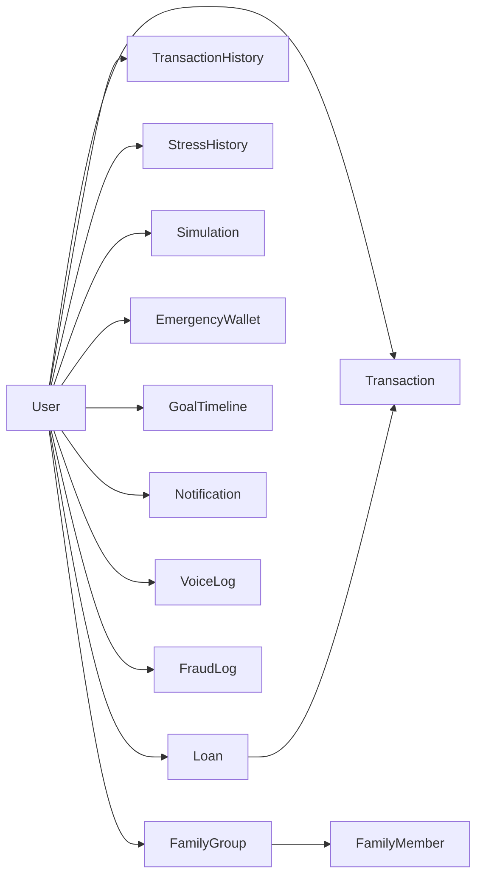

**Diagram sources**
- [User.js:5](file://backend/models/User.js#L5)
- [Loan.js:5](file://backend/models/Loan.js#L5)
- [Transaction.js:5](file://backend/models/Transaction.js#L5)
- [TransactionHistory.js:4](file://backend/models/TransactionHistory.js#L4)
- [StressHistory.js:5](file://backend/models/StressHistory.js#L5)
- [Simulation.js:5](file://backend/models/Simulation.js#L5)
- [EmergencyWallet.js:11](file://backend/models/EmergencyWallet.js#L11)
- [GoalTimeline.js:4](file://backend/models/GoalTimeline.js#L4)
- [Notification.js:5](file://backend/models/Notification.js#L5)
- [VoiceLog.js:4](file://backend/models/VoiceLog.js#L4)
- [FraudLog.js:4](file://backend/models/FraudLog.js#L4)
- [FamilyGroup.js:27](file://backend/models/FamilyGroup.js#L27)
- [FamilyMember.js:4](file://backend/models/FamilyMember.js#L4)
- [FamilyMember.js:5](file://backend/models/FamilyMember.js#L5)

**Section sources**
- [server.js:44-65](file://backend/server.js#L44-L65)

## Performance Considerations
- Indexes
  - Transaction: userId, loanId, date composite.
  - TransactionHistory: userId+timestamp desc, userId+category.
  - StressHistory: userId+month desc.
  - Notification: userId+read+createdAt desc; read indexed.
  - VoiceLog: userId+createdAt desc.
  - FraudLog: userId.
  - FamilyGroup: members.userId, adminUserId.
  - FamilyMember: userId+groupId.
  - GoalTimeline: userId.
- Startup Index Creation: Ensures indexes exist at runtime and tolerates conflicts.
- Connection Tuning: Pool size, timeouts, strictQuery disabled for flexible queries.

**Section sources**
- [Transaction.js:46](file://backend/models/Transaction.js#L46)
- [TransactionHistory.js:15-16](file://backend/models/TransactionHistory.js#L15-L16)
- [StressHistory.js:46](file://backend/models/StressHistory.js#L46)
- [Notification.js:44](file://backend/models/Notification.js#L44)
- [VoiceLog.js:17](file://backend/models/VoiceLog.js#L17)
- [FraudLog.js:20](file://backend/models/FraudLog.js#L20)
- [FamilyGroup.js:47-48](file://backend/models/FamilyGroup.js#L47-L48)
- [FamilyMember.js:11](file://backend/models/FamilyMember.js#L11)
- [GoalTimeline.js:16](file://backend/models/GoalTimeline.js#L16)
- [server.js:44-65](file://backend/server.js#L44-L65)
- [server.js:69-84](file://backend/server.js#L69-L84)

## Troubleshooting Guide
- Connection Issues
  - Symptom: Repeated connection errors on startup.
  - Action: Review MONGO_URI, network connectivity, and retry logic; inspect logs for timeout or IndexOptionsConflict messages.
- Index Conflicts
  - Symptom: Index creation warnings about existing names or conflicting specs.
  - Action: Ignore warnings if indexes already exist; verify collection state and re-run index creation if needed.
- Data Validation Errors
  - Symptom: Insert/update failures due to enums, min/max violations, or missing required fields.
  - Action: Confirm enum values, numeric bounds, and presence of required fields before writes.
- Referential Integrity
  - Symptom: Queries returning null references or orphaned documents.
  - Action: Ensure ObjectId references are present; avoid deleting referenced documents without cascade logic.

**Section sources**
- [server.js:32-42](file://backend/server.js#L32-L42)
- [server.js:54-64](file://backend/server.js#L54-L64)
- [Loan.js:8-11](file://backend/models/Loan.js#L8-L11)
- [Transaction.js:17-21](file://backend/models/Transaction.js#L17-L21)
- [EmergencyWallet.js:11](file://backend/models/EmergencyWallet.js#L11)

## Conclusion
The schema emphasizes user-centric design with clear references and embedded composition. Strategic indexing supports analytics-heavy workloads, while validation and constraints enforce data quality. Operational safeguards include robust connection handling and index creation at startup. The model is extensible for future enhancements such as audit trails, richer embedded documents, and additional indexes.

## Appendices

### Entity Relationship Diagram (ERD)
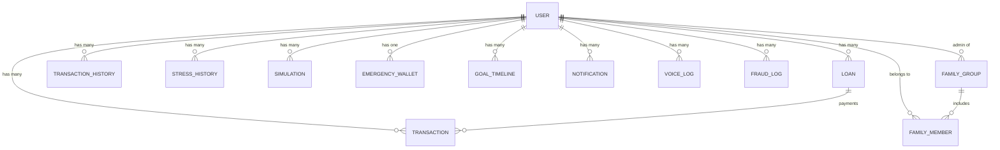

**Diagram sources**
- [User.js:5](file://backend/models/User.js#L5)
- [Loan.js:5](file://backend/models/Loan.js#L5)
- [Transaction.js:5](file://backend/models/Transaction.js#L5)
- [TransactionHistory.js:4](file://backend/models/TransactionHistory.js#L4)
- [StressHistory.js:5](file://backend/models/StressHistory.js#L5)
- [Simulation.js:5](file://backend/models/Simulation.js#L5)
- [EmergencyWallet.js:11](file://backend/models/EmergencyWallet.js#L11)
- [GoalTimeline.js:4](file://backend/models/GoalTimeline.js#L4)
- [Notification.js:5](file://backend/models/Notification.js#L5)
- [VoiceLog.js:4](file://backend/models/VoiceLog.js#L4)
- [FraudLog.js:4](file://backend/models/FraudLog.js#L4)
- [FamilyGroup.js:27](file://backend/models/FamilyGroup.js#L27)
- [FamilyMember.js:4](file://backend/models/FamilyMember.js#L4)
- [FamilyMember.js:5](file://backend/models/FamilyMember.js#L5)

### Sample Data Structures
- User
  - Example keys: name, email, role, monthlyIncome, monthlyExpenses, totalEMI, debtHealthScore.
- Loan
  - Example keys: userId, type, name, amount, interestRate, tenureMonths, status, startDate.
- Transaction
  - Example keys: userId, loanId, amount, date, method, status, note.
- TransactionHistory
  - Example keys: userId, amount, category, merchant, timestamp, location, deviceId, flagged, riskScore.
- StressHistory
  - Example keys: userId, monthlyIncome, monthlyExpense, totalLoanEMI, debtRatio, stressLevel, riskScore, month.
- Simulation
  - Example keys: userId, newIncome, newExpenses, adjustEMI, stressScore.
- EmergencyWallet
  - Example keys: userId, balance, targetAmount, transactions[], isActive, savingMode, totalSaved.
- GoalTimeline
  - Example keys: userId, goalName, targetAmount, currentSaved, monthlySavingCapacity, linkedExpenseCategories[], emoji, category, createdAt, achievedAt.
- Notification
  - Example keys: userId, type, channel, content, sentAt, read, meta{}.
- VoiceLog
  - Example keys: userId, transcript, parsedExpense{}, confidence, rawResponse, createdAt.
- FraudLog
  - Example keys: userId, transaction{}, predictedRisk, score, reason, recommendation, actualOutcome, createdAt.
- FamilyGroup
  - Example keys: groupName, adminUserId, members[], sharedWallet{}, goals[], createdAt.
- FamilyMember
  - Example keys: groupId, userId, role, nickname, monthlyLimit.

[No sources needed since this section provides conceptual examples]

### Data Access Patterns
- User-centric reads: Retrieve all user-related entities (Loans, Transactions, Notifications, Goals) by userId.
- Time-series analytics: Query StressHistory and TransactionHistory by userId and date ranges.
- Composite queries: Use userId+loanId+date composite index for payment analytics.
- Group collaboration: Fetch FamilyGroup with populated members and sharedWallet.

[No sources needed since this section provides conceptual patterns]

### Data Lifecycle Management
- Retention: No explicit TTL fields observed; implement collection-specific policies externally if needed.
- Archival: Consider partitioning TransactionHistory by year/month or moving historical data to cold storage.
- Cleanup: Remove old Notification entries and FraudLog outcomes periodically.

[No sources needed since this section provides general guidance]

### Security and Privacy
- Authentication: Password hashing on User save; secure password comparison method.
- Access Control: Role-based access via User.role; route-level middleware recommended.
- Data Protection: Avoid logging sensitive fields; sanitize logs and audit access.

**Section sources**
- [User.js:19-28](file://backend/models/User.js#L19-L28)

### Migration and Versioning
- Index Evolution: Use server-side index creation with conflict handling to evolve indexes safely.
- Schema Changes: Add new fields with defaults; deprecate enums carefully; maintain backward-compatible routes.
- Backward Compatibility: Keep legacy routes (e.g., v1*) alongside new ones until migration completes.

**Section sources**
- [server.js:44-65](file://backend/server.js#L44-L65)
- [server.js:105-118](file://backend/server.js#L105-L118)