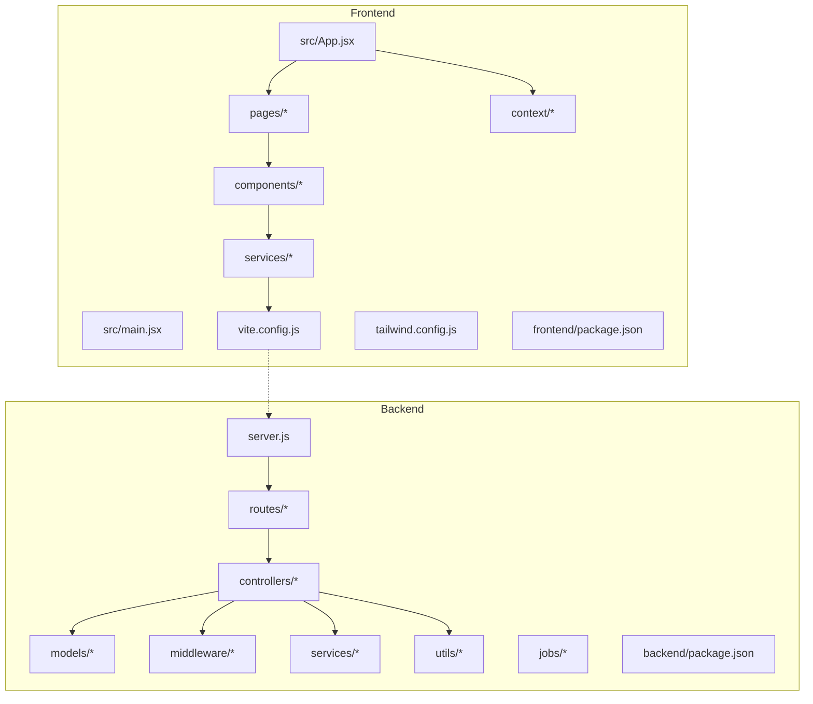
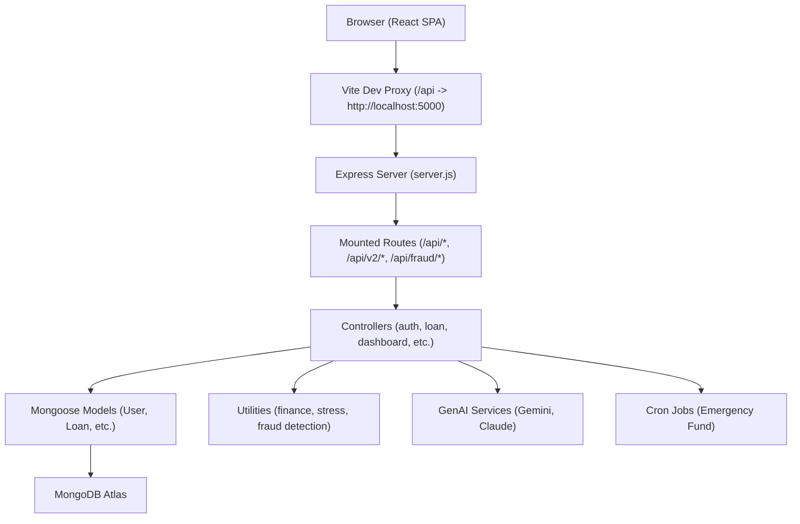
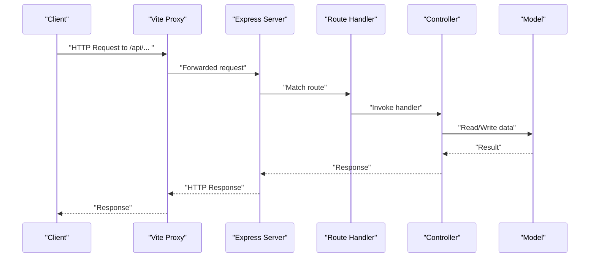
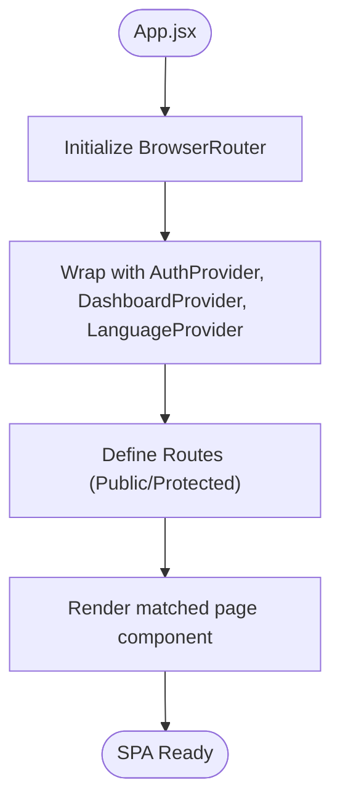
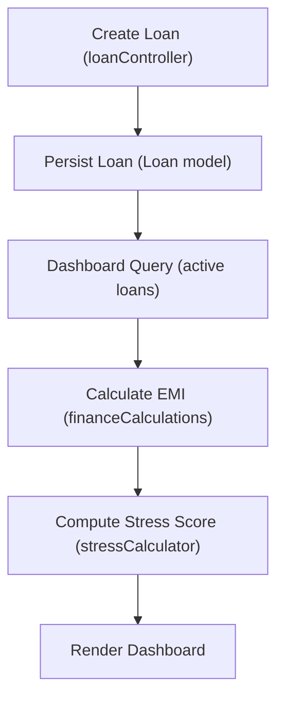
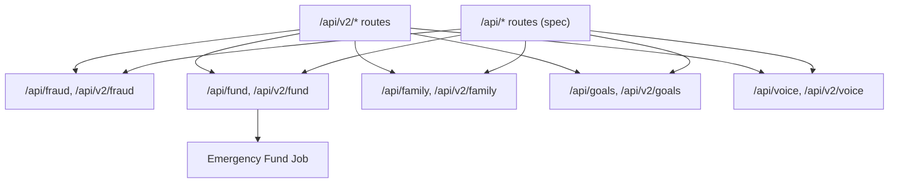
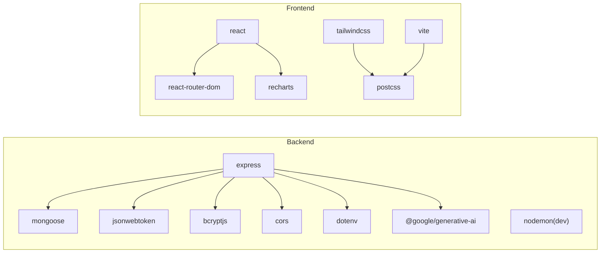
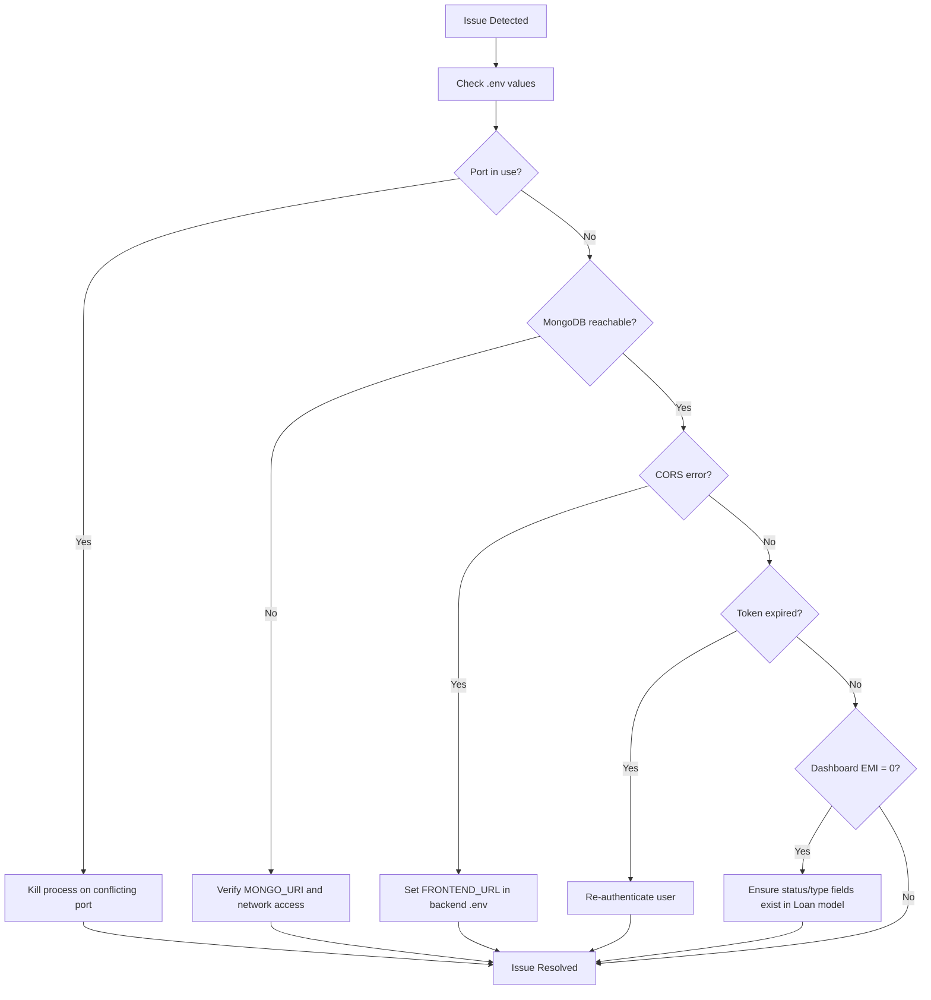

# Development Guidelines

<cite>
**Referenced Files in This Document**
- [README.md](file://README.md)
- [TODO.md](file://TODO.md)
- [CRITICAL_FIXES.md](file://CRITICAL_FIXES.md)
- [ARCHITECTURE_FIX.md](file://ARCHITECTURE_FIX.md)
- [SYSTEM_SYNC_FIX.md](file://SYSTEM_SYNC_FIX.md)
- [TODO_ASSISTANT_FIX.md](file://TODO_ASSISTANT_FIX.md)
- [TODO_LOGIN_FIX.md](file://TODO_LOGIN_FIX.md)
- [backend/package.json](file://backend/package.json)
- [frontend/package.json](file://frontend/package.json)
- [backend/server.js](file://backend/server.js)
- [frontend/vite.config.js](file://frontend/vite.config.js)
- [frontend/tailwind.config.js](file://frontend/tailwind.config.js)
- [frontend/src/main.jsx](file://frontend/src/main.jsx)
- [frontend/src/App.jsx](file://frontend/src/App.jsx)
- [backend/routes/loanRoutes.js](file://backend/routes/loanRoutes.js)
- [backend/controllers/loanController.js](file://backend/controllers/loanController.js)
- [backend/models/Loan.js](file://backend/models/Loan.js)
- [backend/middleware/authMiddleware.js](file://backend/middleware/authMiddleware.js)
- [frontend/src/services/api.js](file://frontend/src/services/api.js)
- [frontend/src/context/AuthContext.jsx](file://frontend/src/context/AuthContext.jsx)
- [frontend/src/pages/Dashboard.jsx](file://frontend/src/pages/Dashboard.jsx)
- [backend/utils/stressCalculator.js](file://backend/utils/stressCalculator.js)
- [backend/utils/financeCalculations.js](file://backend/utils/financeCalculations.js)
- [backend/services/claudeService.js](file://backend/services/claudeService.js)
- [backend/services/geminiService.js](file://backend/services/geminiService.js)
- [backend/routes/fraud.js](file://backend/routes/fraud.js)
- [backend/routes/emergencyFund.js](file://backend/routes/emergencyFund.js)
- [backend/routes/family.js](file://backend/routes/family.js)
- [backend/routes/goals.js](file://backend/routes/goals.js)
- [backend/routes/voice.js](file://backend/routes/voice.js)
- [backend/jobs/emergencyFund.js](file://backend/jobs/emergencyFund.js)
- [postman_collection.json](file://postman_collection.json)
</cite>

## Table of Contents
1. [Introduction](#introduction)
2. [Project Structure](#project-structure)
3. [Core Components](#core-components)
4. [Architecture Overview](#architecture-overview)
5. [Detailed Component Analysis](#detailed-component-analysis)
6. [Dependency Analysis](#dependency-analysis)
7. [Performance Considerations](#performance-considerations)
8. [Troubleshooting Guide](#troubleshooting-guide)
9. [Conclusion](#conclusion)
10. [Appendices](#appendices)

## Introduction
This document provides comprehensive development guidelines for the Smart Loan & Debt Stress Analyzer project. It covers code style conventions, configuration for linting and formatting, development workflow, branch management, contribution guidelines, testing strategies, debugging approaches, deployment procedures, environment configuration, production readiness, extension guidelines, and maintenance tasks. The project is a modern full-stack MERN application with a focus on financial analytics, stress scoring, and AI-assisted insights.

## Project Structure
The repository follows a dual-package structure:
- backend: Node.js/Express server with MongoDB integration, routing, controllers, models, middleware, services, and jobs
- frontend: React 18 application with Vite, Tailwind CSS, Recharts, and React Router DOM
- shared assets and documentation: README, TODO lists, critical fixes, and Postman collection

Key runtime and configuration files:
- Backend entrypoint and server wiring
- Frontend build tooling and proxy configuration
- Tailwind content scanning configuration
- Package manifests for both frontend and backend
- Postman collection for API testing

**Diagram sources**
- [backend/server.js:95-118](file://backend/server.js#L95-L118)
- [frontend/src/App.jsx:21-54](file://frontend/src/App.jsx#L21-L54)
- [frontend/vite.config.js:11-19](file://frontend/vite.config.js#L11-L19)
- [backend/package.json:1-26](file://backend/package.json#L1-L26)
- [frontend/package.json:1-40](file://frontend/package.json#L1-L40)

**Section sources**
- [README.md:487-545](file://README.md#L487-L545)
- [backend/server.js:95-118](file://backend/server.js#L95-L118)
- [frontend/src/App.jsx:21-54](file://frontend/src/App.jsx#L21-L54)
- [frontend/vite.config.js:11-19](file://frontend/vite.config.js#L11-L19)
- [frontend/tailwind.config.js:1-10](file://frontend/tailwind.config.js#L1-L10)
- [backend/package.json:1-26](file://backend/package.json#L1-L26)
- [frontend/package.json:1-40](file://frontend/package.json#L1-L40)

## Core Components
- Backend server initialization, middleware, and route mounting
- Frontend application bootstrap, routing, and provider setup
- Environment configuration and proxy setup for local development
- AI feature scaffolding and legacy compatibility routes
- Utility modules for finance calculations and stress scoring
- Services for GenAI providers and cron-based jobs

Development conventions observed:
- Backend uses ES module-style requires and centralized route mounting
- Frontend uses React functional components, context providers, and Vite for dev/build
- Tailwind CSS configured for content scanning across src tree
- Proxy configured in Vite to forward API calls to backend during development

**Section sources**
- [backend/server.js:1-150](file://backend/server.js#L1-L150)
- [frontend/src/main.jsx:1-14](file://frontend/src/main.jsx#L1-L14)
- [frontend/src/App.jsx:1-58](file://frontend/src/App.jsx#L1-L58)
- [frontend/vite.config.js:1-21](file://frontend/vite.config.js#L1-L21)
- [frontend/tailwind.config.js:1-10](file://frontend/tailwind.config.js#L1-L10)
- [backend/utils/stressCalculator.js](file://backend/utils/stressCalculator.js)
- [backend/utils/financeCalculations.js](file://backend/utils/financeCalculations.js)
- [backend/services/geminiService.js](file://backend/services/geminiService.js)
- [backend/services/claudeService.js](file://backend/services/claudeService.js)
- [backend/jobs/emergencyFund.js](file://backend/jobs/emergencyFund.js)

## Architecture Overview
The system comprises:
- Frontend SPA (React) communicating with backend REST APIs
- Backend REST API with standardized routes and compatibility mounts
- MongoDB Atlas for persistence
- AI feature routes under both current and legacy paths for compatibility
- Cron job for emergency fund automation

**Diagram sources**
- [backend/server.js:95-118](file://backend/server.js#L95-L118)
- [frontend/vite.config.js:11-19](file://frontend/vite.config.js#L11-L19)
- [backend/routes/loanRoutes.js](file://backend/routes/loanRoutes.js)
- [backend/controllers/loanController.js](file://backend/controllers/loanController.js)
- [backend/models/Loan.js](file://backend/models/Loan.js)
- [backend/utils/stressCalculator.js](file://backend/utils/stressCalculator.js)
- [backend/utils/financeCalculations.js](file://backend/utils/financeCalculations.js)
- [backend/services/geminiService.js](file://backend/services/geminiService.js)
- [backend/services/claudeService.js](file://backend/services/claudeService.js)
- [backend/jobs/emergencyFund.js](file://backend/jobs/emergencyFund.js)

## Detailed Component Analysis

### Backend Server and Routing
- Centralized CORS, JSON parsing, and health check
- Route mounting for core features and AI features under both current and legacy paths
- Robust MongoDB connection with retry and index creation for AI feature collections
- Global error handling middleware and 404 handling

**Diagram sources**
- [backend/server.js:95-118](file://backend/server.js#L95-L118)
- [backend/server.js:124-144](file://backend/server.js#L124-L144)

**Section sources**
- [backend/server.js:1-150](file://backend/server.js#L1-L150)

### Frontend Application Bootstrap
- React application bootstrapped via Vite
- Router configuration with public and protected routes
- Provider hierarchy for authentication, dashboard, and language contexts
- Default redirect behavior for unknown routes

**Diagram sources**
- [frontend/src/App.jsx:21-54](file://frontend/src/App.jsx#L21-L54)
- [frontend/src/main.jsx:1-14](file://frontend/src/main.jsx#L1-L14)

**Section sources**
- [frontend/src/App.jsx:1-58](file://frontend/src/App.jsx#L1-L58)
- [frontend/src/main.jsx:1-14](file://frontend/src/main.jsx#L1-L14)

### Loan Management Flow
- Loan creation persists type and status fields
- Dashboard queries active loans and calculates EMI/stress
- Status normalization ensures consistent querying

**Diagram sources**
- [backend/controllers/loanController.js](file://backend/controllers/loanController.js)
- [backend/models/Loan.js](file://backend/models/Loan.js)
- [backend/utils/financeCalculations.js](file://backend/utils/financeCalculations.js)
- [backend/utils/stressCalculator.js](file://backend/utils/stressCalculator.js)

**Section sources**
- [CRITICAL_FIXES.md:1-78](file://CRITICAL_FIXES.md#L1-L78)
- [backend/controllers/loanController.js](file://backend/controllers/loanController.js)
- [backend/models/Loan.js](file://backend/models/Loan.js)
- [backend/utils/financeCalculations.js](file://backend/utils/financeCalculations.js)
- [backend/utils/stressCalculator.js](file://backend/utils/stressCalculator.js)

### AI Feature Integration
- Legacy compatibility routes under /api/v2/* and required spec paths under /api/*
- Fraud detection, emergency fund, family, goals, and voice routes
- Cron job for emergency fund automation

**Diagram sources**
- [backend/server.js:105-118](file://backend/server.js#L105-L118)
- [backend/server.js:113-118](file://backend/server.js#L113-L118)
- [backend/jobs/emergencyFund.js](file://backend/jobs/emergencyFund.js)

**Section sources**
- [backend/server.js:105-118](file://backend/server.js#L105-L118)
- [backend/server.js:113-118](file://backend/server.js#L113-L118)
- [backend/jobs/emergencyFund.js](file://backend/jobs/emergencyFund.js)

## Dependency Analysis
- Backend dependencies include Express, Mongoose, JWT, bcrypt, CORS, dotenv, and GenAI SDK
- Frontend dependencies include React, React Router DOM, Recharts, Tailwind CSS, and Vite
- Development tools include nodemon (backend), Vite (frontend), Tailwind, and PostCSS

**Diagram sources**
- [backend/package.json:12-24](file://backend/package.json#L12-L24)
- [frontend/package.json:5-38](file://frontend/package.json#L5-L38)

**Section sources**
- [backend/package.json:1-26](file://backend/package.json#L1-L26)
- [frontend/package.json:1-40](file://frontend/package.json#L1-L40)

## Performance Considerations
- Backend MongoDB connection retries and index creation for AI feature collections improve resilience and query performance
- Frontend proxy configuration avoids CORS overhead during development
- Use production builds for performance-sensitive environments
- Minimize unnecessary re-renders in React components and leverage memoization where appropriate

[No sources needed since this section provides general guidance]

## Troubleshooting Guide
Common issues and resolutions:
- MongoDB connection errors: verify connection string and network access settings
- Port conflicts: terminate processes using ports 5000 (backend) and 3000 (frontend)
- CORS errors: ensure FRONTEND_URL is correctly set in backend environment
- Token expiration: default 7-day expiry; adjust as needed in authentication controller
- Dashboard EMI shows zero: verify loan status and type fields are persisted and normalized

**Section sources**
- [README.md:574-598](file://README.md#L574-L598)
- [CRITICAL_FIXES.md:1-78](file://CRITICAL_FIXES.md#L1-L78)

## Conclusion
These guidelines consolidate the project’s development practices, architecture, and operational procedures. By adhering to the outlined conventions, contributors can maintain code quality, streamline development workflows, and ensure reliable operation across environments.

[No sources needed since this section summarizes without analyzing specific files]

## Appendices

### A. Code Style Conventions
- Backend
  - Use consistent naming for controllers, routes, models, and middleware
  - Group related routes under feature-specific route files
  - Centralize middleware and error handling
- Frontend
  - Prefer functional components with hooks
  - Keep components small and focused; compose via layout and page components
  - Use Tailwind utilities for styling; avoid inline styles
  - Place API service functions in dedicated modules

[No sources needed since this section provides general guidance]

### B. Linting and Formatting
- Backend
  - No explicit ESLint/Prettier configuration files were found in the repository snapshot
  - Recommended: Add ESLint and Prettier configurations aligned with Node.js/Express projects
- Frontend
  - No explicit ESLint/Prettier configuration files were found in the repository snapshot
  - Recommended: Add ESLint and Prettier configurations aligned with React/Vite projects

[No sources needed since this section provides general guidance]

### C. Development Workflow and Branching
- Workflow
  - Create feature branches from develop/main
  - Commit messages should be concise and descriptive
  - Open pull requests for code review before merging
- Branching
  - Main: stable releases
  - Develop: integration of features
  - Feature/<feature-name>: individual features
  - Hotfix/<issue>: urgent fixes

[No sources needed since this section provides general guidance]

### D. Contribution Guidelines
- Fork and branch from the default branch
- Follow code style conventions
- Include tests where applicable
- Update documentation and README as needed
- Reference related issues and PRs

[No sources needed since this section provides general guidance]

### E. Testing Strategies
- Backend
  - Use Postman collection to validate API endpoints
  - Manual testing via Postman is documented in the repository
- Frontend
  - Manual smoke tests for critical flows (login, dashboard, loan creation)
  - Snapshot testing for key components if automated testing is introduced

**Section sources**
- [README.md:408-486](file://README.md#L408-L486)
- [postman_collection.json](file://postman_collection.json)

### F. Debugging Approaches
- Enable logging in controllers and middleware
- Use browser developer tools for frontend debugging
- Validate environment variables and database connectivity
- Inspect network tab for API responses and errors

[No sources needed since this section provides general guidance]

### G. Deployment Procedures
- Build production bundles for both backend and frontend
- Configure environment variables for production (MongoDB Atlas, JWT secret, CORS)
- Serve frontend static files via backend or a CDN
- Use process managers for backend in production

[No sources needed since this section provides general guidance]

### H. Environment Configuration Management
- Backend
  - Required variables include PORT, MONGO_URI, JWT_SECRET, FRONTEND_URL
  - Generate a secure JWT secret for production
- Frontend
  - REACT_APP_API_URL should point to the backend API base URL

**Section sources**
- [README.md:124-164](file://README.md#L124-L164)

### I. Production Readiness Checks
- Database connectivity and index creation verified at startup
- Health check endpoint available
- CORS properly configured for production origins
- Error handling and 404 routes in place

**Section sources**
- [backend/server.js:67-85](file://backend/server.js#L67-L85)
- [backend/server.js:124-144](file://backend/server.js#L124-L144)

### J. Extending the Application
- Add new routes under the existing route mounting pattern
- Create corresponding controllers and models
- Integrate with AI services if applicable
- Update frontend pages and components to consume new endpoints

[No sources needed since this section provides general guidance]

### K. Maintaining Code Quality
- Regular code reviews
- Consistent error handling and logging
- Keep dependencies updated
- Add unit/integration tests as the project evolves

[No sources needed since this section provides general guidance]

### L. TODO Items, Critical Fixes, and Maintenance Tasks
- TODO items include verifying fraud flows, implementing family ecosystem features, upgrading emergency fund panel, adding skeleton loaders, confirming fallbacks, and updating environment examples
- Critical fixes addressed dashboard EMI calculation by ensuring status and type fields are persisted and normalized
- Ongoing maintenance includes running end-to-end verification and updating documentation

**Section sources**
- [TODO.md:1-27](file://TODO.md#L1-L27)
- [CRITICAL_FIXES.md:1-78](file://CRITICAL_FIXES.md#L1-L78)
- [ARCHITECTURE_FIX.md](file://ARCHITECTURE_FIX.md)
- [SYSTEM_SYNC_FIX.md](file://SYSTEM_SYNC_FIX.md)
- [TODO_ASSISTANT_FIX.md](file://TODO_ASSISTANT_FIX.md)
- [TODO_LOGIN_FIX.md](file://TODO_LOGIN_FIX.md)