# Emergency Fund Management

<cite>
**Referenced Files in This Document**
- [EmergencyWallet.js](file://backend/models/EmergencyWallet.js)
- [TransactionHistory.js](file://backend/models/TransactionHistory.js)
- [emergencyFund.js](file://backend/routes/emergencyFund.js)
- [v1EmergencyFund.js](file://backend/routes/v1EmergencyFund.js)
- [emergencyFund.js](file://backend/jobs/emergencyFund.js)
- [fundBuilder.js](file://backend/utils/fundBuilder.js)
- [geminiService.js](file://backend/services/geminiService.js)
- [FundDashboard.jsx](file://frontend/src/pages/FundDashboard.jsx)
- [api.js](file://frontend/src/services/api.js)
- [DashboardContext.jsx](file://frontend/src/context/DashboardContext.jsx)
- [App.jsx](file://frontend/src/App.jsx)
- [Layout.jsx](file://frontend/src/components/Layout.jsx)
- [dashboardController.js](file://backend/controllers/dashboardController.js)
- [Notification.js](file://backend/models/Notification.js)
- [server.js](file://backend/server.js)
</cite>

## Table of Contents
1. [Introduction](#introduction)
2. [Project Structure](#project-structure)
3. [Core Components](#core-components)
4. [Architecture Overview](#architecture-overview)
5. [Detailed Component Analysis](#detailed-component-analysis)
6. [Dependency Analysis](#dependency-analysis)
7. [Performance Considerations](#performance-considerations)
8. [Troubleshooting Guide](#troubleshooting-guide)
9. [Conclusion](#conclusion)
10. [Appendices](#appendices)

## Introduction
This document describes the Emergency Fund Management system, covering fund setup and configuration, automated transaction processing, savings tracking, and the frontend dashboard. It explains the EmergencyWallet model schema, fund allocation strategies via micro-roundups and AI-driven suggestions, and withdrawal management. It also details the automated fund management jobs, notification systems, and user interface patterns, with examples of fund configuration, transaction workflows, and integration with the broader financial dashboard system.

## Project Structure
The Emergency Fund system spans backend models, routes, jobs, and utilities, and integrates with the frontend dashboard and financial overview.

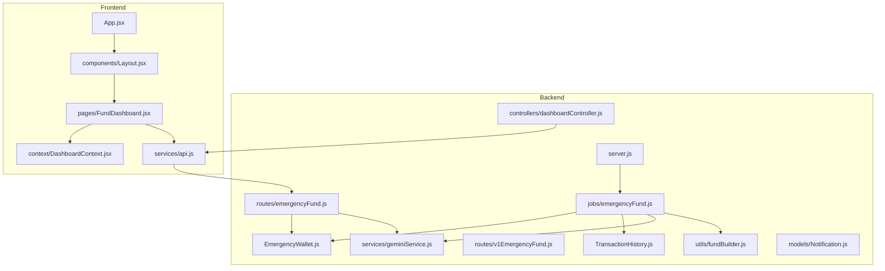

**Diagram sources**
- [EmergencyWallet.js:1-21](file://backend/models/EmergencyWallet.js#L1-L21)
- [TransactionHistory.js:1-19](file://backend/models/TransactionHistory.js#L1-L19)
- [emergencyFund.js:1-93](file://backend/routes/emergencyFund.js#L1-L93)
- [v1EmergencyFund.js:1-11](file://backend/routes/v1EmergencyFund.js#L1-L11)
- [emergencyFund.js:1-76](file://backend/jobs/emergencyFund.js#L1-L76)
- [fundBuilder.js:1-39](file://backend/utils/fundBuilder.js#L1-L39)
- [geminiService.js:1-29](file://backend/services/geminiService.js#L1-L29)
- [dashboardController.js:1-116](file://backend/controllers/dashboardController.js#L1-L116)
- [FundDashboard.jsx:1-288](file://frontend/src/pages/FundDashboard.jsx#L1-L288)
- [DashboardContext.jsx:1-46](file://frontend/src/context/DashboardContext.jsx#L1-L46)
- [api.js:1-104](file://frontend/src/services/api.js#L1-L104)
- [server.js:122-149](file://backend/server.js#L122-L149)

**Section sources**
- [EmergencyWallet.js:1-21](file://backend/models/EmergencyWallet.js#L1-L21)
- [TransactionHistory.js:1-19](file://backend/models/TransactionHistory.js#L1-L19)
- [emergencyFund.js:1-93](file://backend/routes/emergencyFund.js#L1-L93)
- [v1EmergencyFund.js:1-11](file://backend/routes/v1EmergencyFund.js#L1-L11)
- [emergencyFund.js:1-76](file://backend/jobs/emergencyFund.js#L1-L76)
- [fundBuilder.js:1-39](file://backend/utils/fundBuilder.js#L1-L39)
- [geminiService.js:1-29](file://backend/services/geminiService.js#L1-L29)
- [FundDashboard.jsx:1-288](file://frontend/src/pages/FundDashboard.jsx#L1-L288)
- [DashboardContext.jsx:1-46](file://frontend/src/context/DashboardContext.jsx#L1-L46)
- [api.js:1-104](file://frontend/src/services/api.js#L1-L104)
- [server.js:122-149](file://backend/server.js#L122-L149)

## Core Components
- EmergencyWallet model: Stores user’s emergency fund balance, target, saving mode, total saved, and transaction history.
- TransactionHistory model: Captures daily spending for analysis and micro-saving computation.
- Routes: Setup, status, withdrawal, and AI-powered savings suggestion endpoints.
- Job scheduler: Nightly cron job to compute daily micro-transfers and auto-save.
- Utilities: Round-up calculator and safe saving window analyzer.
- AI service: Gemini integration for financial advice and micro-transfer estimation.
- Frontend dashboard: Interactive fund monitoring, savings visualization, and AI tips.

**Section sources**
- [EmergencyWallet.js:1-21](file://backend/models/EmergencyWallet.js#L1-L21)
- [TransactionHistory.js:1-19](file://backend/models/TransactionHistory.js#L1-L19)
- [emergencyFund.js:1-93](file://backend/routes/emergencyFund.js#L1-L93)
- [emergencyFund.js:1-76](file://backend/jobs/emergencyFund.js#L1-L76)
- [fundBuilder.js:1-39](file://backend/utils/fundBuilder.js#L1-L39)
- [geminiService.js:1-29](file://backend/services/geminiService.js#L1-L29)
- [FundDashboard.jsx:1-288](file://frontend/src/pages/FundDashboard.jsx#L1-L288)

## Architecture Overview
The system follows a layered architecture:
- Frontend renders the Emergency Fund dashboard and interacts with backend APIs.
- Backend exposes REST endpoints for fund configuration and status.
- A nightly cron job processes transaction history, computes micro-savings, and updates wallets.
- AI service provides financial insights for safe micro-transfer amounts.
- Models persist wallet and transaction data.

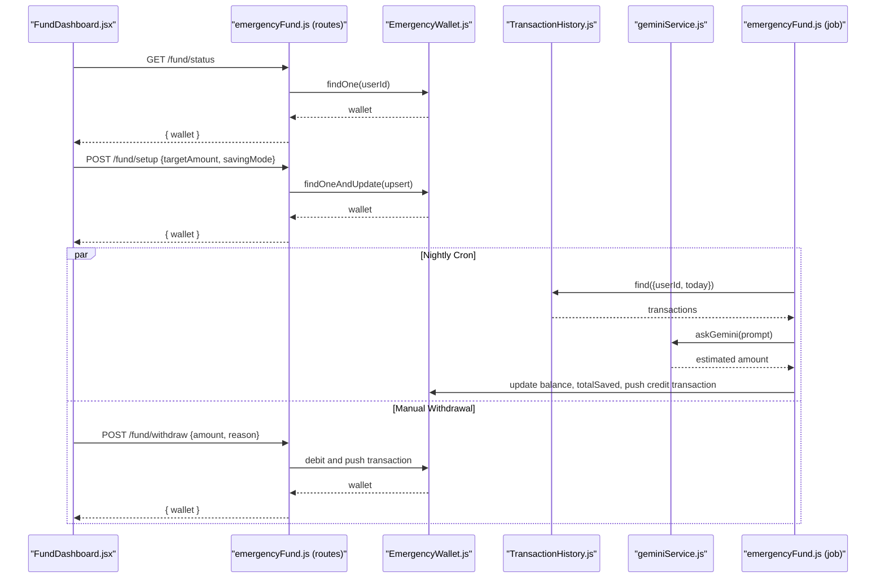

**Diagram sources**
- [FundDashboard.jsx:1-288](file://frontend/src/pages/FundDashboard.jsx#L1-L288)
- [emergencyFund.js:1-93](file://backend/routes/emergencyFund.js#L1-L93)
- [EmergencyWallet.js:1-21](file://backend/models/EmergencyWallet.js#L1-L21)
- [TransactionHistory.js:1-19](file://backend/models/TransactionHistory.js#L1-L19)
- [geminiService.js:1-29](file://backend/services/geminiService.js#L1-L29)
- [emergencyFund.js:1-76](file://backend/jobs/emergencyFund.js#L1-L76)

## Detailed Component Analysis

### EmergencyWallet Model Schema
The EmergencyWallet aggregates user-specific emergency fund data and maintains a transaction log.

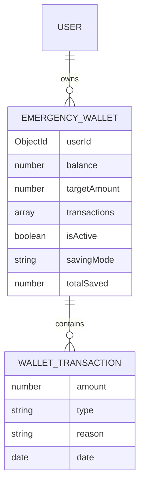

- Fields:
  - userId: references User
  - balance: current emergency fund balance
  - targetAmount: desired accumulation goal
  - transactions: array of credit/debit entries
  - isActive: enables/disables automatic transfers
  - savingMode: gentle/moderate/aggressive
  - totalSaved: lifetime accumulated amount

**Diagram sources**
- [EmergencyWallet.js:1-21](file://backend/models/EmergencyWallet.js#L1-L21)

**Section sources**
- [EmergencyWallet.js:1-21](file://backend/models/EmergencyWallet.js#L1-L21)

### Transaction History Model
Daily spending records are indexed for efficient querying by user and timestamp.

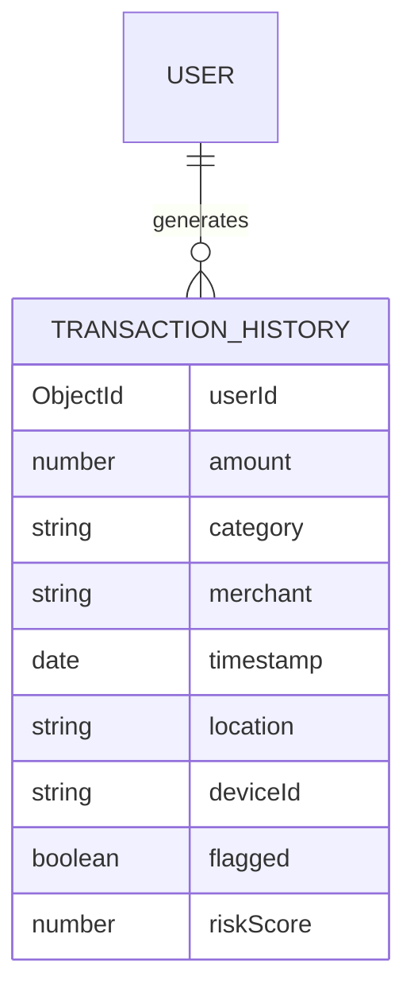

- Indexes: (userId, timestamp), (userId, category)
- Used by the job to compute daily micro-savings and by the dashboard for insights.

**Diagram sources**
- [TransactionHistory.js:1-19](file://backend/models/TransactionHistory.js#L1-L19)

**Section sources**
- [TransactionHistory.js:1-19](file://backend/models/TransactionHistory.js#L1-L19)

### Fund Setup and Configuration
- Endpoint: POST /fund/setup
- Behavior:
  - Upserts EmergencyWallet for the authenticated user
  - Sets targetAmount and savingMode
  - Activates the fund
- Frontend integration:
  - Calls emergencyFundService.setup
  - Updates local state and triggers notifications

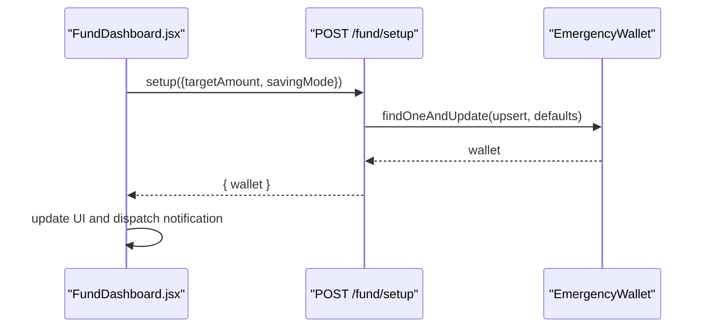

**Diagram sources**
- [emergencyFund.js:8-26](file://backend/routes/emergencyFund.js#L8-L26)
- [FundDashboard.jsx:69-85](file://frontend/src/pages/FundDashboard.jsx#L69-L85)

**Section sources**
- [emergencyFund.js:8-26](file://backend/routes/emergencyFund.js#L8-L26)
- [FundDashboard.jsx:69-85](file://frontend/src/pages/FundDashboard.jsx#L69-L85)

### Transaction Processing Mechanisms
- Daily micro-savings:
  - Cron job runs nightly to compute potential savings per transaction using rounding rules
  - Aggregates today’s savings and queries AI for a conservative transfer amount
  - Applies the minimum of AI estimate and computed savings
- Round-up logic:
  - Gentle: round to nearest 10
  - Moderate: round to nearest 50
  - Aggressive: round to nearest 100
- TransactionHistory is queried for the current day’s spending.

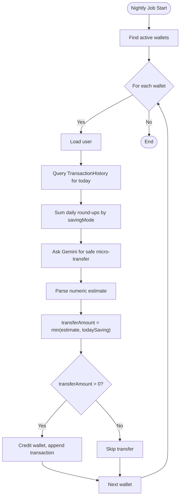

**Diagram sources**
- [emergencyFund.js:8-76](file://backend/jobs/emergencyFund.js#L8-L76)
- [fundBuilder.js:7-12](file://backend/utils/fundBuilder.js#L7-L12)

**Section sources**
- [emergencyFund.js:8-76](file://backend/jobs/emergencyFund.js#L8-L76)
- [fundBuilder.js:7-12](file://backend/utils/fundBuilder.js#L7-L12)

### Savings Tracking and Visualization
- Frontend dashboard displays:
  - Current balance, total saved, and progress toward target
  - Circular progress visualization and bar chart of auto-saving history
  - Support runway calculation based on current balance
  - AI-generated savings tips integrated via Gemini
- Data sources:
  - Status endpoint for wallet data
  - Dashboard context for financial overview (income, expenses, EMI)

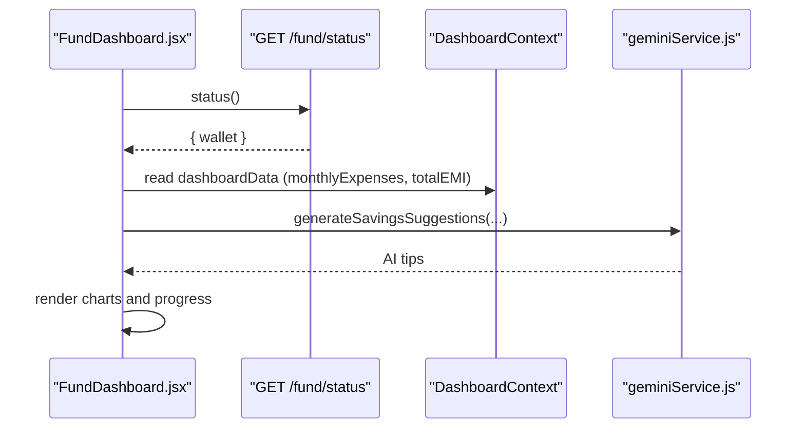

**Diagram sources**
- [FundDashboard.jsx:35-67](file://frontend/src/pages/FundDashboard.jsx#L35-L67)
- [DashboardContext.jsx:11-30](file://frontend/src/context/DashboardContext.jsx#L11-L30)
- [geminiService.js:17-26](file://backend/services/geminiService.js#L17-L26)

**Section sources**
- [FundDashboard.jsx:1-288](file://frontend/src/pages/FundDashboard.jsx#L1-L288)
- [DashboardContext.jsx:1-46](file://frontend/src/context/DashboardContext.jsx#L1-L46)

### Withdrawal Management Procedures
- Endpoint: POST /fund/withdraw
- Behavior:
  - Validates amount and checks balance
  - Decrements balance and appends a debit transaction
- Frontend:
  - Calls emergencyFundService.withdraw
  - Updates UI and persists state

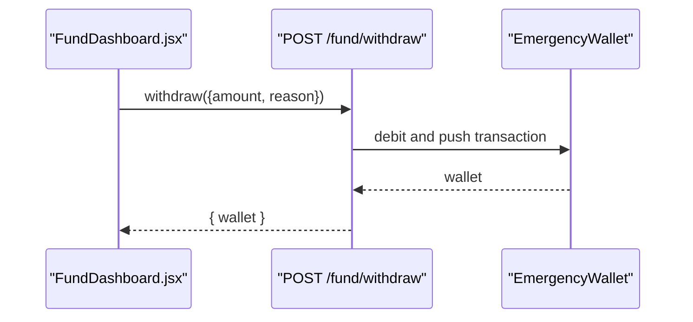

**Diagram sources**
- [emergencyFund.js:41-59](file://backend/routes/emergencyFund.js#L41-L59)
- [FundDashboard.jsx:1-288](file://frontend/src/pages/FundDashboard.jsx#L1-L288)

**Section sources**
- [emergencyFund.js:41-59](file://backend/routes/emergencyFund.js#L41-L59)
- [FundDashboard.jsx:1-288](file://frontend/src/pages/FundDashboard.jsx#L1-L288)

### Automated Fund Management Jobs
- Scheduled: Every day at 2 AM
- Responsibilities:
  - Iterate active wallets
  - Compute daily round-ups from TransactionHistory
  - Query Gemini for a conservative transfer recommendation
  - Apply the minimum of AI estimate and computed savings
  - Update balance, totalSaved, and append a credit transaction

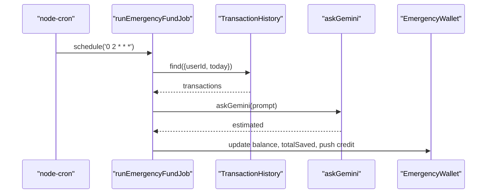

**Diagram sources**
- [emergencyFund.js:70-76](file://backend/jobs/emergencyFund.js#L70-L76)
- [emergencyFund.js:8-76](file://backend/jobs/emergencyFund.js#L8-L76)

**Section sources**
- [emergencyFund.js:1-76](file://backend/jobs/emergencyFund.js#L1-L76)
- [server.js:122-122](file://backend/server.js#L122-L122)

### Notification Systems
- Notification model supports in-app/email/SMS channels with types like TIP and MILESTONE.
- Frontend dispatches bilingual notifications for user feedback (e.g., saving mode change).
- Integration points:
  - Frontend emits CustomEvent 'add-notification' with localized messages
  - Backend Notification model can be extended for system-wide alerts

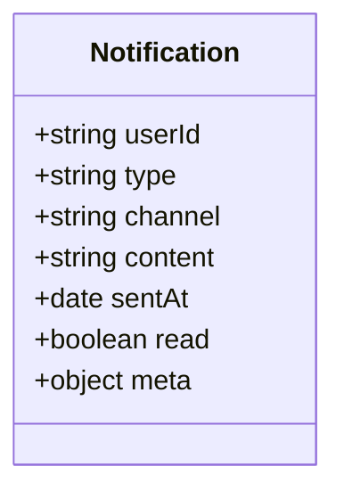

**Diagram sources**
- [Notification.js:1-47](file://backend/models/Notification.js#L1-L47)

**Section sources**
- [FundDashboard.jsx:75-81](file://frontend/src/pages/FundDashboard.jsx#L75-L81)
- [Notification.js:1-47](file://backend/models/Notification.js#L1-L47)

### Integration with Financial Dashboard
- The dashboard controller provides monthly income, expenses, disposable income, total EMI, and stress metrics.
- FundDashboard reads dashboardData to inform AI savings suggestions and contextualize recommendations.
- Routes:
  - GET /dashboard returns financial snapshot
  - PUT /dashboard/financial-info updates income/expenses

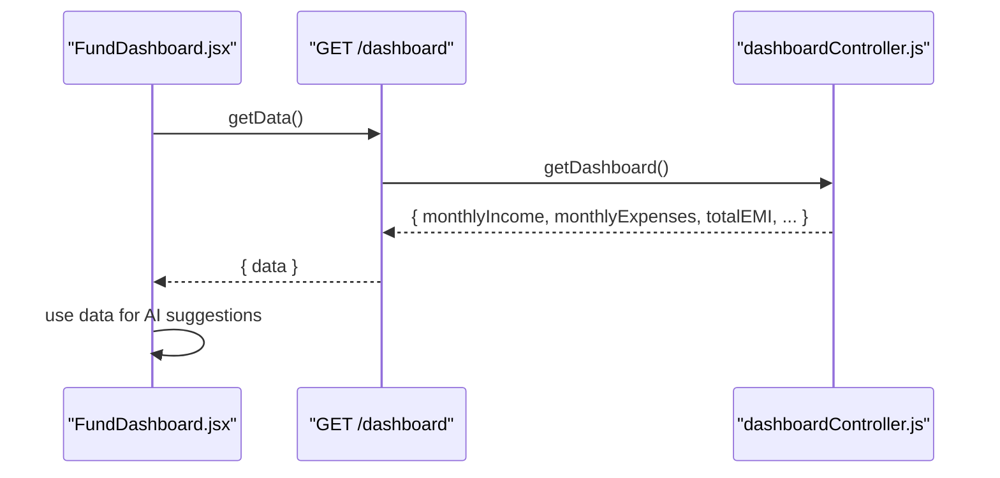

**Diagram sources**
- [FundDashboard.jsx:35-67](file://frontend/src/pages/FundDashboard.jsx#L35-L67)
- [dashboardController.js:5-84](file://backend/controllers/dashboardController.js#L5-L84)

**Section sources**
- [dashboardController.js:1-116](file://backend/controllers/dashboardController.js#L1-L116)
- [FundDashboard.jsx:1-288](file://frontend/src/pages/FundDashboard.jsx#L1-L288)

## Dependency Analysis
- Routes depend on:
  - EmergencyWallet model for persistence
  - Gemini service for AI assistance
- Job depends on:
  - EmergencyWallet and TransactionHistory for data
  - fundBuilder utility for round-up calculations
  - Gemini service for estimates
- Frontend depends on:
  - emergencyFundService for fund operations
  - DashboardContext for financial context
  - Gemini service for AI tips

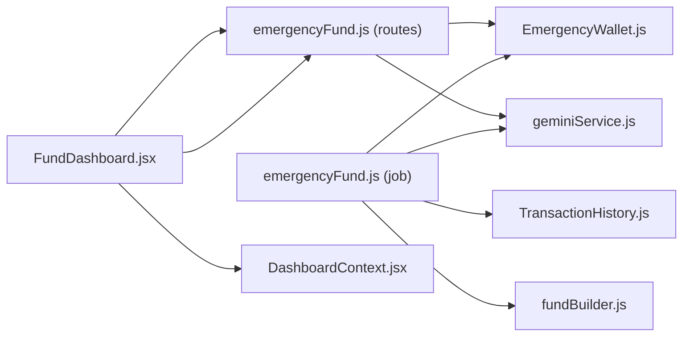

**Diagram sources**
- [FundDashboard.jsx:1-288](file://frontend/src/pages/FundDashboard.jsx#L1-L288)
- [emergencyFund.js:1-93](file://backend/routes/emergencyFund.js#L1-L93)
- [emergencyFund.js:1-76](file://backend/jobs/emergencyFund.js#L1-L76)
- [EmergencyWallet.js:1-21](file://backend/models/EmergencyWallet.js#L1-L21)
- [TransactionHistory.js:1-19](file://backend/models/TransactionHistory.js#L1-L19)
- [fundBuilder.js:1-39](file://backend/utils/fundBuilder.js#L1-L39)
- [geminiService.js:1-29](file://backend/services/geminiService.js#L1-L29)
- [DashboardContext.jsx:1-46](file://frontend/src/context/DashboardContext.jsx#L1-L46)

**Section sources**
- [emergencyFund.js:1-93](file://backend/routes/emergencyFund.js#L1-L93)
- [emergencyFund.js:1-76](file://backend/jobs/emergencyFund.js#L1-L76)
- [FundDashboard.jsx:1-288](file://frontend/src/pages/FundDashboard.jsx#L1-L288)

## Performance Considerations
- Indexing:
  - TransactionHistory uses compound indexes on (userId, timestamp) and (userId, category) to speed up daily queries.
- Cron scheduling:
  - Runs at off-peak hour (2 AM) to minimize impact on user activity.
- AI fallback:
  - Job continues even if Gemini fails, using computed savings as a baseline.
- Frontend caching:
  - Dashboard data is fetched once and reused across components to reduce network overhead.

[No sources needed since this section provides general guidance]

## Troubleshooting Guide
- Setup errors:
  - Verify user authentication and presence of targetAmount and savingMode.
- Status not found:
  - Ensure wallet exists for the user; initialize via setup endpoint.
- Withdrawal failures:
  - Confirm sufficient balance and positive amount.
- Cron job failures:
  - Check logs for database connectivity and Gemini API availability.
- Frontend not updating:
  - Ensure emergencyFundService calls succeed and state updates occur after API responses.

**Section sources**
- [emergencyFund.js:8-26](file://backend/routes/emergencyFund.js#L8-L26)
- [emergencyFund.js:28-39](file://backend/routes/emergencyFund.js#L28-L39)
- [emergencyFund.js:41-59](file://backend/routes/emergencyFund.js#L41-L59)
- [emergencyFund.js:65-67](file://backend/jobs/emergencyFund.js#L65-L67)

## Conclusion
The Emergency Fund Management system combines user-configurable saving modes, automated micro-savings computed from daily transactions, and AI-driven recommendations to build a resilient emergency fund. The frontend dashboard offers real-time visibility and actionable insights, while backend jobs ensure consistent, low-friction contributions. Integrations with the broader financial dashboard enrich context-aware suggestions and support informed financial decisions.

[No sources needed since this section summarizes without analyzing specific files]

## Appendices

### API Definitions
- POST /fund/setup
  - Body: { targetAmount: number, savingMode: "gentle" | "moderate" | "aggressive" }
  - Response: { wallet }
- GET /fund/status
  - Response: { wallet }
- POST /fund/withdraw
  - Body: { amount: number, reason?: string }
  - Response: { wallet }
- POST /fund/calculate-savings
  - Body: { income: number, spendingPattern: string, balance: number }
  - Response: { suggestedAmount: number }

**Section sources**
- [emergencyFund.js:8-90](file://backend/routes/emergencyFund.js#L8-L90)

### Frontend Routing and Integration
- Route: /emergency-fund maps to FundDashboard page.
- Services:
  - emergencyFundService exposes setup, status, and withdraw methods.
  - DashboardContext provides financial data consumed by FundDashboard.

**Section sources**
- [App.jsx:41-41](file://frontend/src/App.jsx#L41-L41)
- [api.js:74-78](file://frontend/src/services/api.js#L74-L78)
- [DashboardContext.jsx:11-30](file://frontend/src/context/DashboardContext.jsx#L11-L30)