# Family Dashboard System

<cite>
**Referenced Files in This Document**
- [FamilyGroup.js](file://backend/models/FamilyGroup.js)
- [FamilyMember.js](file://backend/models/FamilyMember.js)
- [family.js](file://backend/routes/family.js)
- [v1Family.js](file://backend/routes/v1Family.js)
- [FamilyDashboard.jsx](file://frontend/src/components/FamilyDashboard.jsx)
- [FamilyDashboardPage.jsx](file://frontend/src/pages/FamilyDashboard.jsx)
- [api.js](file://frontend/src/services/api.js)
- [server.js](file://backend/server.js)
- [authMiddleware.js](file://backend/middleware/authMiddleware.js)
- [dashboardController.js](file://backend/controllers/dashboardController.js)
- [finance.js](file://backend/utils/finance.js)
</cite>

## Table of Contents
1. [Introduction](#introduction)
2. [Project Structure](#project-structure)
3. [Core Components](#core-components)
4. [Architecture Overview](#architecture-overview)
5. [Detailed Component Analysis](#detailed-component-analysis)
6. [Dependency Analysis](#dependency-analysis)
7. [Performance Considerations](#performance-considerations)
8. [Troubleshooting Guide](#troubleshooting-guide)
9. [Conclusion](#conclusion)

## Introduction
The Family Dashboard System enables families to collaborate on shared finances, manage group memberships, and monitor spending through a centralized shared wallet. It provides:
- Group creation and management with administrative controls
- Shared wallet funding, tracking, and transaction logging
- Member role-based permissions and monthly spending limits
- Real-time dashboards powered by AI summaries
- Invitation workflows for adding family members
- Frontend interface for intuitive financial collaboration

## Project Structure
The system spans a modern MERN stack with clear separation of concerns:
- Backend: Express.js server with MongoDB ODM (Mongoose), JWT-based authentication, and modular routes
- Frontend: React-based SPA with service layer abstraction and localized UI components
- Models: FamilyGroup and FamilyMember schemas define the domain model for family ecosystems
- Routes: REST endpoints for group lifecycle, invitations, and wallet operations
- Services: Axios-based API client encapsulating backend endpoints
- Middleware: Authentication guard ensuring protected access to sensitive operations

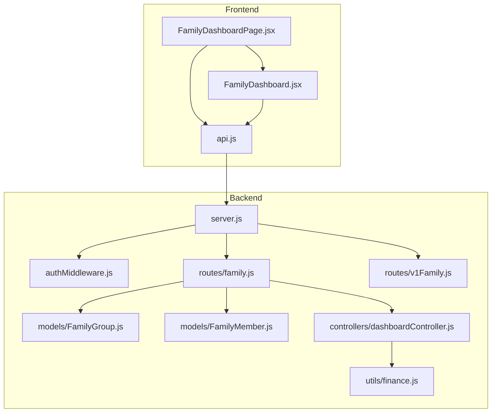

**Diagram sources**
- [server.js:1-150](file://backend/server.js#L1-L150)
- [family.js:1-226](file://backend/routes/family.js#L1-L226)
- [v1Family.js:1-11](file://backend/routes/v1Family.js#L1-L11)
- [FamilyGroup.js:1-51](file://backend/models/FamilyGroup.js#L1-L51)
- [FamilyMember.js:1-14](file://backend/models/FamilyMember.js#L1-L14)
- [dashboardController.js:1-116](file://backend/controllers/dashboardController.js#L1-L116)
- [finance.js:1-117](file://backend/utils/finance.js#L1-L117)
- [FamilyDashboardPage.jsx:1-235](file://frontend/src/pages/FamilyDashboard.jsx#L1-L235)
- [FamilyDashboard.jsx:1-295](file://frontend/src/components/FamilyDashboard.jsx#L1-L295)
- [api.js:1-104](file://frontend/src/services/api.js#L1-L104)

**Section sources**
- [server.js:1-150](file://backend/server.js#L1-L150)
- [family.js:1-226](file://backend/routes/family.js#L1-L226)
- [v1Family.js:1-11](file://backend/routes/v1Family.js#L1-L11)
- [FamilyGroup.js:1-51](file://backend/models/FamilyGroup.js#L1-L51)
- [FamilyMember.js:1-14](file://backend/models/FamilyMember.js#L1-L14)
- [FamilyDashboardPage.jsx:1-235](file://frontend/src/pages/FamilyDashboard.jsx#L1-L235)
- [FamilyDashboard.jsx:1-295](file://frontend/src/components/FamilyDashboard.jsx#L1-L295)
- [api.js:1-104](file://frontend/src/services/api.js#L1-L104)

## Core Components
This section documents the primary building blocks of the Family Dashboard System.

### FamilyGroup Model
The FamilyGroup model defines the shared family ecosystem:
- Group identity: name, admin user, creation timestamp
- Membership: array of FamilyMember entries with roles and limits
- Shared wallet: balance, transaction ledger, and funding requests
- Goals: collection of family-saving targets with contributors

Key schema highlights:
- Embedded FamilyMemberSchema with role enumeration and monthlyLimit
- Embedded GroupTransactionSchema for wallet activity
- Indexes on members.userId and adminUserId for efficient lookups

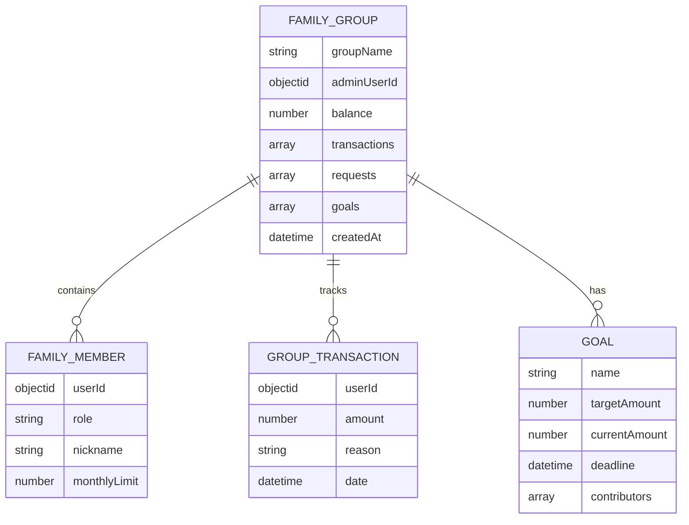

**Diagram sources**
- [FamilyGroup.js:18-45](file://backend/models/FamilyGroup.js#L18-L45)

**Section sources**
- [FamilyGroup.js:1-51](file://backend/models/FamilyGroup.js#L1-L51)

### FamilyMember Model
The FamilyMember model represents a user's participation in a specific family group:
- Links a User to a FamilyGroup
- Role-based permissions (parent, child, elder)
- Optional nickname and monthly spending limit

Indexing ensures fast lookups by user and group combination.

**Section sources**
- [FamilyMember.js:1-14](file://backend/models/FamilyMember.js#L1-L14)

### Family Routes and Permissions
The family routes implement the core workflows:
- Auto-provisioning of a family group for a user if none exists
- Group creation with admin privileges
- Member invitation with role and limit assignment
- Dashboard retrieval gated by membership
- Shared wallet top-ups with authorization checks

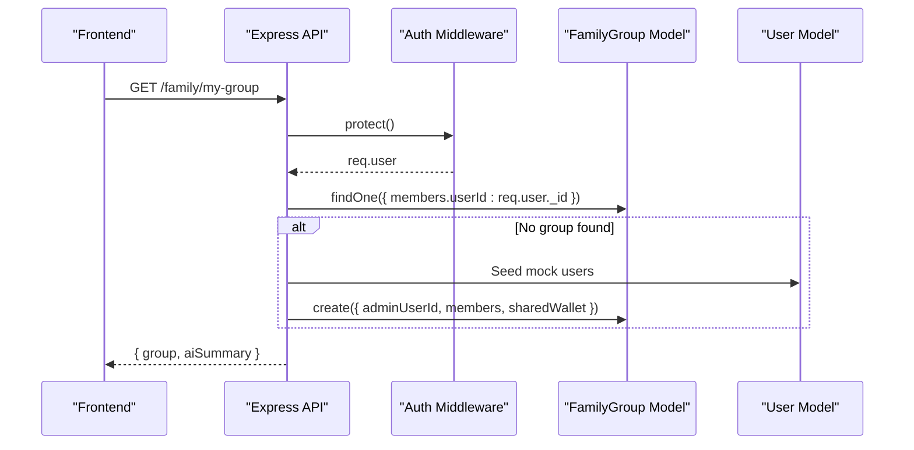

**Diagram sources**
- [family.js:9-116](file://backend/routes/family.js#L9-L116)
- [authMiddleware.js:1-35](file://backend/middleware/authMiddleware.js#L1-L35)

**Section sources**
- [family.js:1-226](file://backend/routes/family.js#L1-L226)
- [authMiddleware.js:1-35](file://backend/middleware/authMiddleware.js#L1-L35)

### Frontend Family Interface
The frontend provides an intuitive dashboard:
- Auto-initialization of a family group on page load
- Group creation with customizable name
- Invitation form for adding members with role and limit
- Real-time notifications for actions
- Shared wallet balance display and quick top-up
- Recent transactions table with member attribution

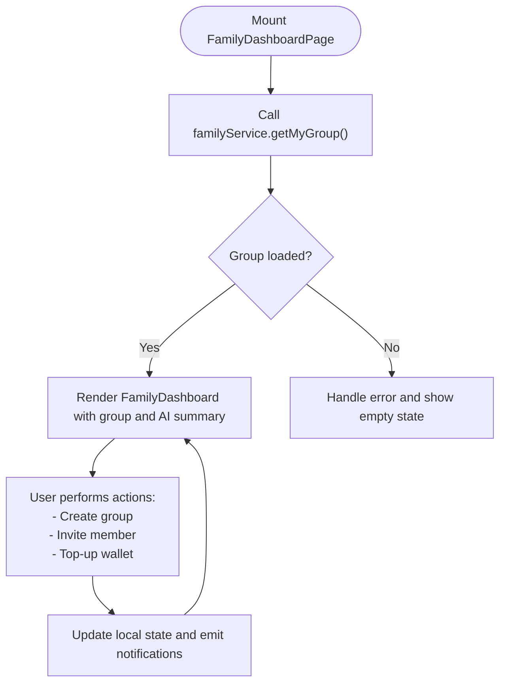

**Diagram sources**
- [FamilyDashboardPage.jsx:27-43](file://frontend/src/pages/FamilyDashboard.jsx#L27-L43)
- [FamilyDashboard.jsx:38-57](file://frontend/src/components/FamilyDashboard.jsx#L38-L57)

**Section sources**
- [FamilyDashboardPage.jsx:1-235](file://frontend/src/pages/FamilyDashboard.jsx#L1-L235)
- [FamilyDashboard.jsx:1-295](file://frontend/src/components/FamilyDashboard.jsx#L1-L295)
- [api.js:80-87](file://frontend/src/services/api.js#L80-L87)

## Architecture Overview
The system follows a layered architecture:
- Presentation Layer: React components and pages
- Service Layer: Axios-based API client encapsulating backend endpoints
- Application Layer: Express routes implementing business logic
- Persistence Layer: Mongoose models with MongoDB collections
- Security Layer: JWT-based authentication middleware

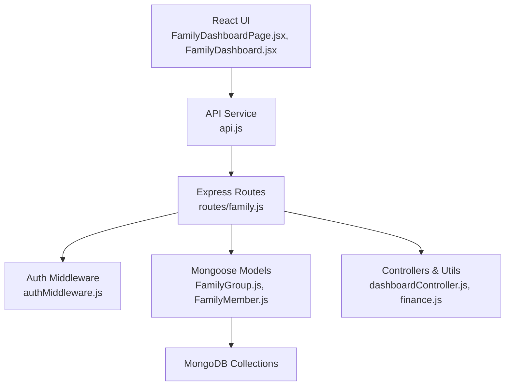

**Diagram sources**
- [FamilyDashboardPage.jsx:1-235](file://frontend/src/pages/FamilyDashboard.jsx#L1-L235)
- [FamilyDashboard.jsx:1-295](file://frontend/src/components/FamilyDashboard.jsx#L1-L295)
- [api.js:1-104](file://frontend/src/services/api.js#L1-L104)
- [family.js:1-226](file://backend/routes/family.js#L1-L226)
- [authMiddleware.js:1-35](file://backend/middleware/authMiddleware.js#L1-L35)
- [FamilyGroup.js:1-51](file://backend/models/FamilyGroup.js#L1-L51)
- [FamilyMember.js:1-14](file://backend/models/FamilyMember.js#L1-L14)
- [dashboardController.js:1-116](file://backend/controllers/dashboardController.js#L1-L116)
- [finance.js:1-117](file://backend/utils/finance.js#L1-L117)

## Detailed Component Analysis

### Group Creation and Management
- Endpoint: POST /api/family/create
- Behavior: Creates a new group with the requesting user as admin and adds them as a parent member
- Validation: Requires a non-empty group name
- Response: Returns the newly created group

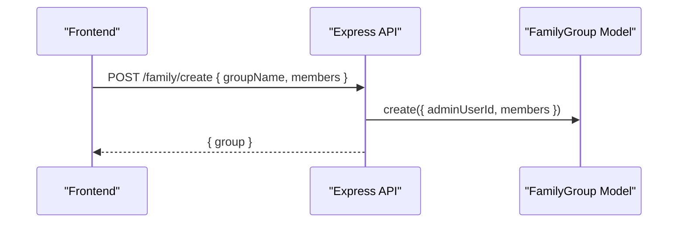

**Diagram sources**
- [family.js:118-142](file://backend/routes/family.js#L118-L142)

**Section sources**
- [family.js:118-142](file://backend/routes/family.js#L118-L142)

### Member Invitation Workflow
- Endpoint: POST /api/family/invite
- Authorization: Only the group admin can invite
- Validation: Ensures groupId, email, and role are present; checks user existence and absence from group
- Behavior: Adds a new member with provided role, nickname, and monthlyLimit
- Response: Returns the updated group

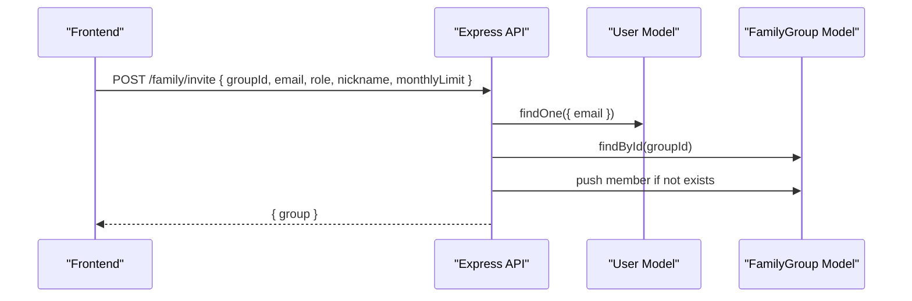

**Diagram sources**
- [family.js:144-172](file://backend/routes/family.js#L144-L172)

**Section sources**
- [family.js:144-172](file://backend/routes/family.js#L144-L172)

### Shared Wallet Operations
- Top-up endpoint: POST /api/family/:id/wallet/topup
- Authorization: Only group members can contribute
- Validation: Requires a positive amount and valid group ID
- Behavior: Increases balance and logs a transaction
- Response: Returns the updated group

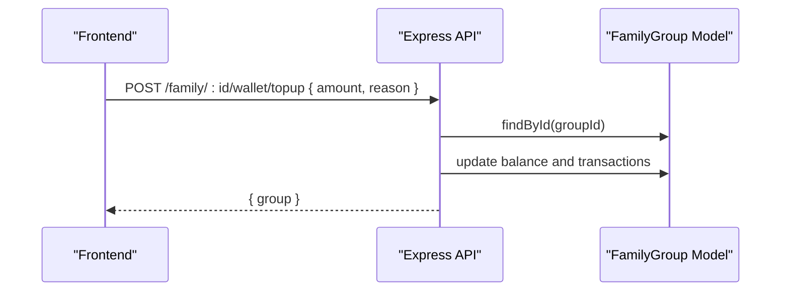

**Diagram sources**
- [family.js:201-223](file://backend/routes/family.js#L201-L223)

**Section sources**
- [family.js:201-223](file://backend/routes/family.js#L201-L223)

### Member Monitoring and Activity Tracking
- Dashboard endpoint: GET /api/family/:id/dashboard
- Authorization: Only group members can view
- Behavior: Populates member details and generates an AI summary of financial health
- Response: Returns the group and AI summary

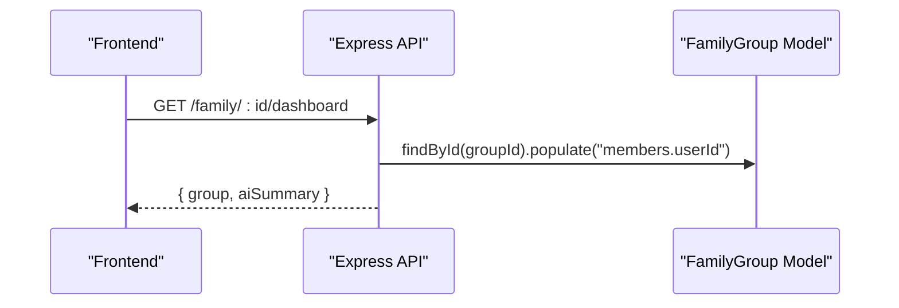

**Diagram sources**
- [family.js:174-199](file://backend/routes/family.js#L174-L199)

**Section sources**
- [family.js:174-199](file://backend/routes/family.js#L174-L199)

### Permission Systems and Relationship Management
- Admin-only operations: Creating groups and inviting members
- Membership checks: Verifying group membership for dashboard access and wallet top-ups
- Role-based modeling: FamilyMember role determines participation scope
- Indexing: Efficient lookups on members.userId and adminUserId

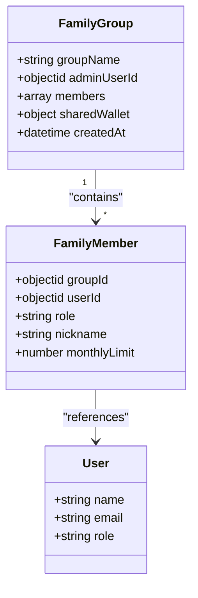

**Diagram sources**
- [FamilyGroup.js:25-45](file://backend/models/FamilyGroup.js#L25-L45)
- [FamilyMember.js:3-9](file://backend/models/FamilyMember.js#L3-L9)

**Section sources**
- [FamilyGroup.js:1-51](file://backend/models/FamilyGroup.js#L1-L51)
- [FamilyMember.js:1-14](file://backend/models/FamilyMember.js#L1-L14)
- [family.js:158-160](file://backend/routes/family.js#L158-L160)
- [family.js:211-213](file://backend/routes/family.js#L211-L213)

### Collaborative Financial Planning Tools
- AI-driven summaries: Generated via Gemini service to assess financial health
- Transaction ledger: Real-time visibility into contributions and withdrawals
- Monthly limits: Built-in controls to manage spending across members
- Goal tracking: Integrated with broader financial planning workflows

**Section sources**
- [family.js:94-110](file://backend/routes/family.js#L94-L110)
- [family.js:187-193](file://backend/routes/family.js#L187-L193)
- [FamilyGroup.js:10-16](file://backend/models/FamilyGroup.js#L10-L16)

## Dependency Analysis
The system exhibits clear separation of concerns with minimal coupling between layers.

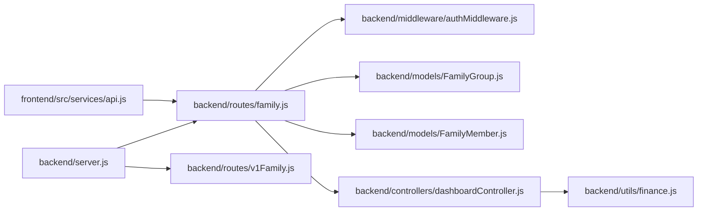

**Diagram sources**
- [api.js:80-87](file://frontend/src/services/api.js#L80-L87)
- [family.js:1-226](file://backend/routes/family.js#L1-L226)
- [authMiddleware.js:1-35](file://backend/middleware/authMiddleware.js#L1-L35)
- [FamilyGroup.js:1-51](file://backend/models/FamilyGroup.js#L1-L51)
- [FamilyMember.js:1-14](file://backend/models/FamilyMember.js#L1-L14)
- [dashboardController.js:1-116](file://backend/controllers/dashboardController.js#L1-L116)
- [finance.js:1-117](file://backend/utils/finance.js#L1-L117)
- [server.js:109-118](file://backend/server.js#L109-L118)
- [v1Family.js:1-11](file://backend/routes/v1Family.js#L1-L11)

**Section sources**
- [api.js:80-87](file://frontend/src/services/api.js#L80-L87)
- [family.js:1-226](file://backend/routes/family.js#L1-L226)
- [server.js:109-118](file://backend/server.js#L109-L118)

## Performance Considerations
- Database indexing: Composite indexes on FamilyGroup members.userId and adminUserId improve query performance for membership checks and admin operations
- Population strategy: Populate member user details only when needed to minimize payload sizes
- AI summary caching: Consider caching AI summaries to reduce repeated LLM calls during frequent dashboard refreshes
- Pagination: For large transaction histories, implement pagination to keep the UI responsive
- Token verification: Ensure JWT secret management and token expiration policies are enforced consistently

[No sources needed since this section provides general guidance]

## Troubleshooting Guide
Common issues and resolutions:
- Authentication failures: Verify JWT token presence and validity; ensure Authorization header is attached to requests
- Authorization errors: Confirm the requester is the group admin for invitation and creation operations, or a group member for dashboard and top-up operations
- Group not found: Validate the groupId parameter and ensure it matches an existing FamilyGroup document
- User not found: Ensure the invited email corresponds to a registered User account
- Network connectivity: Check frontend API base URL configuration and CORS settings on the backend

**Section sources**
- [authMiddleware.js:4-31](file://backend/middleware/authMiddleware.js#L4-L31)
- [family.js:158-160](file://backend/routes/family.js#L158-L160)
- [family.js:211-213](file://backend/routes/family.js#L211-L213)
- [api.js:4-7](file://frontend/src/services/api.js#L4-L7)

## Conclusion
The Family Dashboard System provides a robust foundation for collaborative family finance management. Its modular design, clear permission boundaries, and real-time dashboards enable families to share resources, monitor spending, and make informed financial decisions together. The documented models, routes, and frontend components offer a comprehensive blueprint for extending functionality, integrating additional financial tools, and scaling to larger family ecosystems.