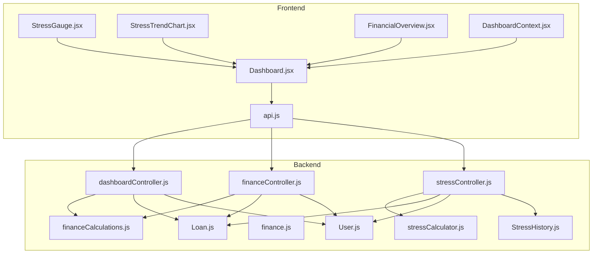
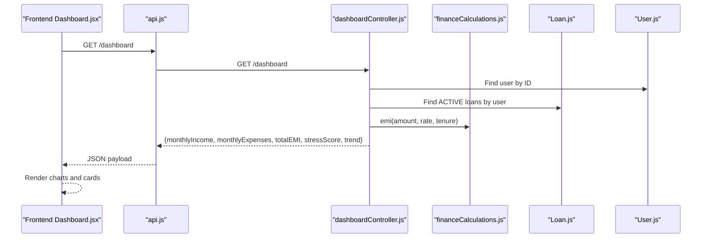
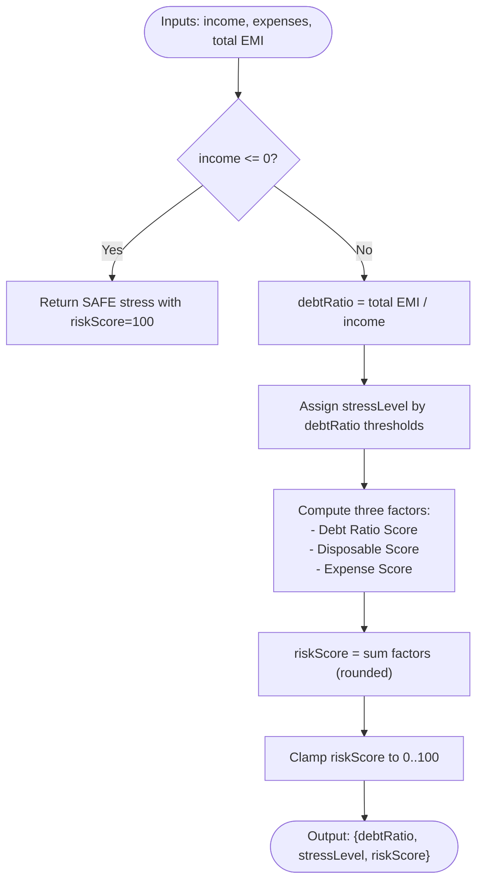
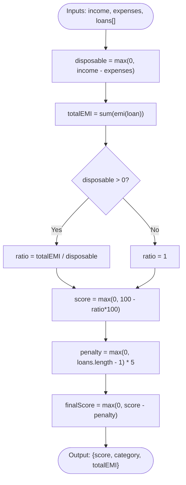
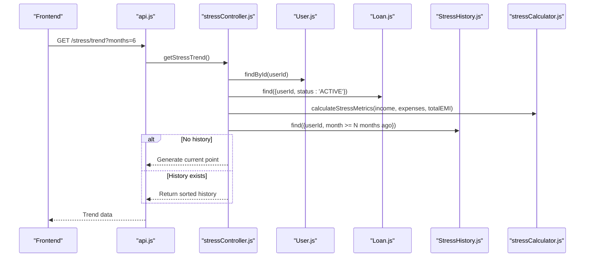
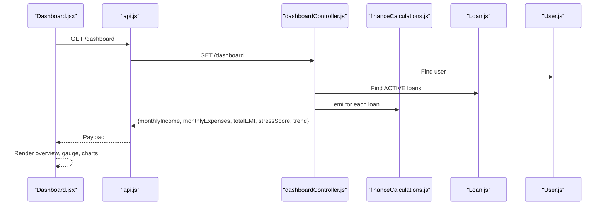
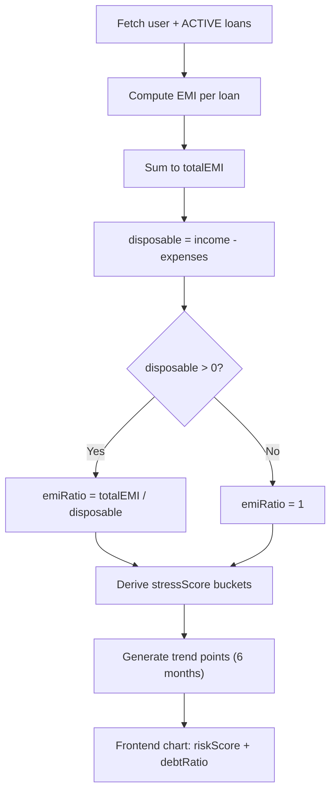
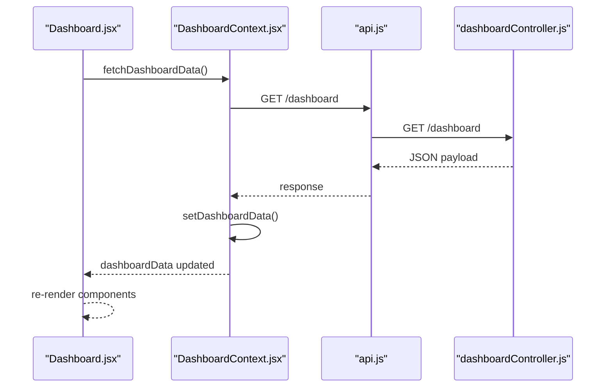
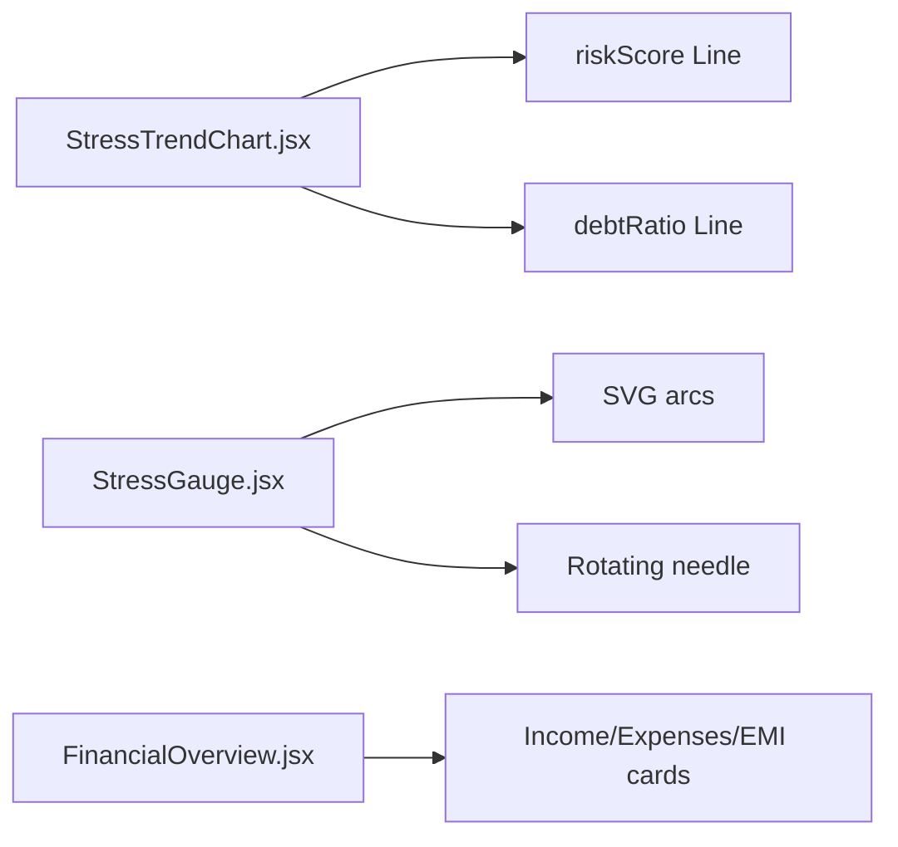
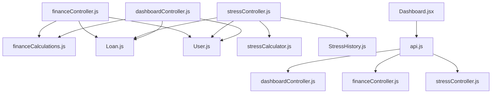

# Financial Analysis Engine

<cite>
**Referenced Files in This Document**
- [stressCalculator.js](file://backend/utils/stressCalculator.js)
- [financeCalculations.js](file://backend/utils/financeCalculations.js)
- [finance.js](file://backend/utils/finance.js)
- [stressController.js](file://backend/controllers/stressController.js)
- [financeController.js](file://backend/controllers/financeController.js)
- [dashboardController.js](file://backend/controllers/dashboardController.js)
- [StressHistory.js](file://backend/models/StressHistory.js)
- [User.js](file://backend/models/User.js)
- [Loan.js](file://backend/models/Loan.js)
- [Dashboard.jsx](file://frontend/src/pages/Dashboard.jsx)
- [StressGauge.jsx](file://frontend/src/components/StressGauge.jsx)
- [StressTrendChart.jsx](file://frontend/src/components/StressTrendChart.jsx)
- [FinancialOverview.jsx](file://frontend/src/components/FinancialOverview.jsx)
- [DashboardContext.jsx](file://frontend/src/context/DashboardContext.jsx)
- [api.js](file://frontend/src/services/api.js)
</cite>

## Table of Contents
1. [Introduction](#introduction)
2. [Project Structure](#project-structure)
3. [Core Components](#core-components)
4. [Architecture Overview](#architecture-overview)
5. [Detailed Component Analysis](#detailed-component-analysis)
6. [Dependency Analysis](#dependency-analysis)
7. [Performance Considerations](#performance-considerations)
8. [Troubleshooting Guide](#troubleshooting-guide)
9. [Conclusion](#conclusion)
10. [Appendices](#appendices)

## Introduction
This document describes the Financial Analysis Engine responsible for stress score computation, debt health assessment, and financial overview generation. It explains the stress calculator implementation, EMI-to-income ratio calculations, dynamic stress scoring, financial overview components, data aggregation patterns, trend analysis, dashboard data structures, Recharts-based visualizations, and real-time data updates. It also covers utility functions, validation, and performance optimization strategies, along with practical examples for interpreting stress scores and financial health indicators.

## Project Structure
The engine spans backend utilities and controllers, MongoDB models, and frontend components and services. The backend exposes REST endpoints for stress metrics, financial analysis, and dashboard data. The frontend consumes these endpoints via Axios-based services, renders visualizations with Recharts, and manages real-time updates through a shared context.

**Diagram sources**
- [Dashboard.jsx](file://frontend/src/pages/Dashboard.jsx)
- [StressGauge.jsx](file://frontend/src/components/StressGauge.jsx)
- [StressTrendChart.jsx](file://frontend/src/components/StressTrendChart.jsx)
- [FinancialOverview.jsx](file://frontend/src/components/FinancialOverview.jsx)
- [DashboardContext.jsx](file://frontend/src/context/DashboardContext.jsx)
- [api.js](file://frontend/src/services/api.js)
- [dashboardController.js](file://backend/controllers/dashboardController.js)
- [financeController.js](file://backend/controllers/financeController.js)
- [stressController.js](file://backend/controllers/stressController.js)
- [financeCalculations.js](file://backend/utils/financeCalculations.js)
- [stressCalculator.js](file://backend/utils/stressCalculator.js)
- [finance.js](file://backend/utils/finance.js)
- [User.js](file://backend/models/User.js)
- [Loan.js](file://backend/models/Loan.js)
- [StressHistory.js](file://backend/models/StressHistory.js)

**Section sources**
- [Dashboard.jsx](file://frontend/src/pages/Dashboard.jsx)
- [api.js](file://frontend/src/services/api.js)
- [dashboardController.js](file://backend/controllers/dashboardController.js)
- [financeController.js](file://backend/controllers/financeController.js)
- [stressController.js](file://backend/controllers/stressController.js)

## Core Components
- Stress Calculator Utility: Computes debt ratio, stress level, and risk score; provides color mapping and actionable suggestions.
- Finance Calculations Utility: Implements EMI, total interest, loan end date, debt health score, loan prioritization, simulation, and assistant replies.
- Controllers: Expose endpoints for current stress metrics, stress trends, stress analysis, financial analysis, and dashboard data.
- Models: Define User, Loan, and StressHistory schemas with indexes for efficient queries.
- Frontend Dashboard: Renders financial overview, stress gauge, trend chart, and integrates with backend APIs.

**Section sources**
- [stressCalculator.js](file://backend/utils/stressCalculator.js)
- [financeCalculations.js](file://backend/utils/financeCalculations.js)
- [finance.js](file://backend/utils/finance.js)
- [stressController.js](file://backend/controllers/stressController.js)
- [financeController.js](file://backend/controllers/financeController.js)
- [dashboardController.js](file://backend/controllers/dashboardController.js)
- [User.js](file://backend/models/User.js)
- [Loan.js](file://backend/models/Loan.js)
- [StressHistory.js](file://backend/models/StressHistory.js)
- [Dashboard.jsx](file://frontend/src/pages/Dashboard.jsx)
- [StressGauge.jsx](file://frontend/src/components/StressGauge.jsx)
- [StressTrendChart.jsx](file://frontend/src/components/StressTrendChart.jsx)
- [FinancialOverview.jsx](file://frontend/src/components/FinancialOverview.jsx)

## Architecture Overview
The system follows a layered architecture:
- Presentation Layer: React components and services.
- Application Layer: Express controllers orchestrating data retrieval and transformations.
- Domain Utilities: Pure calculation functions for EMI, debt health, and stress metrics.
- Persistence Layer: Mongoose models backed by MongoDB.

**Diagram sources**
- [Dashboard.jsx](file://frontend/src/pages/Dashboard.jsx)
- [api.js](file://frontend/src/services/api.js)
- [dashboardController.js](file://backend/controllers/dashboardController.js)
- [financeCalculations.js](file://backend/utils/financeCalculations.js)
- [Loan.js](file://backend/models/Loan.js)
- [User.js](file://backend/models/User.js)

## Detailed Component Analysis

### Stress Calculator Implementation
The stress calculator computes:
- Debt Ratio: Total Monthly EMI / Monthly Income
- Stress Level: SAFE (≤30%), RISKY (30–50%), DANGEROUS (>50%)
- Risk Score: Composite score derived from three factors:
  - Debt Ratio factor (0–50)
  - Disposable Income vs EMI factor (0–30)
  - Expense Ratio factor (0–20)
- Color mapping and suggestions are provided for each stress level.

**Diagram sources**
- [stressCalculator.js](file://backend/utils/stressCalculator.js)

**Section sources**
- [stressCalculator.js](file://backend/utils/stressCalculator.js)

### EMI-to-Income Ratio and Debt Health Scoring
- EMI calculation uses the standard amortizing loan formula.
- Debt health score is computed from disposable income and total EMI across all loans, with penalties for multiple loans.
- Loan priority prioritizes by highest interest rate and EMI impact.

**Diagram sources**
- [financeCalculations.js](file://backend/utils/financeCalculations.js)

**Section sources**
- [financeCalculations.js](file://backend/utils/financeCalculations.js)
- [finance.js](file://backend/utils/finance.js)

### Dynamic Stress Scoring System
- Current stress metrics endpoint aggregates active loans, computes stress metrics, and persists debt ratio, stress level, and risk score to the user profile.
- Stress trend endpoint retrieves historical data from StressHistory, falling back to generating a synthetic point if no history exists.
- Stress analysis endpoint enriches current metrics with insights and trend comparisons.

**Diagram sources**
- [stressController.js](file://backend/controllers/stressController.js)
- [User.js](file://backend/models/User.js)
- [Loan.js](file://backend/models/Loan.js)
- [StressHistory.js](file://backend/models/StressHistory.js)
- [stressCalculator.js](file://backend/utils/stressCalculator.js)
- [api.js](file://frontend/src/services/api.js)

**Section sources**
- [stressController.js](file://backend/controllers/stressController.js)
- [StressHistory.js](file://backend/models/StressHistory.js)

### Financial Overview Generation
- Dashboard controller aggregates user financials, active loans, computes EMI per loan, totals EMI, and derives stress score based on EMI-to-disposable ratio.
- Frontend Dashboard.jsx renders:
  - Financial overview cards (income, expenses, total EMI)
  - Stress gauge visualization
  - Stress trend chart
  - Recent loans table
  - Financial health score circular indicator

**Diagram sources**
- [Dashboard.jsx](file://frontend/src/pages/Dashboard.jsx)
- [api.js](file://frontend/src/services/api.js)
- [dashboardController.js](file://backend/controllers/dashboardController.js)
- [financeCalculations.js](file://backend/utils/financeCalculations.js)
- [Loan.js](file://backend/models/Loan.js)
- [User.js](file://backend/models/User.js)

**Section sources**
- [dashboardController.js](file://backend/controllers/dashboardController.js)
- [Dashboard.jsx](file://frontend/src/pages/Dashboard.jsx)
- [FinancialOverview.jsx](file://frontend/src/components/FinancialOverview.jsx)
- [StressGauge.jsx](file://frontend/src/components/StressGauge.jsx)
- [StressTrendChart.jsx](file://frontend/src/components/StressTrendChart.jsx)

### Data Aggregation Patterns and Trend Analysis
- Dashboard aggregates recent loans and computes EMI-to-disposable ratio to derive a stress score.
- Stress trend data is generated for the last six months, enabling trend analysis in the frontend chart.
- The frontend trend chart computes a simple moving delta over the last three points to label rising/improving/stable risk trends.

**Diagram sources**
- [dashboardController.js](file://backend/controllers/dashboardController.js)
- [financeCalculations.js](file://backend/utils/financeCalculations.js)
- [StressTrendChart.jsx](file://frontend/src/components/StressTrendChart.jsx)

**Section sources**
- [dashboardController.js](file://backend/controllers/dashboardController.js)
- [StressTrendChart.jsx](file://frontend/src/components/StressTrendChart.jsx)

### Dashboard Data Structure and Real-Time Updates
- Backend returns a single source of truth: monthlyIncome, monthlyExpenses, disposableIncome, totalEMI, emiRatio, stressScore, recentLoans, stressTrend, loansCount.
- Frontend uses a context provider to centralize state and trigger re-renders on successful fetches.
- Financial setup modal allows updating monthlyIncome and monthlyExpenses, which triggers a refetch.

**Diagram sources**
- [Dashboard.jsx](file://frontend/src/pages/Dashboard.jsx)
- [DashboardContext.jsx](file://frontend/src/context/DashboardContext.jsx)
- [api.js](file://frontend/src/services/api.js)
- [dashboardController.js](file://backend/controllers/dashboardController.js)

**Section sources**
- [Dashboard.jsx](file://frontend/src/pages/Dashboard.jsx)
- [DashboardContext.jsx](file://frontend/src/context/DashboardContext.jsx)
- [api.js](file://frontend/src/services/api.js)
- [dashboardController.js](file://backend/controllers/dashboardController.js)

### Recharts-Based Visualizations
- Stress Trend Chart: Renders riskScore and debtRatio over time with tooltips and legend; computes a trend label based on the last three points.
- Stress Gauge: SVG-based gauge showing low/moderate/high stress arcs and a needle indicator.
- Financial Overview: Grid of gradient cards for income, expenses, and total EMI.

**Diagram sources**
- [StressTrendChart.jsx](file://frontend/src/components/StressTrendChart.jsx)
- [StressGauge.jsx](file://frontend/src/components/StressGauge.jsx)
- [FinancialOverview.jsx](file://frontend/src/components/FinancialOverview.jsx)

**Section sources**
- [StressTrendChart.jsx](file://frontend/src/components/StressTrendChart.jsx)
- [StressGauge.jsx](file://frontend/src/components/StressGauge.jsx)
- [FinancialOverview.jsx](file://frontend/src/components/FinancialOverview.jsx)

### Financial Calculations Utility Functions
- EMI: Standard amortization formula with zero-rate fallback.
- Total Interest: EMI × tenure − principal.
- Loan End Date: Adds tenure to start date.
- Debt Health Score: Based on disposable income ratio and loan count penalties.
- Loan Priority: Sort by interest rate and EMI impact.
- Simulation: Estimates payoff acceleration via extra EMI or prepayment.
- Assistant Reply: Provides contextual advice based on current state.

**Section sources**
- [financeCalculations.js](file://backend/utils/financeCalculations.js)
- [finance.js](file://backend/utils/finance.js)

### Data Validation and Normalization
- Finance controller validates presence of monthlyIncome, monthlyExpenses, and loans array; normalizes loan entries and computes derived metrics.
- Dashboard controller normalizes loan durations and computes EMI per loan.
- User model enforces numeric constraints for financial fields.

**Section sources**
- [financeController.js](file://backend/controllers/financeController.js)
- [dashboardController.js](file://backend/controllers/dashboardController.js)
- [User.js](file://backend/models/User.js)

## Dependency Analysis
The backend controllers depend on:
- Mongoose models for persistence
- Finance utilities for calculations
- Stress utility for metrics

Frontend depends on:
- Services for API communication
- Context for state management
- Recharts for visualization

**Diagram sources**
- [financeController.js](file://backend/controllers/financeController.js)
- [stressController.js](file://backend/controllers/stressController.js)
- [dashboardController.js](file://backend/controllers/dashboardController.js)
- [financeCalculations.js](file://backend/utils/financeCalculations.js)
- [stressCalculator.js](file://backend/utils/stressCalculator.js)
- [Loan.js](file://backend/models/Loan.js)
- [User.js](file://backend/models/User.js)
- [StressHistory.js](file://backend/models/StressHistory.js)
- [Dashboard.jsx](file://frontend/src/pages/Dashboard.jsx)
- [api.js](file://frontend/src/services/api.js)

**Section sources**
- [financeController.js](file://backend/controllers/financeController.js)
- [stressController.js](file://backend/controllers/stressController.js)
- [dashboardController.js](file://backend/controllers/dashboardController.js)
- [api.js](file://frontend/src/services/api.js)

## Performance Considerations
- Prefer client-side normalization and caching for repeated computations (e.g., EMI derivations) to minimize backend load.
- Use database indexes on StressHistory (userId, month) to speed up trend queries.
- Cap simulation loops and guard against infinite iterations; ensure early exits when payments fail to cover interest.
- Defer heavy chart computations to the frontend; keep backend payloads minimal and structured.
- Batch API requests and debounce frequent updates (e.g., financial setup modal) to reduce network overhead.

[No sources needed since this section provides general guidance]

## Troubleshooting Guide
Common issues and resolutions:
- Unauthorized access: Ensure authentication token is present in local storage and attached to requests.
- Invalid response format: Verify backend returns {success: true, data: payload}.
- Missing financial data: Populate monthlyIncome and monthlyExpenses via the financial setup modal.
- Empty trend data: The backend generates a synthetic point if no StressHistory records exist.
- Zero or negative disposable income: Stress metrics clamp appropriately; ensure accurate income/expense inputs.

**Section sources**
- [DashboardContext.jsx](file://frontend/src/context/DashboardContext.jsx)
- [stressController.js](file://backend/controllers/stressController.js)
- [dashboardController.js](file://backend/controllers/dashboardController.js)

## Conclusion
The Financial Analysis Engine provides a cohesive pipeline for computing stress scores, assessing debt health, aggregating financial data, and visualizing trends. Its modular design separates concerns across utilities, controllers, models, and frontend components, enabling maintainability and scalability. By adhering to validation, indexing, and performance best practices, the system delivers reliable, real-time financial insights.

[No sources needed since this section summarizes without analyzing specific files]

## Appendices

### Stress Score Interpretation Examples
- SAFE (riskScore ≥ 70): Debt ratio ≤30%; room to borrow cautiously.
- RISKY (40–69): Debt ratio 30–50%; monitor borrowing and consider actions.
- DANGEROUS (riskScore < 40): Debt ratio >50%; urgent steps recommended.

**Section sources**
- [stressCalculator.js](file://backend/utils/stressCalculator.js)
- [stressController.js](file://backend/controllers/stressController.js)

### Financial Health Indicators
- Debt-to-Income Ratio: Total EMI divided by monthly income.
- Disposable Income: Monthly income minus monthly expenses.
- Debt Health Score: Derived from disposable ratio and number of loans.
- Loan Priority: Highest interest rate and EMI impact.

**Section sources**
- [financeCalculations.js](file://backend/utils/financeCalculations.js)
- [finance.js](file://backend/utils/finance.js)
- [dashboardController.js](file://backend/controllers/dashboardController.js)