# Fraud Detection System

<cite>
**Referenced Files in This Document**
- [FraudLog.js](file://backend/models/FraudLog.js)
- [TransactionHistory.js](file://backend/models/TransactionHistory.js)
- [Notification.js](file://backend/models/Notification.js)
- [fraudDetection.js](file://backend/utils/fraudDetection.js)
- [geminiService.js](file://backend/services/geminiService.js)
- [fraud.js](file://backend/routes/fraud.js)
- [v1Fraud.js](file://backend/routes/v1Fraud.js)
- [FraudAnalyzer.jsx](file://frontend/src/pages/FraudAnalyzer.jsx)
- [FraudWarningModal.jsx](file://frontend/src/components/FraudWarningModal.jsx)
- [geminiService.js](file://frontend/src/services/geminiService.js)
- [api.jsx](file://frontend/src/services/api.jsx)
- [Navbar.jsx](file://frontend/src/components/Navbar.jsx)
- [App.jsx](file://frontend/src/App.jsx)
</cite>

## Table of Contents
1. [Introduction](#introduction)
2. [Project Structure](#project-structure)
3. [Core Components](#core-components)
4. [Architecture Overview](#architecture-overview)
5. [Detailed Component Analysis](#detailed-component-analysis)
6. [Dependency Analysis](#dependency-analysis)
7. [Performance Considerations](#performance-considerations)
8. [Troubleshooting Guide](#troubleshooting-guide)
9. [Conclusion](#conclusion)
10. [Appendices](#appendices)

## Introduction
This document describes the Fraud Detection System implemented in the Smart Loan Analyzer project. It explains the transaction analysis algorithms, risk assessment methodologies, alert generation mechanisms, and the end-to-end investigation workflow. It also documents the FraudLog model schema, detection criteria, and the frontend fraud analyzer interface, including the warning modal and user notification systems. Real-time monitoring capabilities, pattern recognition algorithms, and integration with external security services are covered, along with performance considerations and data privacy requirements.

## Project Structure
The fraud detection system spans both backend and frontend layers:
- Backend:
  - Routes expose the fraud prediction endpoint.
  - Utilities implement transaction risk analysis using a baseline built from historical transactions.
  - Services integrate with an external AI model provider.
  - Models define the FraudLog and TransactionHistory schemas and support indexing for performance.
- Frontend:
  - A dedicated fraud analyzer page collects transaction inputs and displays risk results.
  - A warning modal prompts users for high-risk decisions.
  - A notification system provides real-time, bilingual in-app alerts.

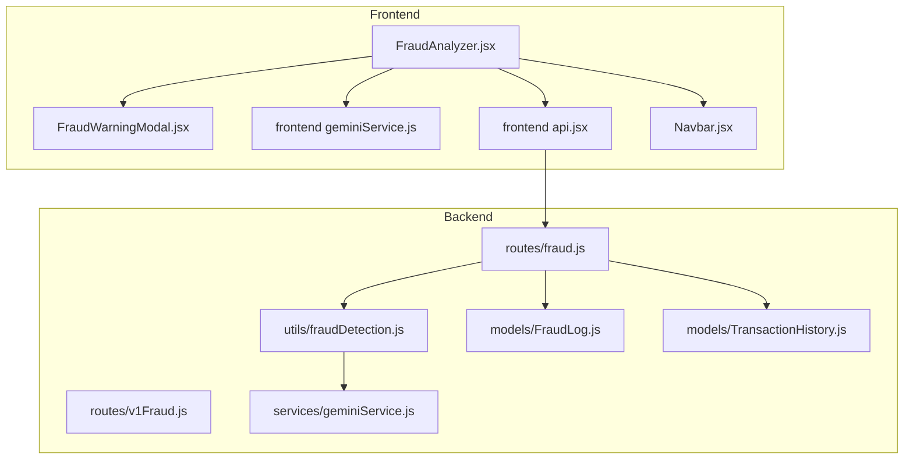

**Diagram sources**
- [FraudAnalyzer.jsx:1-250](file://frontend/src/pages/FraudAnalyzer.jsx#L1-L250)
- [FraudWarningModal.jsx:1-45](file://frontend/src/components/FraudWarningModal.jsx#L1-L45)
- [geminiService.js:1-99](file://frontend/src/services/geminiService.js#L1-L99)
- [api.jsx:1-30](file://frontend/src/services/api.jsx#L1-L30)
- [fraud.js:1-55](file://backend/routes/fraud.js#L1-L55)
- [v1Fraud.js:1-11](file://backend/routes/v1Fraud.js#L1-L11)
- [fraudDetection.js:1-83](file://backend/utils/fraudDetection.js#L1-L83)
- [geminiService.js:1-29](file://backend/services/geminiService.js#L1-L29)
- [FraudLog.js:1-23](file://backend/models/FraudLog.js#L1-L23)
- [TransactionHistory.js:1-19](file://backend/models/TransactionHistory.js#L1-L19)
- [Navbar.jsx:68-299](file://frontend/src/components/Navbar.jsx#L68-L299)

**Section sources**
- [App.jsx:1-58](file://frontend/src/App.jsx#L1-L58)
- [fraud.js:1-55](file://backend/routes/fraud.js#L1-L55)
- [v1Fraud.js:1-11](file://backend/routes/v1Fraud.js#L1-L11)

## Core Components
- Fraud Prediction Endpoint: Validates inputs, builds a user-specific baseline from recent transaction history, queries an AI service for risk assessment, writes a FraudLog record, and returns a recommendation and message.
- Risk Analysis Utility: Constructs a concise baseline summary from category averages, frequent merchants, and temporal patterns, then parses AI-provided risk level and reason into structured output.
- AI Integration: Uses a generative model to assess risk and optionally explain the reasoning behind a flagged transaction.
- Models:
  - FraudLog: Stores predicted risk, score, reason, recommendation, and outcome for each analyzed transaction.
  - TransactionHistory: Stores historical transactions with indexes optimized for retrieval.
- Frontend Analyzer: Collects transaction inputs, triggers prediction, shows risk metrics, and optionally opens a warning modal.
- Warning Modal: Presents risk level and reason with explicit user controls.
- Notification System: Receives real-time events from the analyzer and displays bilingual in-app notifications.

**Section sources**
- [fraud.js:12-52](file://backend/routes/fraud.js#L12-L52)
- [fraudDetection.js:9-30](file://backend/utils/fraudDetection.js#L9-L30)
- [geminiService.js:17-26](file://backend/services/geminiService.js#L17-L26)
- [FraudLog.js:3-18](file://backend/models/FraudLog.js#L3-L18)
- [TransactionHistory.js:3-13](file://backend/models/TransactionHistory.js#L3-L13)
- [FraudAnalyzer.jsx:30-69](file://frontend/src/pages/FraudAnalyzer.jsx#L30-L69)
- [FraudWarningModal.jsx:9-42](file://frontend/src/components/FraudWarningModal.jsx#L9-L42)
- [Navbar.jsx:74-85](file://frontend/src/components/Navbar.jsx#L74-L85)

## Architecture Overview
The system follows a client-server architecture:
- The frontend fraud analyzer sends a transaction payload to the backend.
- The backend route fetches recent transaction history, computes a baseline, and asks the AI service for risk assessment.
- The backend persists the result in FraudLog and returns a recommendation and message.
- The frontend displays the result, optionally shows a warning modal, and dispatches a bilingual notification.

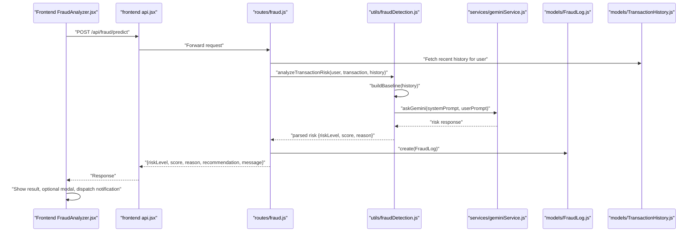

**Diagram sources**
- [FraudAnalyzer.jsx:30-69](file://frontend/src/pages/FraudAnalyzer.jsx#L30-L69)
- [api.jsx:1-30](file://frontend/src/services/api.jsx#L1-L30)
- [fraud.js:12-52](file://backend/routes/fraud.js#L12-L52)
- [fraudDetection.js:9-30](file://backend/utils/fraudDetection.js#L9-L30)
- [geminiService.js:17-26](file://backend/services/geminiService.js#L17-L26)
- [FraudLog.js:3-18](file://backend/models/FraudLog.js#L3-L18)
- [TransactionHistory.js:3-13](file://backend/models/TransactionHistory.js#L3-L13)

## Detailed Component Analysis

### Backend Fraud Prediction Route
- Input validation ensures required fields are present.
- Retrieves recent transaction history for the authenticated user.
- Delegates risk analysis to the utility module.
- Computes recommendation based on risk level.
- Persists a FraudLog entry and returns a structured response with a user-friendly message.

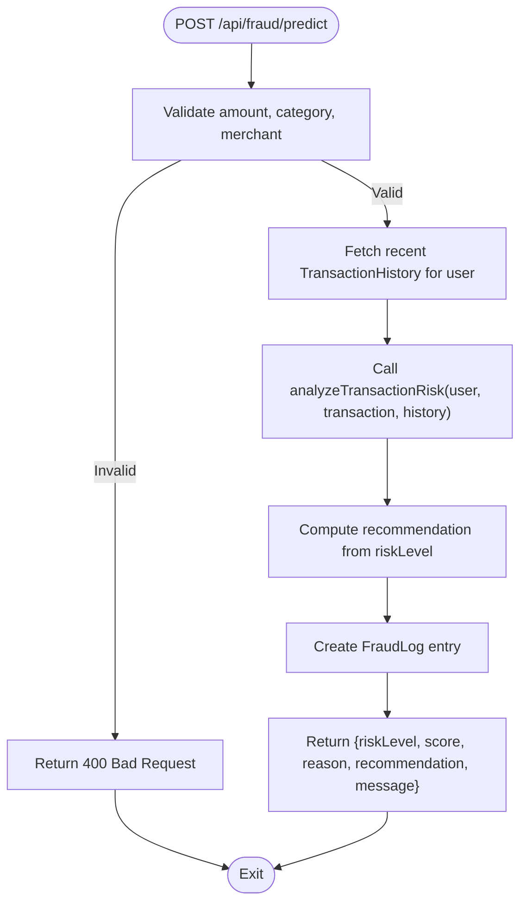

**Diagram sources**
- [fraud.js:12-52](file://backend/routes/fraud.js#L12-L52)

**Section sources**
- [fraud.js:12-52](file://backend/routes/fraud.js#L12-L52)

### Risk Analysis Utility
- Baseline construction aggregates:
  - Category totals and counts to compute average spending per category.
  - Merchant frequency to identify typical vendors.
  - Hour range of transactions to capture typical activity windows.
- Prompt assembly provides the AI with a concise summary and the proposed transaction details.
- Response parsing extracts risk level, computes a numeric score, and captures a reason string.

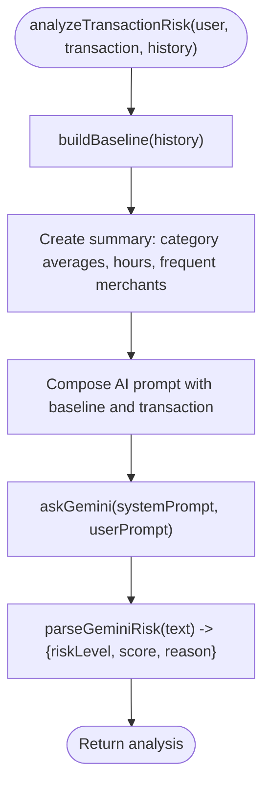

**Diagram sources**
- [fraudDetection.js:9-30](file://backend/utils/fraudDetection.js#L9-L30)
- [fraudDetection.js:32-64](file://backend/utils/fraudDetection.js#L32-L64)
- [fraudDetection.js:66-78](file://backend/utils/fraudDetection.js#L66-L78)

**Section sources**
- [fraudDetection.js:9-30](file://backend/utils/fraudDetection.js#L9-L30)
- [fraudDetection.js:32-64](file://backend/utils/fraudDetection.js#L32-L64)
- [fraudDetection.js:66-78](file://backend/utils/fraudDetection.js#L66-L78)

### AI Service Integration
- The backend service wraps the external AI model, handling errors gracefully and returning a safe default when unavailable.
- The frontend service proxies AI requests through the backend to avoid exposing API keys, and provides specialized prompts for fraud explanations.

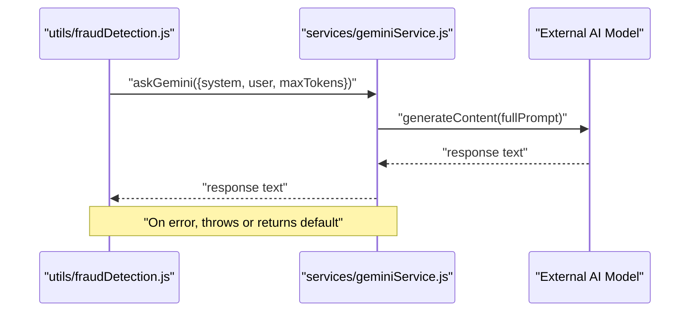

**Diagram sources**
- [fraudDetection.js:1-30](file://backend/utils/fraudDetection.js#L1-L30)
- [geminiService.js:17-26](file://backend/services/geminiService.js#L17-L26)

**Section sources**
- [geminiService.js:17-26](file://backend/services/geminiService.js#L17-L26)
- [geminiService.js:75-84](file://frontend/src/services/geminiService.js#L75-L84)

### FraudLog Model Schema
- Tracks user identity, transaction metadata, predicted risk level, numeric score, reason, recommendation, and outcome.
- Includes an index on userId for efficient lookups.

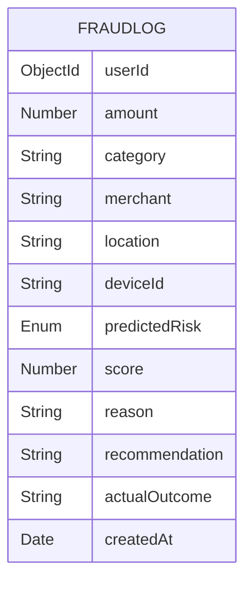

**Diagram sources**
- [FraudLog.js:3-18](file://backend/models/FraudLog.js#L3-L18)

**Section sources**
- [FraudLog.js:3-18](file://backend/models/FraudLog.js#L3-L18)

### TransactionHistory Model Schema
- Stores historical transactions with indexes on userId and composite fields to optimize queries by time and category.

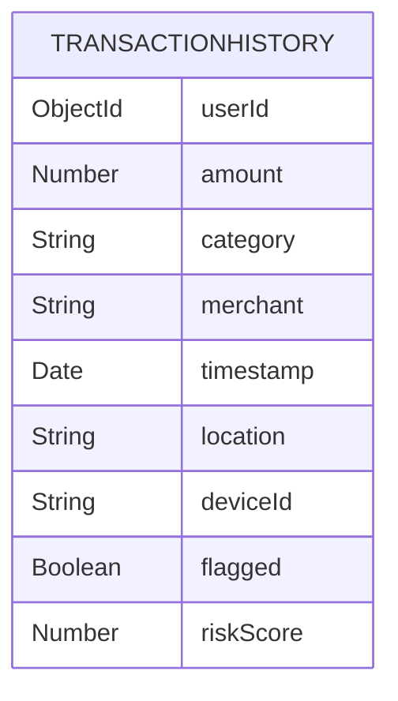

**Diagram sources**
- [TransactionHistory.js:3-13](file://backend/models/TransactionHistory.js#L3-L13)

**Section sources**
- [TransactionHistory.js:3-13](file://backend/models/TransactionHistory.js#L3-L13)

### Frontend Fraud Analyzer Interface
- Collects settlement amount, category, merchant, and location.
- Submits the transaction to the backend and displays:
  - Threat score with color-coded indicator and progress bar.
  - Recommendation label with allow/warn/block semantics.
  - AI-generated explanation of the risk.
- Triggers a warning modal when recommendation is not allow.
- Dispatches a bilingual notification via a window event.

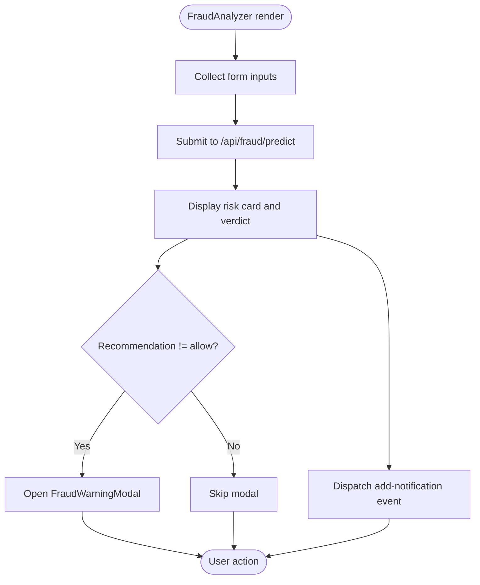

**Diagram sources**
- [FraudAnalyzer.jsx:18-70](file://frontend/src/pages/FraudAnalyzer.jsx#L18-L70)
- [FraudAnalyzer.jsx:238-244](file://frontend/src/pages/FraudAnalyzer.jsx#L238-L244)

**Section sources**
- [FraudAnalyzer.jsx:18-70](file://frontend/src/pages/FraudAnalyzer.jsx#L18-L70)
- [FraudAnalyzer.jsx:238-244](file://frontend/src/pages/FraudAnalyzer.jsx#L238-L244)

### Warning Modal Implementation
- Renders risk level with contextual badges.
- Shows the AI-provided reason.
- Provides explicit Cancel and Proceed buttons for user override.

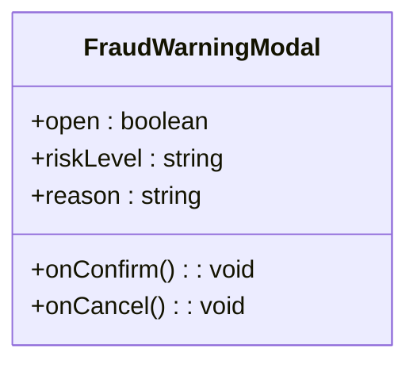

**Diagram sources**
- [FraudWarningModal.jsx:9-42](file://frontend/src/components/FraudWarningModal.jsx#L9-L42)

**Section sources**
- [FraudWarningModal.jsx:9-42](file://frontend/src/components/FraudWarningModal.jsx#L9-L42)

### User Notification System
- The analyzer dispatches a CustomEvent with bilingual text.
- The Navbar listens for the event, prepends a new notification, and syncs to localStorage.
- Notifications are displayed in a dropdown with read/unread states and dismissal.

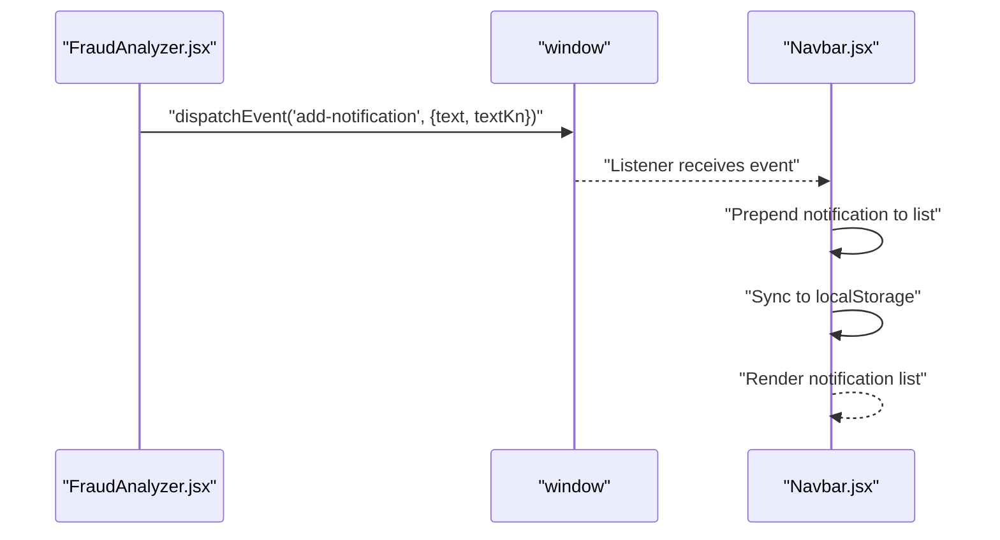

**Diagram sources**
- [FraudAnalyzer.jsx:44-51](file://frontend/src/pages/FraudAnalyzer.jsx#L44-L51)
- [Navbar.jsx:74-85](file://frontend/src/components/Navbar.jsx#L74-L85)

**Section sources**
- [FraudAnalyzer.jsx:44-51](file://frontend/src/pages/FraudAnalyzer.jsx#L44-L51)
- [Navbar.jsx:74-85](file://frontend/src/components/Navbar.jsx#L74-L85)

## Dependency Analysis
- Route depends on:
  - Authentication middleware (via protect).
  - Fraud detection utility.
  - FraudLog and TransactionHistory models.
- Utility depends on:
  - AI service for risk assessment.
- Frontend components depend on:
  - API service for backend communication.
  - Gemini service for AI explanations.
  - Notification system for real-time updates.

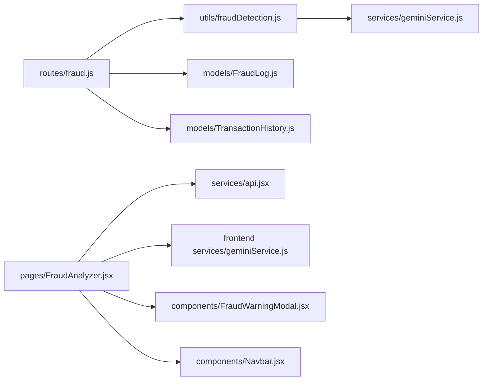

**Diagram sources**
- [fraud.js:1-55](file://backend/routes/fraud.js#L1-L55)
- [fraudDetection.js:1-30](file://backend/utils/fraudDetection.js#L1-L30)
- [geminiService.js:1-29](file://backend/services/geminiService.js#L1-L29)
- [FraudAnalyzer.jsx:1-250](file://frontend/src/pages/FraudAnalyzer.jsx#L1-L250)
- [api.jsx:1-30](file://frontend/src/services/api.jsx#L1-L30)
- [geminiService.js:1-99](file://frontend/src/services/geminiService.js#L1-L99)
- [FraudWarningModal.jsx:1-45](file://frontend/src/components/FraudWarningModal.jsx#L1-L45)
- [Navbar.jsx:68-299](file://frontend/src/components/Navbar.jsx#L68-L299)

**Section sources**
- [fraud.js:1-55](file://backend/routes/fraud.js#L1-L55)
- [fraudDetection.js:1-30](file://backend/utils/fraudDetection.js#L1-L30)
- [geminiService.js:1-29](file://backend/services/geminiService.js#L1-L29)
- [FraudAnalyzer.jsx:1-250](file://frontend/src/pages/FraudAnalyzer.jsx#L1-L250)
- [api.jsx:1-30](file://frontend/src/services/api.jsx#L1-L30)
- [geminiService.js:1-99](file://frontend/src/services/geminiService.js#L1-L99)
- [FraudWarningModal.jsx:1-45](file://frontend/src/components/FraudWarningModal.jsx#L1-L45)
- [Navbar.jsx:68-299](file://frontend/src/components/Navbar.jsx#L68-L299)

## Performance Considerations
- Indexing:
  - FraudLog and TransactionHistory include indices on userId to accelerate lookups.
  - TransactionHistory has composite indices on (userId, timestamp) and (userId, category) to speed up history retrieval and aggregation.
- Query window:
  - History retrieval limits the time window to a recent period to keep queries fast and relevant.
- Baseline computation:
  - Aggregations operate over the retrieved history; keeping the window bounded ensures O(n) complexity with a small n.
- AI latency:
  - The system handles AI failures gracefully by defaulting to low risk, preventing cascading failures.
- Frontend responsiveness:
  - UI updates are deferred until after network calls complete; loading states and animations improve perceived performance.

**Section sources**
- [FraudLog.js:20-20](file://backend/models/FraudLog.js#L20-L20)
- [TransactionHistory.js:15-17](file://backend/models/TransactionHistory.js#L15-L17)
- [fraud.js:19-22](file://backend/routes/fraud.js#L19-L22)
- [fraudDetection.js:32-64](file://backend/utils/fraudDetection.js#L32-L64)
- [fraudDetection.js:24-26](file://backend/utils/fraudDetection.js#L24-L26)

## Troubleshooting Guide
- Missing input fields:
  - The route returns a 400 error if amount, category, or merchant are missing.
- AI unavailability:
  - The utility defaults to low risk when the AI service fails, ensuring the system remains functional.
- Notification not appearing:
  - Verify that the analyzer dispatches the event and the Navbar listener is active.
- Modal not opening:
  - Confirm that the recommendation is not "allow" and that the modal props are passed correctly.

**Section sources**
- [fraud.js:14-17](file://backend/routes/fraud.js#L14-L17)
- [fraudDetection.js:24-26](file://backend/utils/fraudDetection.js#L24-L26)
- [FraudAnalyzer.jsx:44-51](file://frontend/src/pages/FraudAnalyzer.jsx#L44-L51)
- [FraudAnalyzer.jsx:238-244](file://frontend/src/pages/FraudAnalyzer.jsx#L238-L244)

## Conclusion
The Fraud Detection System integrates a lightweight, AI-assisted risk assessment pipeline with robust data models and a user-centric frontend. It supports real-time transaction analysis, clear risk communication, and actionable alerts while maintaining performance and resilience. The modular design allows for incremental enhancements, such as expanding detection criteria, integrating external security services, and scaling AI inference.

## Appendices

### Fraud Detection Scenarios and Criteria
- Low-risk scenario:
  - Normal amount, category, merchant, and location within user’s typical behavior.
  - Baseline shows consistent patterns; AI reason indicates no anomalies.
- Medium-risk scenario:
  - Slight deviation from category averages or occurs outside usual hours.
  - AI flags unusual velocity or merchant frequency; recommendation is warn.
- High-risk scenario:
  - Large amount, unfamiliar merchant, or cross-location transaction.
  - AI flags strong anomalies; recommendation is block; modal prompts user override.

### False Positive Handling
- Users can override warnings when the recommendation is not allow.
- The system logs outcomes in FraudLog for future learning and retraining.

### Integration with External Security Services
- AI model integration is proxied through the backend to avoid exposing API keys.
- Future extensions can incorporate external identity verification, device fingerprinting, or IP reputation services by augmenting the baseline and prompts.

### Data Privacy Requirements
- Client-side AI explanations are routed through the backend to prevent API key exposure.
- Notifications are stored locally and not persisted server-side.
- Ensure that sensitive fields (e.g., location, device ID) are handled according to applicable privacy policies and only retained as needed.