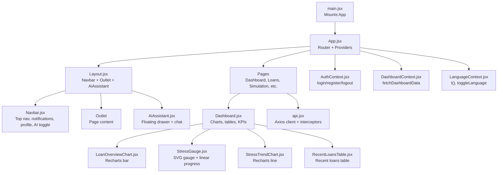
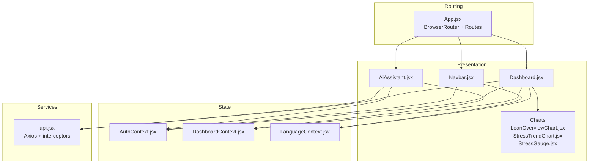
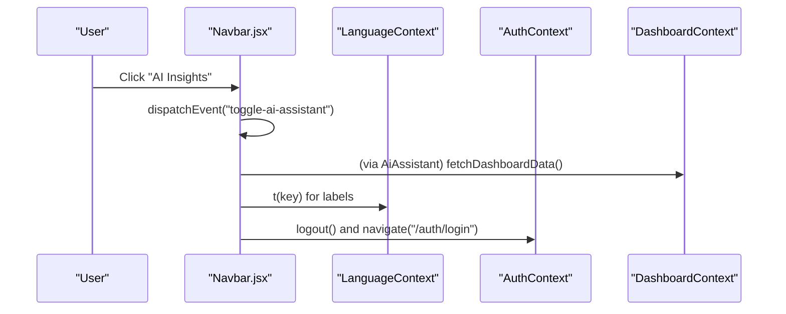
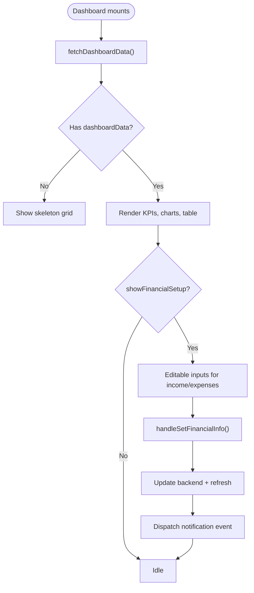
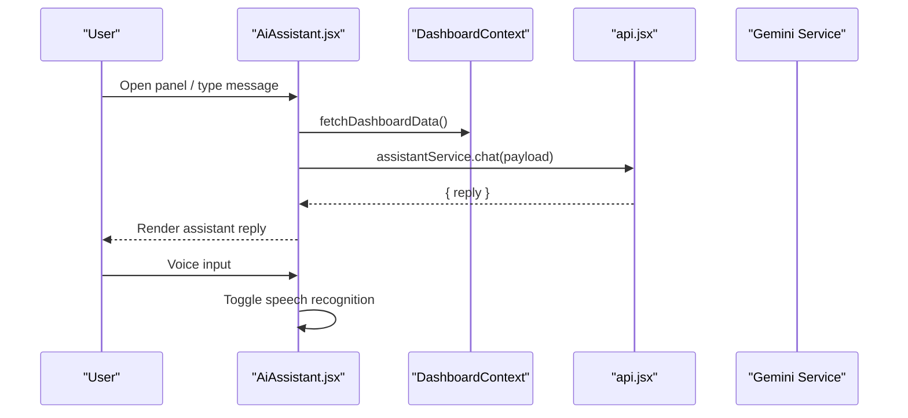
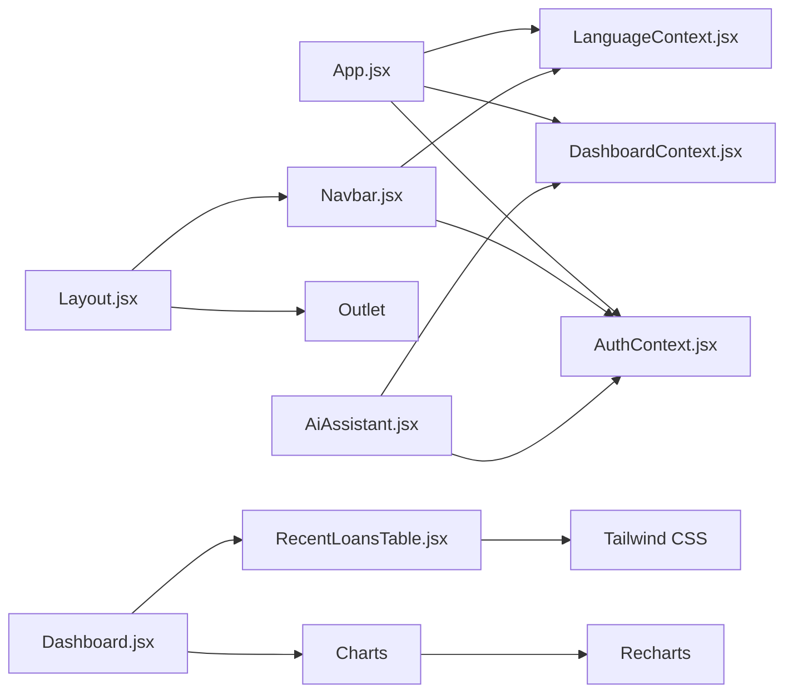

# Frontend Components

<cite>
**Referenced Files in This Document**
- [App.jsx](file://frontend/src/App.jsx)
- [main.jsx](file://frontend/src/main.jsx)
- [Layout.jsx](file://frontend/src/components/Layout.jsx)
- [Navbar.jsx](file://frontend/src/components/Navbar.jsx)
- [Sidebar.jsx](file://frontend/src/components/Sidebar.jsx)
- [LoanOverviewChart.jsx](file://frontend/src/components/LoanOverviewChart.jsx)
- [StressTrendChart.jsx](file://frontend/src/components/StressTrendChart.jsx)
- [StressGauge.jsx](file://frontend/src/components/StressGauge.jsx)
- [AiAssistant.jsx](file://frontend/src/components/AiAssistant.jsx)
- [RecentLoansTable.jsx](file://frontend/src/components/RecentLoansTable.jsx)
- [AuthContext.jsx](file://frontend/src/context/AuthContext.jsx)
- [DashboardContext.jsx](file://frontend/src/context/DashboardContext.jsx)
- [LanguageContext.jsx](file://frontend/src/context/LanguageContext.jsx)
- [Dashboard.jsx](file://frontend/src/pages/Dashboard.jsx)
- [api.jsx](file://frontend/src/services/api.jsx)
</cite>

## Table of Contents
1. [Introduction](#introduction)
2. [Project Structure](#project-structure)
3. [Core Components](#core-components)
4. [Architecture Overview](#architecture-overview)
5. [Detailed Component Analysis](#detailed-component-analysis)
6. [Dependency Analysis](#dependency-analysis)
7. [Performance Considerations](#performance-considerations)
8. [Troubleshooting Guide](#troubleshooting-guide)
9. [Conclusion](#conclusion)
10. [Appendices](#appendices)

## Introduction
This document describes the React frontend components for the Smart Loan Analyzer. It covers visual appearance, behavior, user interactions, props/events/customization, layout and navigation, responsive design, chart components powered by Recharts, state management via Context APIs, styling with Tailwind CSS, accessibility considerations, performance optimization, lifecycle management, and integration patterns with backend services.

## Project Structure
The frontend is a Vite-based React application bootstrapped in main.jsx and rendered inside App.jsx. Routing is handled by react-router-dom with protected routes via a PrivateRoute wrapper. Providers wrap the app to supply authentication, dashboard data, and internationalization state. Components are organized under src/components and pages under src/pages, with shared contexts under src/context and service clients under src/services.

**Diagram sources**
- [main.jsx:1-14](file://frontend/src/main.jsx#L1-L14)
- [App.jsx:1-58](file://frontend/src/App.jsx#L1-L58)
- [Layout.jsx:1-19](file://frontend/src/components/Layout.jsx#L1-L19)
- [Navbar.jsx:1-463](file://frontend/src/components/Navbar.jsx#L1-L463)
- [AiAssistant.jsx:1-295](file://frontend/src/components/AiAssistant.jsx#L1-L295)
- [Dashboard.jsx:1-474](file://frontend/src/pages/Dashboard.jsx#L1-L474)
- [LoanOverviewChart.jsx:1-44](file://frontend/src/components/LoanOverviewChart.jsx#L1-L44)
- [StressGauge.jsx:1-105](file://frontend/src/components/StressGauge.jsx#L1-L105)
- [StressTrendChart.jsx:1-80](file://frontend/src/components/StressTrendChart.jsx#L1-L80)
- [RecentLoansTable.jsx:1-57](file://frontend/src/components/RecentLoansTable.jsx#L1-L57)
- [AuthContext.jsx:1-67](file://frontend/src/context/AuthContext.jsx#L1-L67)
- [DashboardContext.jsx:1-46](file://frontend/src/context/DashboardContext.jsx#L1-L46)
- [LanguageContext.jsx:1-603](file://frontend/src/context/LanguageContext.jsx#L1-L603)
- [api.jsx:1-30](file://frontend/src/services/api.jsx#L1-L30)

**Section sources**
- [main.jsx:1-14](file://frontend/src/main.jsx#L1-L14)
- [App.jsx:1-58](file://frontend/src/App.jsx#L1-L58)

## Core Components
- Layout: Provides a consistent page shell with Navbar, main content area, and AiAssistant.
- Navbar: Top navigation bar with logo, menu items, notifications, profile dropdown, mobile drawer, language toggle, and AI insights trigger.
- Sidebar: Collapsible sidebar for desktop-like navigation (present in the codebase).
- Dashboard: Orchestrates financial KPIs, charts, recent loans, and financial setup panel.
- Chart components: LoanOverviewChart (bar), StressTrendChart (line), StressGauge (SVG gauge).
- AiAssistant: Floating drawer with chat, quick prompts, voice input, and Gemini integration.
- Context providers: AuthContext, DashboardContext, LanguageContext.
- Services: api.jsx Axios client with Authorization header injection.

**Section sources**
- [Layout.jsx:1-19](file://frontend/src/components/Layout.jsx#L1-L19)
- [Navbar.jsx:1-463](file://frontend/src/components/Navbar.jsx#L1-L463)
- [Sidebar.jsx:1-147](file://frontend/src/components/Sidebar.jsx#L1-L147)
- [Dashboard.jsx:1-474](file://frontend/src/pages/Dashboard.jsx#L1-L474)
- [LoanOverviewChart.jsx:1-44](file://frontend/src/components/LoanOverviewChart.jsx#L1-L44)
- [StressTrendChart.jsx:1-80](file://frontend/src/components/StressTrendChart.jsx#L1-L80)
- [StressGauge.jsx:1-105](file://frontend/src/components/StressGauge.jsx#L1-L105)
- [AiAssistant.jsx:1-295](file://frontend/src/components/AiAssistant.jsx#L1-L295)
- [AuthContext.jsx:1-67](file://frontend/src/context/AuthContext.jsx#L1-L67)
- [DashboardContext.jsx:1-46](file://frontend/src/context/DashboardContext.jsx#L1-L46)
- [LanguageContext.jsx:1-603](file://frontend/src/context/LanguageContext.jsx#L1-L603)
- [api.jsx:1-30](file://frontend/src/services/api.jsx#L1-L30)

## Architecture Overview
The frontend uses a layered architecture:
- Presentation layer: Pages and components.
- State layer: Context providers for auth, dashboard data, and language.
- Service layer: Axios client with interceptors for authenticated requests.
- Routing layer: React Router with protected routes.

**Diagram sources**
- [App.jsx:1-58](file://frontend/src/App.jsx#L1-L58)
- [Dashboard.jsx:1-474](file://frontend/src/pages/Dashboard.jsx#L1-L474)
- [Navbar.jsx:1-463](file://frontend/src/components/Navbar.jsx#L1-L463)
- [AiAssistant.jsx:1-295](file://frontend/src/components/AiAssistant.jsx#L1-L295)
- [LoanOverviewChart.jsx:1-44](file://frontend/src/components/LoanOverviewChart.jsx#L1-L44)
- [StressTrendChart.jsx:1-80](file://frontend/src/components/StressTrendChart.jsx#L1-L80)
- [StressGauge.jsx:1-105](file://frontend/src/components/StressGauge.jsx#L1-L105)
- [AuthContext.jsx:1-67](file://frontend/src/context/AuthContext.jsx#L1-L67)
- [DashboardContext.jsx:1-46](file://frontend/src/context/DashboardContext.jsx#L1-L46)
- [LanguageContext.jsx:1-603](file://frontend/src/context/LanguageContext.jsx#L1-L603)
- [api.jsx:1-30](file://frontend/src/services/api.jsx#L1-L30)

## Detailed Component Analysis

### Layout
- Purpose: Wraps page content with Navbar and AiAssistant, manages responsive padding and width.
- Behavior: Uses Outlet to render routed content; integrates with Tailwind for spacing and responsiveness.
- Props: None.
- Events: None.
- Customization: Adjust max-w, padding, and background via Tailwind classes.

**Section sources**
- [Layout.jsx:1-19](file://frontend/src/components/Layout.jsx#L1-L19)

### Navbar
- Visuals: Sticky header with logo, desktop menu, notification bell with animated dropdown, profile dropdown, language toggle, and AI Insights button.
- Behavior:
  - Tracks scroll to apply backdrop blur and shadow.
  - Manages mobile drawer with Framer Motion animations.
  - Local storage persistence for notifications; emits custom events to add notifications.
  - Integrates with AuthContext for user and logout; LanguageContext for translations.
  - Toggles AiAssistant via a global CustomEvent.
- Props: None.
- Events: toggleAssistant triggers AI panel; logout navigates to login.
- Accessibility: Uses semantic buttons, proper roles, and keyboard-friendly dropdowns.

**Diagram sources**
- [Navbar.jsx:105-112](file://frontend/src/components/Navbar.jsx#L105-L112)
- [Navbar.jsx:27-28](file://frontend/src/components/Navbar.jsx#L27-L28)
- [LanguageContext.jsx:585-587](file://frontend/src/context/LanguageContext.jsx#L585-L587)
- [AuthContext.jsx:50-53](file://frontend/src/context/AuthContext.jsx#L50-L53)

**Section sources**
- [Navbar.jsx:1-463](file://frontend/src/components/Navbar.jsx#L1-L463)
- [LanguageContext.jsx:1-603](file://frontend/src/context/LanguageContext.jsx#L1-L603)
- [AuthContext.jsx:1-67](file://frontend/src/context/AuthContext.jsx#L1-L67)

### Sidebar
- Visuals: Dark-themed collapsible sidebar with icons, active state highlighting, and user profile/logout.
- Behavior: Toggle open/close; adjusts main content margins via injected styles; mobile backdrop hides content behind sidebar.
- Props: None.
- Events: Handles logout and optional assistant click hook.
- Customization: Modify colors, widths, and transitions via Tailwind classes and inline styles.

**Section sources**
- [Sidebar.jsx:1-147](file://frontend/src/components/Sidebar.jsx#L1-L147)

### Dashboard
- Visuals: Grid layout with KPI cards, allocation chart, recent loans table, stress gauge, financial health indicator, and stress trend chart.
- Behavior:
  - Fetches dashboard data via DashboardContext; handles errors with retry and reauthenticate actions.
  - Provides financial setup modal to update monthly income and expenses; dispatches notifications.
  - Generates mock chart data when backend data is unavailable.
  - Uses Recharts for responsive charts and Framer Motion for animations.
- Props: None.
- Events: Form submission, button clicks, and route navigation.
- Customization: Tailwind utilities for spacing, colors, and responsive breakpoints.

**Diagram sources**
- [Dashboard.jsx:45-47](file://frontend/src/pages/Dashboard.jsx#L45-L47)
- [Dashboard.jsx:82-106](file://frontend/src/pages/Dashboard.jsx#L82-L106)
- [Dashboard.jsx:135-156](file://frontend/src/pages/Dashboard.jsx#L135-L156)
- [Dashboard.jsx:316-340](file://frontend/src/pages/Dashboard.jsx#L316-L340)
- [Dashboard.jsx:438-466](file://frontend/src/pages/Dashboard.jsx#L438-L466)

**Section sources**
- [Dashboard.jsx:1-474](file://frontend/src/pages/Dashboard.jsx#L1-L474)

### LoanOverviewChart
- Purpose: Visualizes total loan amounts by loan type.
- Props:
  - data: array of objects with name and totalAmount keys.
- Behavior: Validates input, renders responsive bar chart with tooltip and legend; shows empty state when no data.
- Styling: Tailwind-styled container; Recharts theme applied.

**Section sources**
- [LoanOverviewChart.jsx:1-44](file://frontend/src/components/LoanOverviewChart.jsx#L1-L44)

### StressTrendChart
- Purpose: Plots stress trend over time with dual series (riskScore and debtRatio) and computes a simple trend label.
- Props:
  - data: array of objects with month/riskScore/debtRatio keys.
- Behavior: Computes trend delta over last three points; renders responsive line chart with tooltips and legends.

**Section sources**
- [StressTrendChart.jsx:1-80](file://frontend/src/components/StressTrendChart.jsx#L1-L80)

### StressGauge
- Purpose: Presents a visual stress score using an SVG arc and needle, plus a linear progress bar and contextual message.
- Props:
  - score: number (0–100).
- Behavior: Determines stress level thresholds and applies color classes; rotates needle proportionally; displays health advice.

**Section sources**
- [StressGauge.jsx:1-105](file://frontend/src/components/StressGauge.jsx#L1-L105)

### RecentLoansTable
- Purpose: Displays recent loans with status badges and currency formatting.
- Props:
  - loans: array of loan objects.
- Behavior: Limits to top 5 entries; maps status to color classes.

**Section sources**
- [RecentLoansTable.jsx:1-57](file://frontend/src/components/RecentLoansTable.jsx#L1-L57)

### AiAssistant
- Purpose: Floating AI assistant panel with chat, quick prompts, voice input, and Gemini integration.
- Props: None.
- Behavior:
  - Global toggle via CustomEvent.
  - Web Speech API for voice input; toggles listening state.
  - Loads latest dashboard data before sending messages to Gemini.
  - Renders formatted replies with simple HTML replacements.
- Accessibility: Focus management via refs; readable labels; disabled states during loading.

**Diagram sources**
- [AiAssistant.jsx:90-121](file://frontend/src/components/AiAssistant.jsx#L90-L121)
- [DashboardContext.jsx:11-30](file://frontend/src/context/DashboardContext.jsx#L11-L30)
- [api.jsx:25-27](file://frontend/src/services/api.jsx#L25-L27)

**Section sources**
- [AiAssistant.jsx:1-295](file://frontend/src/components/AiAssistant.jsx#L1-295)
- [DashboardContext.jsx:1-46](file://frontend/src/context/DashboardContext.jsx#L1-L46)
- [api.jsx:1-30](file://frontend/src/services/api.jsx#L1-L30)

### Context Providers
- AuthContext
  - State: user, loading, refreshKey.
  - Methods: login, register, logout, triggerRefresh.
  - Persistence: stores JWT token in localStorage; verifies on mount.
- DashboardContext
  - State: dashboardData, loading, error.
  - Method: fetchDashboardData with error handling and loading flags.
- LanguageContext
  - State: language, translations for English and Kannada.
  - Methods: toggleLanguage, t(key) with fallback to English.

**Section sources**
- [AuthContext.jsx:1-67](file://frontend/src/context/AuthContext.jsx#L1-L67)
- [DashboardContext.jsx:1-46](file://frontend/src/context/DashboardContext.jsx#L1-L46)
- [LanguageContext.jsx:1-603](file://frontend/src/context/LanguageContext.jsx#L1-L603)

### Services
- api.jsx
  - Axios instance with base URL /api.
  - Request interceptor adds Authorization: Bearer token from localStorage.
  - Named exports for authService, financeService, loanService, assistantService.

**Section sources**
- [api.jsx:1-30](file://frontend/src/services/api.jsx#L1-L30)

## Dependency Analysis
- Component dependencies:
  - Dashboard depends on Recharts, Tailwind classes, and Contexts.
  - Navbar depends on AuthContext, LanguageContext, and Framer Motion.
  - AiAssistant depends on DashboardContext and Gemini service.
- Provider hierarchy:
  - App wraps children in LanguageProvider → AuthProvider → DashboardProvider.
- Routing:
  - App defines public and protected routes; Layout renders Outlet for page content.

**Diagram sources**
- [App.jsx:24-52](file://frontend/src/App.jsx#L24-L52)
- [Layout.jsx:1-19](file://frontend/src/components/Layout.jsx#L1-L19)
- [Dashboard.jsx:1-474](file://frontend/src/pages/Dashboard.jsx#L1-L474)
- [Navbar.jsx:1-463](file://frontend/src/components/Navbar.jsx#L1-L463)
- [AiAssistant.jsx:1-295](file://frontend/src/components/AiAssistant.jsx#L1-L295)

**Section sources**
- [App.jsx:1-58](file://frontend/src/App.jsx#L1-L58)

## Performance Considerations
- Memoization and callbacks:
  - Use useMemo/useCallback for expensive computations in Dashboard and charts.
- Lazy loading:
  - Load Recharts and Framer Motion lazily if needed to reduce initial bundle size.
- Virtualization:
  - For large tables, consider react-window or react-big-table.
- Network:
  - Debounce frequent fetches; cache dashboard data per session.
- Rendering:
  - Avoid unnecessary re-renders by passing stable references and using shallow comparisons.
- Animations:
  - Keep animation complexity minimal; disable on reduced motion preferences.

## Troubleshooting Guide
- Authentication issues:
  - Verify token presence and validity; clear localStorage token on failures; ensure interceptor attaches Authorization header.
- Dashboard data errors:
  - Check error boundaries and provide retry/reauthenticate actions; inspect network tab for 401/403 responses.
- Notifications not appearing:
  - Confirm localStorage persistence and event listener registration; ensure event detail contains text/textKn.
- AI panel not opening:
  - Ensure global CustomEvent listener is registered; check browser speech recognition support.
- Charts not rendering:
  - Validate data shape; ensure arrays are non-empty; confirm ResponsiveContainer dimensions.

**Section sources**
- [AuthContext.jsx:11-34](file://frontend/src/context/AuthContext.jsx#L11-L34)
- [Dashboard.jsx:49-80](file://frontend/src/pages/Dashboard.jsx#L49-L80)
- [Navbar.jsx:37-96](file://frontend/src/components/Navbar.jsx#L37-L96)
- [AiAssistant.jsx:36-43](file://frontend/src/components/AiAssistant.jsx#L36-L43)
- [LoanOverviewChart.jsx:15-17](file://frontend/src/components/LoanOverviewChart.jsx#L15-L17)

## Conclusion
The frontend employs a clean separation of concerns with robust context providers, a responsive layout, and interactive data visualizations. Recharts powers insightful charts, while Tailwind CSS ensures consistent styling. The Context APIs centralize state management, and the Axios service encapsulates API communication with authentication. The design emphasizes usability, internationalization, and maintainability.

## Appendices

### Props and Events Reference
- Navbar
  - Props: None
  - Events: toggleAssistant, logout
- AiAssistant
  - Props: None
  - Events: Global "toggle-ai-assistant"
- LoanOverviewChart
  - Props: data[]
- StressTrendChart
  - Props: data[]
- StressGauge
  - Props: score
- RecentLoansTable
  - Props: loans[]
- Dashboard
  - Props: None
  - Events: Form submit, button clicks, route navigation

### Integration Patterns
- Authenticated requests: api.jsx interceptor attaches Authorization header.
- Context-driven data: DashboardContext fetches and exposes dashboardData.
- Internationalization: LanguageContext provides t() and toggleLanguage.
- AI integration: AiAssistant composes Gemini service with latest dashboard metrics.

**Section sources**
- [api.jsx:5-9](file://frontend/src/services/api.jsx#L5-L9)
- [DashboardContext.jsx:11-30](file://frontend/src/context/DashboardContext.jsx#L11-L30)
- [LanguageContext.jsx:581-587](file://frontend/src/context/LanguageContext.jsx#L581-L587)
- [AiAssistant.jsx:100-121](file://frontend/src/components/AiAssistant.jsx#L100-L121)