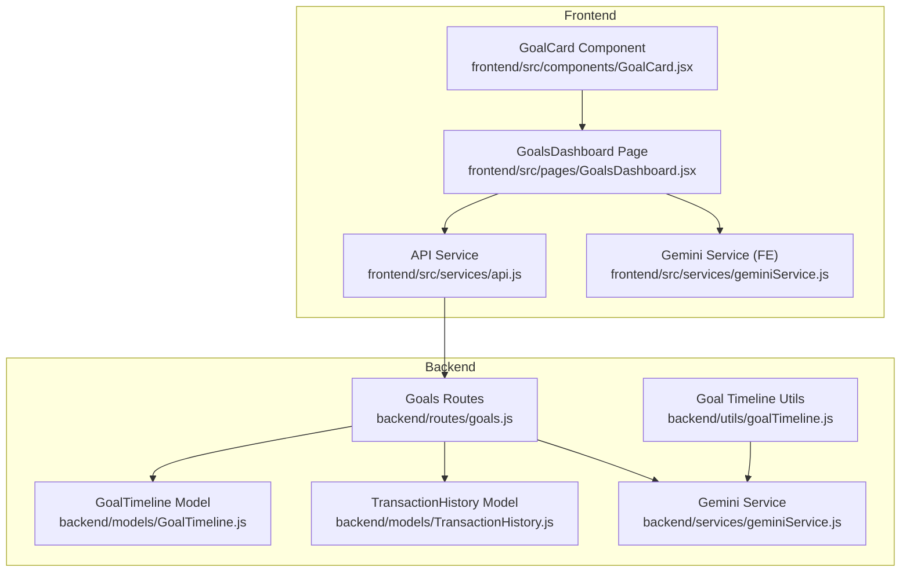
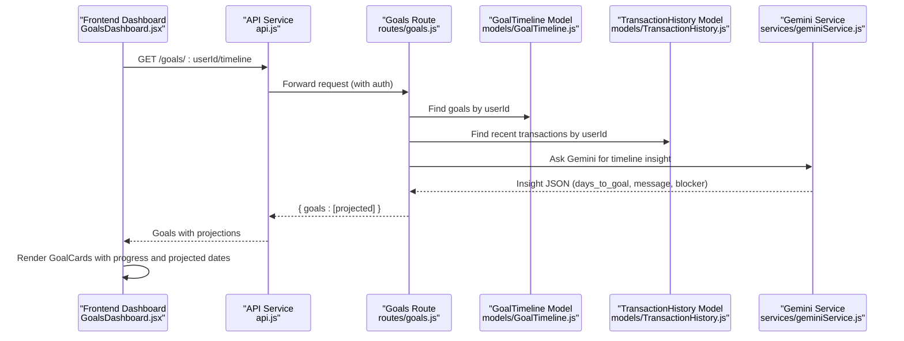
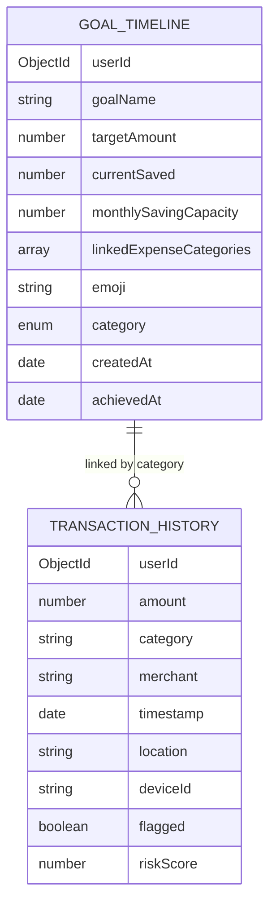
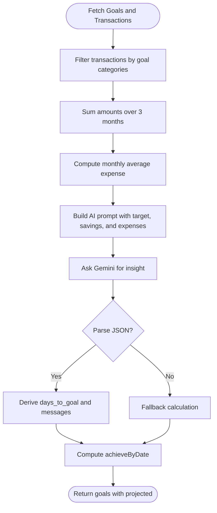
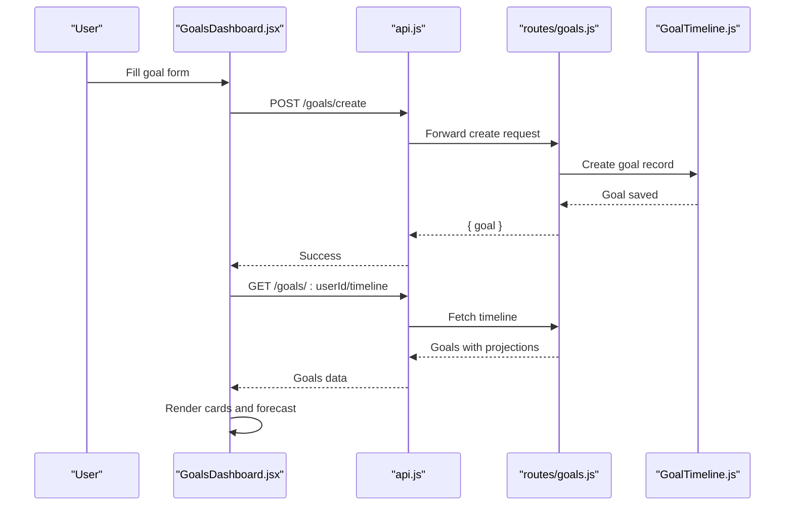
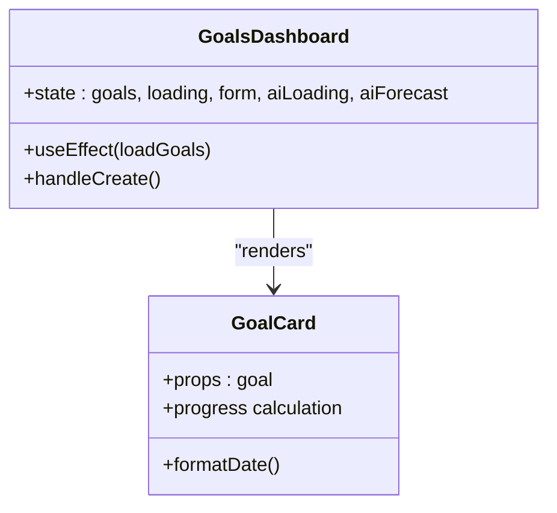
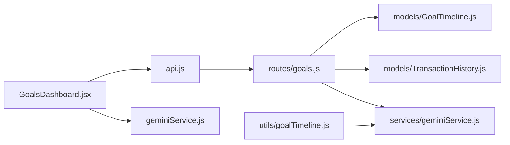

# Goal Timeline Management

<cite>
**Referenced Files in This Document**
- [GoalTimeline.js](file://backend/models/GoalTimeline.js)
- [TransactionHistory.js](file://backend/models/TransactionHistory.js)
- [goals.js](file://backend/routes/goals.js)
- [v1Goals.js](file://backend/routes/v1Goals.js)
- [goalTimeline.js](file://backend/utils/goalTimeline.js)
- [geminiService.js](file://backend/services/geminiService.js)
- [GoalsDashboard.jsx](file://frontend/src/pages/GoalsDashboard.jsx)
- [GoalCard.jsx](file://frontend/src/components/GoalCard.jsx)
- [api.js](file://frontend/src/services/api.js)
- [geminiService.js](file://frontend/src/services/geminiService.js)
</cite>

## Table of Contents
1. [Introduction](#introduction)
2. [Project Structure](#project-structure)
3. [Core Components](#core-components)
4. [Architecture Overview](#architecture-overview)
5. [Detailed Component Analysis](#detailed-component-analysis)
6. [Dependency Analysis](#dependency-analysis)
7. [Performance Considerations](#performance-considerations)
8. [Troubleshooting Guide](#troubleshooting-guide)
9. [Conclusion](#conclusion)

## Introduction
This document describes the Goal Timeline Management system that enables users to define savings goals, track progress, visualize timelines, and receive AI-powered insights. It covers the GoalTimeline model schema, goal categorization, milestone projections, frontend dashboard components, timeline visualization, progress monitoring, utility functions for deadline calculations, and integration with the broader financial planning system.

## Project Structure
The Goal Timeline Management spans backend models, routes, services, and frontend pages/components:
- Backend models define the GoalTimeline and TransactionHistory collections.
- Backend routes expose endpoints to create goals and fetch timeline projections.
- Utility functions encapsulate AI-driven timeline calculations.
- Frontend pages render goal dashboards, cards, and integrate with AI predictions.

**Diagram sources**
- [GoalTimeline.js:1-19](file://backend/models/GoalTimeline.js#L1-L19)
- [TransactionHistory.js:1-19](file://backend/models/TransactionHistory.js#L1-L19)
- [goals.js:1-95](file://backend/routes/goals.js#L1-L95)
- [goalTimeline.js:1-36](file://backend/utils/goalTimeline.js#L1-L36)
- [geminiService.js:1-29](file://backend/services/geminiService.js#L1-L29)
- [GoalsDashboard.jsx:1-204](file://frontend/src/pages/GoalsDashboard.jsx#L1-L204)
- [GoalCard.jsx:1-74](file://frontend/src/components/GoalCard.jsx#L1-L74)
- [api.js:96-100](file://frontend/src/services/api.js#L96-L100)
- [geminiService.js:1-99](file://frontend/src/services/geminiService.js#L1-L99)

**Section sources**
- [GoalTimeline.js:1-19](file://backend/models/GoalTimeline.js#L1-L19)
- [TransactionHistory.js:1-19](file://backend/models/TransactionHistory.js#L1-L19)
- [goals.js:1-95](file://backend/routes/goals.js#L1-L95)
- [goalTimeline.js:1-36](file://backend/utils/goalTimeline.js#L1-L36)
- [geminiService.js:1-29](file://backend/services/geminiService.js#L1-L29)
- [GoalsDashboard.jsx:1-204](file://frontend/src/pages/GoalsDashboard.jsx#L1-L204)
- [GoalCard.jsx:1-74](file://frontend/src/components/GoalCard.jsx#L1-L74)
- [api.js:96-100](file://frontend/src/services/api.js#L96-L100)
- [geminiService.js:1-99](file://frontend/src/services/geminiService.js#L1-L99)

## Core Components
- GoalTimeline model: Stores user-defined goals, target amounts, current savings, monthly saving capacity, linked expense categories, emoji, category, timestamps, and optional achievedAt.
- TransactionHistory model: Tracks user transactions with amount, category, merchant, timestamp, location, device, flags, and risk scores.
- Goals routes: Provide creation and timeline retrieval endpoints with user authentication checks.
- Goal timeline utilities: Compute projected timelines using AI insights or fallback calculations.
- Frontend dashboard: Renders goal creation UI, displays AI forecasts, and shows goal cards with progress and projected completion dates.

Key responsibilities:
- Data modeling and indexing for efficient queries.
- Timeline projection combining recent spending and savings capacity.
- Frontend rendering with progress bars, projected dates, and motivational insights.

**Section sources**
- [GoalTimeline.js:3-14](file://backend/models/GoalTimeline.js#L3-L14)
- [TransactionHistory.js:3-13](file://backend/models/TransactionHistory.js#L3-L13)
- [goals.js:9-30](file://backend/routes/goals.js#L9-L30)
- [goalTimeline.js:8-31](file://backend/utils/goalTimeline.js#L8-L31)
- [GoalsDashboard.jsx:15-86](file://frontend/src/pages/GoalsDashboard.jsx#L15-L86)

## Architecture Overview
The system integrates frontend and backend components to deliver a goal-tracking experience:
- Frontend pages and components request goal data and predictions via API services.
- Backend routes authenticate users, fetch goals, compute projections using AI, and return structured data.
- Models support efficient querying and indexing for user-scoped goals and transactions.

**Diagram sources**
- [GoalsDashboard.jsx:26-54](file://frontend/src/pages/GoalsDashboard.jsx#L26-L54)
- [api.js:96-100](file://frontend/src/services/api.js#L96-L100)
- [goals.js:32-92](file://backend/routes/goals.js#L32-L92)
- [GoalTimeline.js:3-14](file://backend/models/GoalTimeline.js#L3-L14)
- [TransactionHistory.js:3-13](file://backend/models/TransactionHistory.js#L3-L13)
- [geminiService.js:17-26](file://backend/services/geminiService.js#L17-L26)

## Detailed Component Analysis

### GoalTimeline Model Schema
The GoalTimeline collection defines the structure for user goals:
- Fields: userId, goalName, targetAmount, currentSaved, monthlySavingCapacity, linkedExpenseCategories, emoji, category, createdAt, achievedAt.
- Indexes: userId for fast filtering by user.
- Categories: vehicle, travel, gadget, education, emergency, other.

**Diagram sources**
- [GoalTimeline.js:3-14](file://backend/models/GoalTimeline.js#L3-L14)
- [TransactionHistory.js:3-13](file://backend/models/TransactionHistory.js#L3-L13)

**Section sources**
- [GoalTimeline.js:3-14](file://backend/models/GoalTimeline.js#L3-L14)

### Timeline Projection and Milestone Tracking
The backend computes projected completion dates using:
- Recent transaction history filtered by linked expense categories.
- Monthly expense estimation averaged over the last three months.
- AI insight generation via Gemini with a structured prompt.
- Fallback calculation when AI is unavailable.

**Diagram sources**
- [goals.js:32-92](file://backend/routes/goals.js#L32-L92)
- [geminiService.js:17-26](file://backend/services/geminiService.js#L17-L26)

**Section sources**
- [goals.js:32-92](file://backend/routes/goals.js#L32-L92)
- [geminiService.js:17-26](file://backend/services/geminiService.js#L17-L26)

### Goal Creation and Tracking Workflow
End-to-end process:
- Frontend collects goal parameters (name, target, monthly savings, linked categories).
- Frontend posts to backend create endpoint.
- Backend validates and persists the goal.
- Frontend refreshes timeline and displays AI forecast and goal cards.

**Diagram sources**
- [GoalsDashboard.jsx:56-86](file://frontend/src/pages/GoalsDashboard.jsx#L56-L86)
- [api.js:96-100](file://frontend/src/services/api.js#L96-L100)
- [goals.js:9-30](file://backend/routes/goals.js#L9-L30)
- [GoalTimeline.js:3-14](file://backend/models/GoalTimeline.js#L3-L14)

**Section sources**
- [GoalsDashboard.jsx:56-86](file://frontend/src/pages/GoalsDashboard.jsx#L56-L86)
- [api.js:96-100](file://frontend/src/services/api.js#L96-L100)
- [goals.js:9-30](file://backend/routes/goals.js#L9-L30)

### Frontend Goal Dashboard Components
- GoalsDashboard page:
  - Provides a form to create goals with name, target, monthly savings, and linked categories.
  - Loads existing goals and triggers an AI forecast for the first goal.
  - Displays goals in a responsive grid of GoalCard components.
- GoalCard component:
  - Shows emoji, goal name, target date, progress percentage, motivational message, and biggest blocker.
  - Renders a progress bar and formatted currency values.

**Diagram sources**
- [GoalsDashboard.jsx:15-204](file://frontend/src/pages/GoalsDashboard.jsx#L15-L204)
- [GoalCard.jsx:8-74](file://frontend/src/components/GoalCard.jsx#L8-L74)

**Section sources**
- [GoalsDashboard.jsx:15-204](file://frontend/src/pages/GoalsDashboard.jsx#L15-L204)
- [GoalCard.jsx:8-74](file://frontend/src/components/GoalCard.jsx#L8-L74)

### Progress Monitoring Features
- Progress computation: currentSaved/targetAmount scaled to percentage with a minimum baseline.
- Projected completion: derived from AI insight days_to_goal plus current date.
- Biggest blocker: expense category identified by AI or defaults to spending categories.
- Currency formatting and localized date formatting for internationalization.

**Section sources**
- [GoalCard.jsx:10-17](file://frontend/src/components/GoalCard.jsx#L10-L17)
- [goals.js:74-83](file://backend/routes/goals.js#L74-L83)

### Goal Timeline Utility Functions
- calculateGoalTimeline: Computes timeline using Claude AI when available, otherwise falls back to a mathematical approximation.
- Uses linked expense categories to filter recent transactions and estimate monthly spending.

**Section sources**
- [goalTimeline.js:8-31](file://backend/utils/goalTimeline.js#L8-L31)

### Deadline Calculations and Achievement Celebration
- Deadline calculation: Adds days_to_goal to current time to derive achieveByDate.
- Achievement flagging: achievedAt field can be set upon reaching the target amount (implementation note).
- Celebration messaging: Motivational messages embedded in projections encourage continued saving.

**Section sources**
- [goals.js:76-81](file://backend/routes/goals.js#L76-L81)
- [GoalTimeline.js:13-13](file://backend/models/GoalTimeline.js#L13-L13)

### Integration with Financial Planning System
- Goal creation supports linking expense categories to enable AI to tailor predictions.
- Timeline projections incorporate recent spending trends to provide realistic milestones.
- Frontend AI forecast leverages a Gemini-backed service to offer engaging, scenario-specific advice.

**Section sources**
- [GoalsDashboard.jsx:34-46](file://frontend/src/pages/GoalsDashboard.jsx#L34-L46)
- [geminiService.js:62-73](file://frontend/src/services/geminiService.js#L62-L73)

## Dependency Analysis
- Backend dependencies:
  - Goals route depends on GoalTimeline and TransactionHistory models.
  - Uses Gemini service for AI insights with structured prompts.
  - goalTimeline utility uses Claude service for alternate calculations.
- Frontend dependencies:
  - GoalsDashboard uses goalService and geminiService.
  - GoalCard consumes goal data and renders progress visuals.

**Diagram sources**
- [GoalsDashboard.jsx:1-14](file://frontend/src/pages/GoalsDashboard.jsx#L1-L14)
- [api.js:96-100](file://frontend/src/services/api.js#L96-L100)
- [geminiService.js:1-99](file://frontend/src/services/geminiService.js#L1-L99)
- [goals.js:1-95](file://backend/routes/goals.js#L1-L95)
- [GoalTimeline.js:1-19](file://backend/models/GoalTimeline.js#L1-L19)
- [TransactionHistory.js:1-19](file://backend/models/TransactionHistory.js#L1-L19)
- [goalTimeline.js:1-36](file://backend/utils/goalTimeline.js#L1-L36)

**Section sources**
- [goals.js:1-95](file://backend/routes/goals.js#L1-L95)
- [goalTimeline.js:1-36](file://backend/utils/goalTimeline.js#L1-L36)
- [geminiService.js:1-29](file://backend/services/geminiService.js#L1-L29)
- [GoalsDashboard.jsx:1-14](file://frontend/src/pages/GoalsDashboard.jsx#L1-L14)
- [geminiService.js:1-99](file://frontend/src/services/geminiService.js#L1-L99)
- [api.js:96-100](file://frontend/src/services/api.js#L96-L100)

## Performance Considerations
- Indexing: GoalTimeline and TransactionHistory have user-based indexes to optimize filtering and joins.
- Batch processing: Timeline endpoint computes projections concurrently for all goals.
- AI fallback: Mathematical fallback ensures responsiveness when AI services are unavailable.
- Frontend rendering: Skeleton loaders improve perceived performance during initial data fetch.

## Troubleshooting Guide
Common issues and resolutions:
- Unauthorized access: Ensure authentication middleware validates user ownership of requested userId.
- Missing required fields: Goal creation requires goalName and targetAmount; validation returns 400 errors.
- AI unavailability: Fallback calculations still produce projected timelines and messages.
- Empty goals list: Dashboard displays a friendly message when no goals exist.
- Transaction filtering: Verify linkedExpenseCategories align with TransactionHistory categories for accurate monthly expense estimates.

**Section sources**
- [goals.js:12-14](file://backend/routes/goals.js#L12-L14)
- [goals.js:34-36](file://backend/routes/goals.js#L34-L36)
- [GoalsDashboard.jsx:192-196](file://frontend/src/pages/GoalsDashboard.jsx#L192-L196)

## Conclusion
The Goal Timeline Management system provides a robust framework for goal creation, timeline projection, and progress visualization. By linking goals to spending categories and leveraging AI insights, users receive personalized forecasts and actionable feedback. The frontend dashboard offers an intuitive interface for managing goals alongside broader financial planning features.