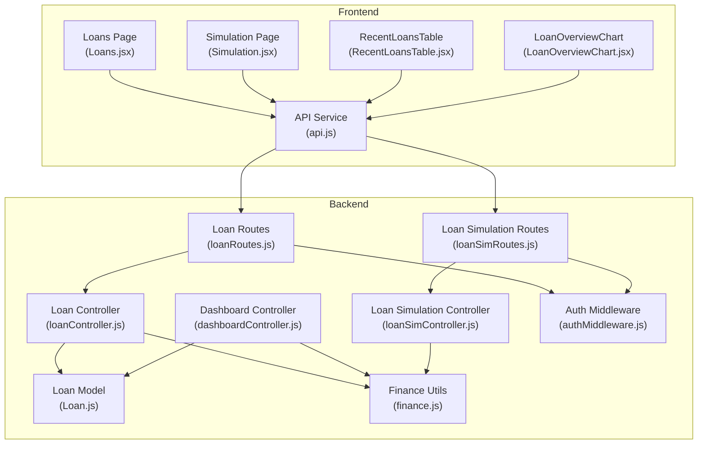
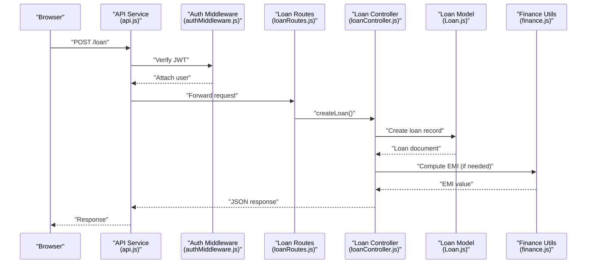
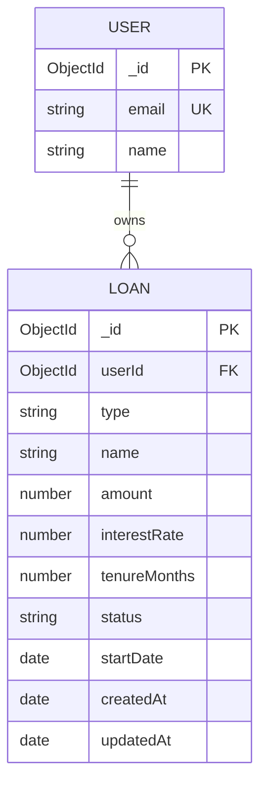
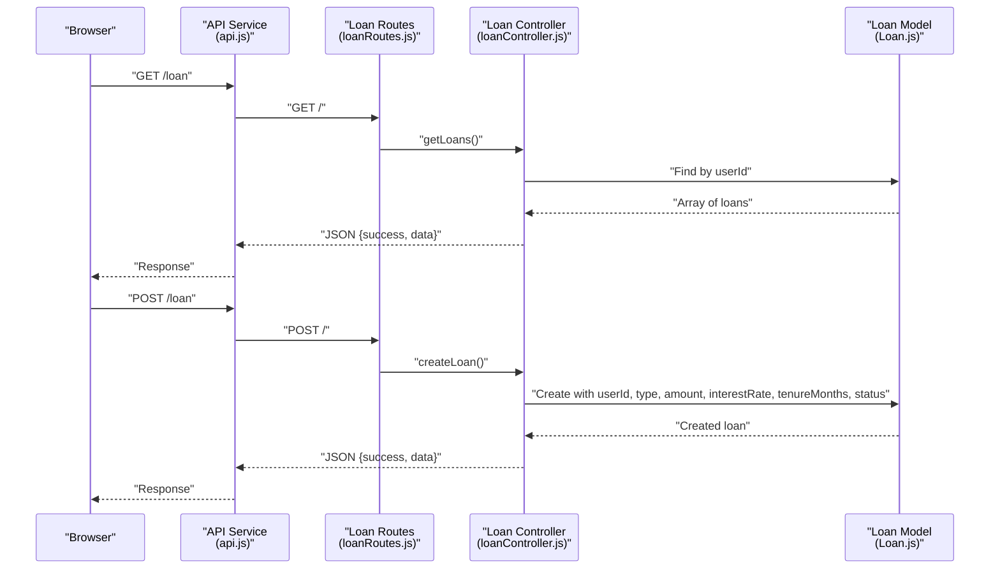
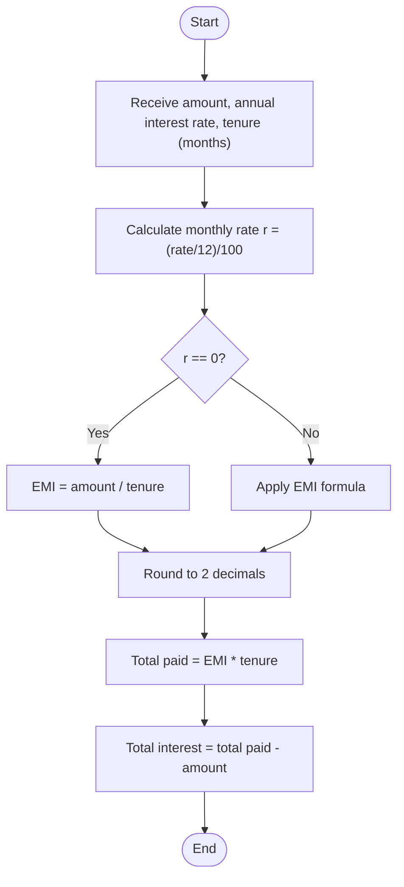
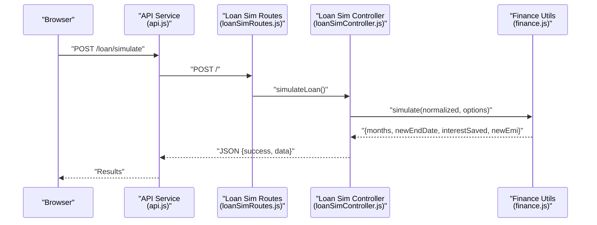
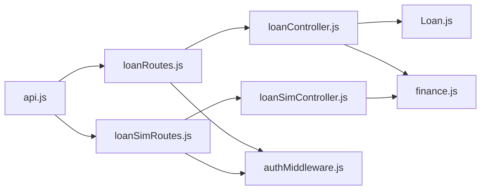

# Loan Management System

<cite>
**Referenced Files in This Document**
- [Loan.js](file://backend/models/Loan.js)
- [loanController.js](file://backend/controllers/loanController.js)
- [loanRoutes.js](file://backend/routes/loanRoutes.js)
- [finance.js](file://backend/utils/finance.js)
- [financeCalculations.js](file://backend/utils/financeCalculations.js)
- [loanSimController.js](file://backend/controllers/loanSimController.js)
- [loanSimRoutes.js](file://backend/routes/loanSimRoutes.js)
- [dashboardController.js](file://backend/controllers/dashboardController.js)
- [authMiddleware.js](file://backend/middleware/authMiddleware.js)
- [api.js](file://frontend/src/services/api.js)
- [Loans.jsx](file://frontend/src/pages/Loans.jsx)
- [Simulation.jsx](file://frontend/src/pages/Simulation.jsx)
- [RecentLoansTable.jsx](file://frontend/src/components/RecentLoansTable.jsx)
- [LoanOverviewChart.jsx](file://frontend/src/components/LoanOverviewChart.jsx)
</cite>

## Table of Contents
1. [Introduction](#introduction)
2. [Project Structure](#project-structure)
3. [Core Components](#core-components)
4. [Architecture Overview](#architecture-overview)
5. [Detailed Component Analysis](#detailed-component-analysis)
6. [Dependency Analysis](#dependency-analysis)
7. [Performance Considerations](#performance-considerations)
8. [Troubleshooting Guide](#troubleshooting-guide)
9. [Conclusion](#conclusion)
10. [Appendices](#appendices)

## Introduction
This document provides comprehensive documentation for the Loan Management System, covering the complete CRUD lifecycle for loans, EMI calculation algorithms, loan status tracking, automatic EMI computation, model schema and validation, business logic, and frontend components for display, table operations, and visualizations. It also explains loan prioritization logic, status color coding, and user interface patterns, along with practical examples of loan data structures, API interactions, and common use cases.

## Project Structure
The system follows a layered architecture:
- Backend: Express.js server with Mongoose models, controllers, routes, middleware, and shared financial utilities
- Frontend: React application with services for API communication, pages for loan management and simulation, and reusable components for data display

**Diagram sources**
- [loanRoutes.js:1-19](file://backend/routes/loanRoutes.js#L1-L19)
- [loanSimRoutes.js:1-9](file://backend/routes/loanSimRoutes.js#L1-L9)
- [loanController.js:1-77](file://backend/controllers/loanController.js#L1-L77)
- [dashboardController.js:1-116](file://backend/controllers/dashboardController.js#L1-L116)
- [loanSimController.js:1-22](file://backend/controllers/loanSimController.js#L1-L22)
- [Loan.js:1-18](file://backend/models/Loan.js#L1-L18)
- [finance.js:1-117](file://backend/utils/finance.js#L1-L117)
- [authMiddleware.js:1-35](file://backend/middleware/authMiddleware.js#L1-L35)
- [api.js:1-104](file://frontend/src/services/api.js#L1-L104)
- [Loans.jsx:1-196](file://frontend/src/pages/Loans.jsx#L1-L196)
- [Simulation.jsx:1-573](file://frontend/src/pages/Simulation.jsx#L1-L573)
- [RecentLoansTable.jsx:1-57](file://frontend/src/components/RecentLoansTable.jsx#L1-L57)
- [LoanOverviewChart.jsx:1-44](file://frontend/src/components/LoanOverviewChart.jsx#L1-L44)

**Section sources**
- [loanRoutes.js:1-19](file://backend/routes/loanRoutes.js#L1-L19)
- [loanController.js:1-77](file://backend/controllers/loanController.js#L1-L77)
- [Loan.js:1-18](file://backend/models/Loan.js#L1-L18)
- [finance.js:1-117](file://backend/utils/finance.js#L1-L117)
- [authMiddleware.js:1-35](file://backend/middleware/authMiddleware.js#L1-L35)
- [api.js:1-104](file://frontend/src/services/api.js#L1-L104)
- [Loans.jsx:1-196](file://frontend/src/pages/Loans.jsx#L1-L196)
- [Simulation.jsx:1-573](file://frontend/src/pages/Simulation.jsx#L1-L573)
- [RecentLoansTable.jsx:1-57](file://frontend/src/components/RecentLoansTable.jsx#L1-L57)
- [LoanOverviewChart.jsx:1-44](file://frontend/src/components/LoanOverviewChart.jsx#L1-L44)

## Core Components
- Loan Model: Defines the schema for loan records, including ownership, amounts, rates, tenure, and status
- Loan Controller: Implements CRUD operations and overview endpoints
- Finance Utilities: Provides EMI calculation, total interest, loan end date, debt health scoring, loan prioritization, and simulation
- Authentication Middleware: Protects routes and attaches user context
- Frontend Services and Pages: Manage API interactions, forms, lists, and visualizations

**Section sources**
- [Loan.js:1-18](file://backend/models/Loan.js#L1-L18)
- [loanController.js:1-77](file://backend/controllers/loanController.js#L1-L77)
- [finance.js:1-117](file://backend/utils/finance.js#L1-L117)
- [authMiddleware.js:1-35](file://backend/middleware/authMiddleware.js#L1-L35)
- [api.js:1-104](file://frontend/src/services/api.js#L1-L104)

## Architecture Overview
The system enforces user isolation via the authentication middleware and centralizes financial computations in shared utilities. The frontend consumes protected endpoints to manage loans and run simulations.

**Diagram sources**
- [api.js:34-39](file://frontend/src/services/api.js#L34-L39)
- [authMiddleware.js:4-32](file://backend/middleware/authMiddleware.js#L4-L32)
- [loanRoutes.js:10-14](file://backend/routes/loanRoutes.js#L10-L14)
- [loanController.js:9-24](file://backend/controllers/loanController.js#L9-L24)
- [Loan.js:1-18](file://backend/models/Loan.js#L1-L18)
- [finance.js:2-7](file://backend/utils/finance.js#L2-L7)

## Detailed Component Analysis

### Loan Model Schema and Validation
- Fields:
  - userId: ObjectId referencing User
  - type/name: String defaults to "Loan"
  - amount: Number, required, min 0
  - interestRate: Number, required, min 0
  - tenureMonths: Number, required, min 1
  - status: Enum allowing ACTIVE/Active/active, PAID/Paid/paid, PENDING/Pending/pending, defaults to ACTIVE
  - startDate: Date, default current time
  - timestamps: createdAt, updatedAt

Validation rules:
- Numeric fields enforce non-negative amounts and positive tenures
- Status enum restricts values to predefined set
- Ownership enforced by requiring userId and filtering queries by userId

**Diagram sources**
- [Loan.js:3-15](file://backend/models/Loan.js#L3-L15)

**Section sources**
- [Loan.js:1-18](file://backend/models/Loan.js#L1-L18)

### Loan CRUD Operations
- Retrieve all loans for the authenticated user
- Create a loan with computed fields and default status ACTIVE
- Update a loan owned by the user
- Delete a loan owned by the user
- Overview endpoint aggregates total loan amount and total EMI
- Recent loans endpoint returns latest N loans sorted by creation time

**Diagram sources**
- [loanRoutes.js:10-14](file://backend/routes/loanRoutes.js#L10-L14)
- [loanController.js:3-24](file://backend/controllers/loanController.js#L3-L24)
- [Loan.js:1-18](file://backend/models/Loan.js#L1-L18)

**Section sources**
- [loanController.js:3-77](file://backend/controllers/loanController.js#L3-L77)
- [loanRoutes.js:6-14](file://backend/routes/loanRoutes.js#L6-L14)

### EMI Calculation Algorithms and Business Logic
- EMI Formula: Standard monthly payment computation with zero-rate fallback
- Total Interest: EMI multiplied by tenure minus principal
- Loan End Date: Adds tenure in months to start date
- Debt Health Score: Computes ratio of total EMI to disposable income, penalizes multiple loans, categorizes risk
- Loan Priority: Highest interest rate first; tiebreaks by computed EMI impact
- Simulation: Projects payoff improvements via extra monthly payments or one-time prepayments

**Diagram sources**
- [finance.js:2-13](file://backend/utils/finance.js#L2-L13)

**Section sources**
- [finance.js:1-117](file://backend/utils/finance.js#L1-L117)
- [financeCalculations.js:1-132](file://backend/utils/financeCalculations.js#L1-L132)

### Loan Status Tracking and Color Coding
- Status values supported: ACTIVE/Active/active, PAID/Paid/paid, PENDING/Pending/pending
- Frontend status display uses color-coded badges:
  - Active → green
  - Paid → orange
  - Pending → red
  - Other → gray

**Section sources**
- [Loan.js:10-11](file://backend/models/Loan.js#L10-L11)
- [RecentLoansTable.jsx:3-14](file://frontend/src/components/RecentLoansTable.jsx#L3-L14)

### Automatic EMI Computation and Dashboard Integration
- Dashboard aggregates active loans, computes EMI per loan, sums total EMI, and derives stress score based on EMI-to-disposable-income ratio
- Recent loans list includes computed EMI and formatted display fields

**Section sources**
- [dashboardController.js:16-55](file://backend/controllers/dashboardController.js#L16-L55)

### Loan Simulation Workflow
- Frontend collects loan parameters and optional scenario adjustments (extra monthly payment, prepayment)
- Calls backend simulation endpoint with normalized loan and what-if options
- Renders projected savings, new monthly EMI, remaining horizon, and optimized end date
- Optional AI-driven scenario advice synthesis

**Diagram sources**
- [api.js:38](file://frontend/src/services/api.js#L38)
- [loanSimRoutes.js:6](file://backend/routes/loanSimRoutes.js#L6)
- [loanSimController.js:3-21](file://backend/controllers/loanSimController.js#L3-L21)
- [finance.js:45-80](file://backend/utils/finance.js#L45-L80)

**Section sources**
- [loanSimController.js:1-22](file://backend/controllers/loanSimController.js#L1-L22)
- [loanSimRoutes.js:1-9](file://backend/routes/loanSimRoutes.js#L1-L9)
- [Simulation.jsx:74-110](file://frontend/src/pages/Simulation.jsx#L74-L110)

### Frontend Components for Loan Display and Visualizations
- Loans Page: Form to add new loans, client-side validation, submission to backend, and display of loan cards with amount, interest rate, duration, and status
- RecentLoansTable: Dark-themed table with color-coded status badges and recent loan rows
- LoanOverviewChart: Bar chart for total loan amounts by type (requires backend chart endpoint)
- Status Color Coding: Consistent mapping of status to badge colors across components

**Section sources**
- [Loans.jsx:101-196](file://frontend/src/pages/Loans.jsx#L101-L196)
- [RecentLoansTable.jsx:16-57](file://frontend/src/components/RecentLoansTable.jsx#L16-L57)
- [LoanOverviewChart.jsx:15-44](file://frontend/src/components/LoanOverviewChart.jsx#L15-L44)

### Loan Prioritization Logic
- Sort by highest interest rate; tiebreak by computed EMI impact
- Returns top loan with reasoning and suggestion for prioritizing extra payments

**Section sources**
- [finance.js:36-43](file://backend/utils/finance.js#L36-L43)

### API Interactions and Examples
- Loan Management Endpoints:
  - GET /loan → Returns user’s loans
  - POST /loan → Creates a new loan
  - PUT /loan/:id → Updates a loan
  - DELETE /loan/:id → Deletes a loan
  - GET /loan/overview → Aggregated totals
  - GET /loan/recent → Latest loans
- Loan Simulation Endpoint:
  - POST /loan/simulate → Runs what-if scenarios

Example request/response shapes (paths only):
- [POST /loan:9-24](file://backend/controllers/loanController.js#L9-L24)
- [POST /loan/simulate:3-21](file://backend/controllers/loanSimController.js#L3-L21)

**Section sources**
- [loanRoutes.js:6-14](file://backend/routes/loanRoutes.js#L6-L14)
- [loanController.js:3-77](file://backend/controllers/loanController.js#L3-L77)
- [loanSimRoutes.js:6](file://backend/routes/loanSimRoutes.js#L6)
- [loanSimController.js:3-21](file://backend/controllers/loanSimController.js#L3-L21)

## Dependency Analysis
- Controllers depend on models and shared finance utilities
- Routes depend on controllers and authentication middleware
- Frontend services encapsulate API base URLs and interceptors
- Pages and components consume services and pass normalized data to controllers

**Diagram sources**
- [api.js:34-39](file://frontend/src/services/api.js#L34-L39)
- [loanRoutes.js:10-14](file://backend/routes/loanRoutes.js#L10-L14)
- [loanSimRoutes.js:6](file://backend/routes/loanSimRoutes.js#L6)
- [loanController.js:1](file://backend/controllers/loanController.js#L1)
- [loanSimController.js:1](file://backend/controllers/loanSimController.js#L1)
- [Loan.js:1](file://backend/models/Loan.js#L1)
- [finance.js:1](file://backend/utils/finance.js#L1)
- [authMiddleware.js:1](file://backend/middleware/authMiddleware.js#L1)

**Section sources**
- [api.js:1-104](file://frontend/src/services/api.js#L1-L104)
- [loanRoutes.js:1-19](file://backend/routes/loanRoutes.js#L1-L19)
- [loanSimRoutes.js:1-9](file://backend/routes/loanSimRoutes.js#L1-L9)
- [loanController.js:1-77](file://backend/controllers/loanController.js#L1-L77)
- [loanSimController.js:1-22](file://backend/controllers/loanSimController.js#L1-L22)
- [Loan.js:1-18](file://backend/models/Loan.js#L1-L18)
- [finance.js:1-117](file://backend/utils/finance.js#L1-L117)
- [authMiddleware.js:1-35](file://backend/middleware/authMiddleware.js#L1-L35)

## Performance Considerations
- EMI calculations are O(n) per loan during aggregation; keep recent loan lists bounded
- Simulation loops guard against excessive iterations; ensure input bounds to prevent long-running computations
- Dashboard recomputes EMI per loan; cache or memoize where appropriate in higher layers if needed
- Frontend rendering uses virtualization for large datasets; current components render small lists

## Troubleshooting Guide
- Authentication failures: Verify JWT presence and validity; ensure Authorization header is attached
- Loan not found errors: Confirm userId ownership and correct resource ID
- Simulation parameter errors: Validate numeric inputs and non-zero tenure
- Status normalization: Use supported enum values to avoid unexpected filtering

Common error locations:
- [Auth middleware error handling:15-31](file://backend/middleware/authMiddleware.js#L15-L31)
- [Loan CRUD not found handling:34-50](file://backend/controllers/loanController.js#L34-L50)
- [Simulation error handling:18-20](file://backend/controllers/loanSimController.js#L18-L20)

**Section sources**
- [authMiddleware.js:15-31](file://backend/middleware/authMiddleware.js#L15-L31)
- [loanController.js:34-50](file://backend/controllers/loanController.js#L34-L50)
- [loanSimController.js:18-20](file://backend/controllers/loanSimController.js#L18-L20)

## Conclusion
The Loan Management System provides a robust foundation for managing personal loans with strong separation of concerns, centralized financial logic, and intuitive frontend components. It supports full CRUD operations, automated EMI computations, prioritization insights, and interactive what-if simulations, enabling users to make informed financial decisions.

## Appendices

### Example Loan Data Structures
- Minimal create payload: { type, amount, interestRate, duration }
- Dashboard recent loan item: { id, loanType/type, amount, interestRate, tenureMonths, emi, createdAt, status }
- Simulation input: { amount, interestRate, tenureMonths }, { extraEMI, prepayment }
- Simulation output: { months, newEndDate, interestSaved, newEmi }

**Section sources**
- [loanController.js:10-21](file://backend/controllers/loanController.js#L10-L21)
- [dashboardController.js:44-55](file://backend/controllers/dashboardController.js#L44-L55)
- [loanSimController.js:5-16](file://backend/controllers/loanSimController.js#L5-L16)
- [finance.js:45-80](file://backend/utils/finance.js#L45-L80)