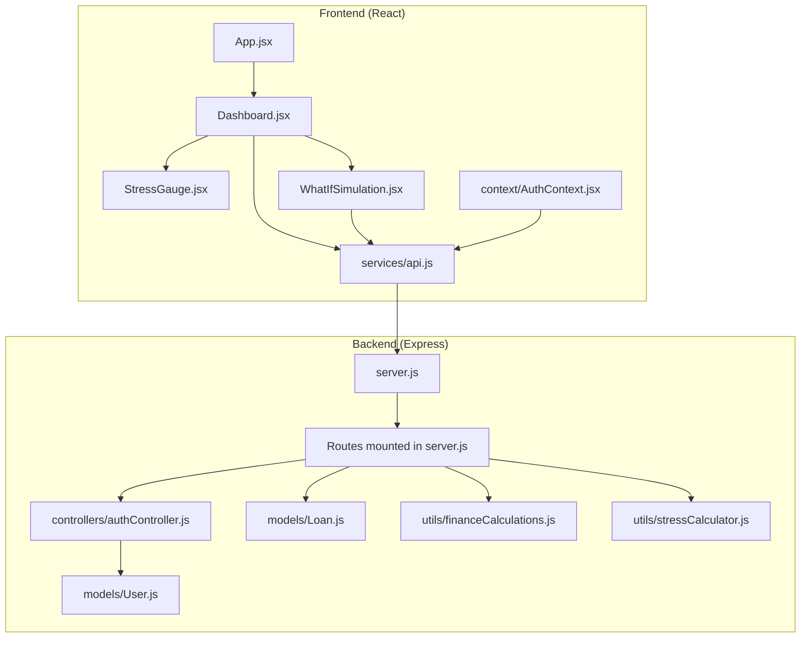
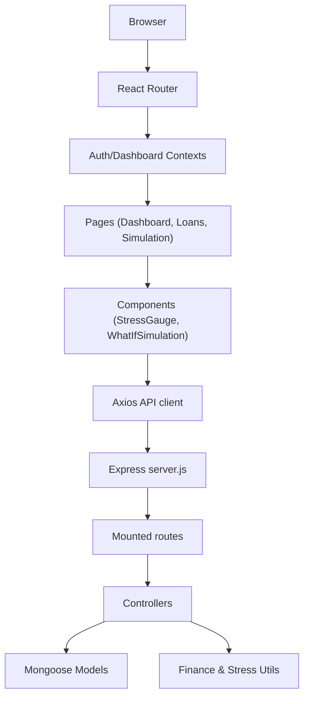
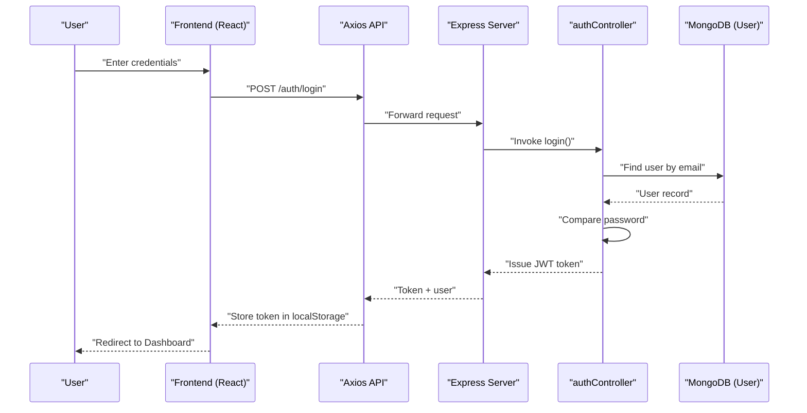
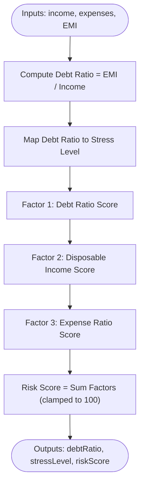
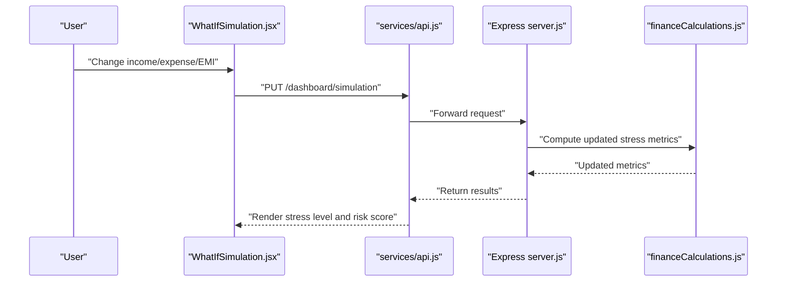
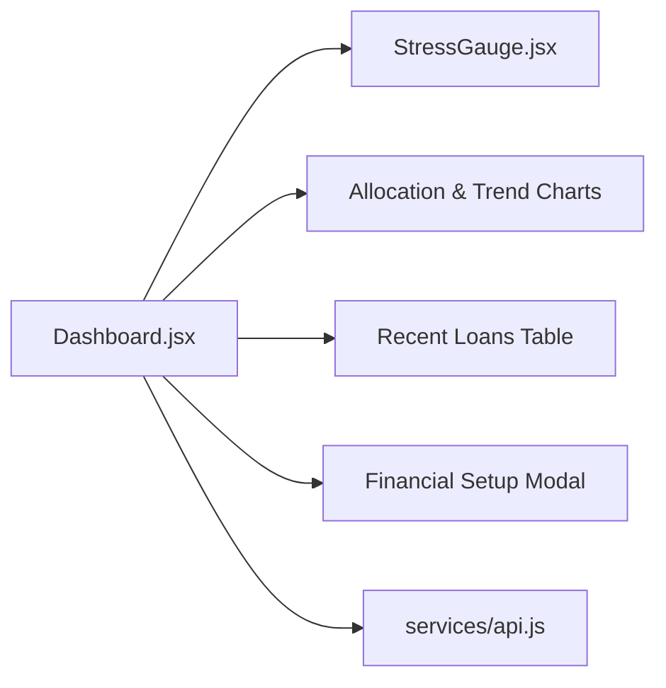
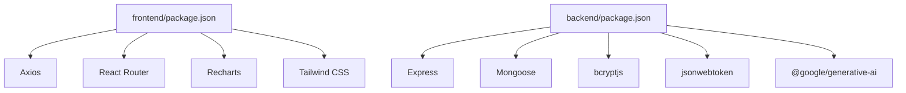

# Project Overview

<cite>
**Referenced Files in This Document**
- [README.md](file://README.md)
- [backend/package.json](file://backend/package.json)
- [frontend/package.json](file://frontend/package.json)
- [backend/server.js](file://backend/server.js)
- [frontend/src/App.jsx](file://frontend/src/App.jsx)
- [backend/controllers/authController.js](file://backend/controllers/authController.js)
- [backend/models/User.js](file://backend/models/User.js)
- [backend/models/Loan.js](file://backend/models/Loan.js)
- [backend/utils/stressCalculator.js](file://backend/utils/stressCalculator.js)
- [backend/utils/financeCalculations.js](file://backend/utils/financeCalculations.js)
- [frontend/src/pages/Dashboard.jsx](file://frontend/src/pages/Dashboard.jsx)
- [frontend/src/components/StressGauge.jsx](file://frontend/src/components/StressGauge.jsx)
- [frontend/src/components/WhatIfSimulation.jsx](file://frontend/src/components/WhatIfSimulation.jsx)
- [frontend/src/services/api.js](file://frontend/src/services/api.js)
- [frontend/src/context/AuthContext.jsx](file://frontend/src/context/AuthContext.jsx)
</cite>

## Table of Contents
1. [Introduction](#introduction)
2. [Project Structure](#project-structure)
3. [Core Components](#core-components)
4. [Architecture Overview](#architecture-overview)
5. [Detailed Component Analysis](#detailed-component-analysis)
6. [Dependency Analysis](#dependency-analysis)
7. [Performance Considerations](#performance-considerations)
8. [Troubleshooting Guide](#troubleshooting-guide)
9. [Conclusion](#conclusion)

## Introduction
Smart Loan & Debt Stress Analyzer is a modern MERN stack application designed to help users track loans, compute stress scores, and simulate financial scenarios. It provides a dark-themed, responsive interface with interactive dashboards, real-time stress gauges, and actionable insights to improve financial health. The platform targets individuals seeking to understand and optimize their debt obligations, monitor stress trends, and plan for future financial scenarios.

Primary use cases include:
- Tracking and managing personal loans with automatic EMI calculations
- Visualizing financial stress via a real-time stress score and trend charts
- Exploring “what-if” financial scenarios to assess the impact of income changes, expense adjustments, and EMI modifications
- Monitoring debt health trends and receiving personalized recommendations

## Project Structure
The project follows a clear separation of concerns:
- Frontend built with React 18, routing with React Router, and styled with Tailwind CSS
- Backend built with Node.js and Express, using MongoDB/Mongoose for persistence
- Shared utilities for financial calculations and stress scoring
- Extensive REST API surface supporting authentication, loan management, dashboards, stress analysis, and AI-assisted suggestions

**Diagram sources**
- [backend/server.js:95-118](file://backend/server.js#L95-L118)
- [frontend/src/App.jsx:21-54](file://frontend/src/App.jsx#L21-L54)
- [frontend/src/pages/Dashboard.jsx:36-474](file://frontend/src/pages/Dashboard.jsx#L36-L474)
- [frontend/src/components/StressGauge.jsx:1-105](file://frontend/src/components/StressGauge.jsx#L1-L105)
- [frontend/src/components/WhatIfSimulation.jsx:1-124](file://frontend/src/components/WhatIfSimulation.jsx#L1-L124)
- [frontend/src/services/api.js:1-104](file://frontend/src/services/api.js#L1-L104)
- [frontend/src/context/AuthContext.jsx:1-67](file://frontend/src/context/AuthContext.jsx#L1-L67)
- [backend/controllers/authController.js:1-41](file://backend/controllers/authController.js#L1-L41)
- [backend/models/User.js:1-31](file://backend/models/User.js#L1-L31)
- [backend/models/Loan.js:1-18](file://backend/models/Loan.js#L1-L18)
- [backend/utils/financeCalculations.js:1-132](file://backend/utils/financeCalculations.js#L1-L132)
- [backend/utils/stressCalculator.js:1-114](file://backend/utils/stressCalculator.js#L1-L114)

**Section sources**
- [README.md:45-620](file://README.md#L45-L620)
- [backend/server.js:95-118](file://backend/server.js#L95-L118)
- [frontend/src/App.jsx:21-54](file://frontend/src/App.jsx#L21-L54)

## Core Components
- Authentication and session management with JWT tokens and protected routes
- Loan lifecycle management with EMI computation and status tracking
- Stress analysis engine computing debt ratios, risk scores, and stress levels
- What-if simulation enabling dynamic scenario modeling
- Interactive dashboards with financial KPIs, allocation charts, and trend visuals
- AI-assisted suggestions and assistant replies for financial guidance

**Section sources**
- [backend/controllers/authController.js:1-41](file://backend/controllers/authController.js#L1-L41)
- [backend/models/User.js:1-31](file://backend/models/User.js#L1-L31)
- [backend/models/Loan.js:1-18](file://backend/models/Loan.js#L1-L18)
- [backend/utils/stressCalculator.js:1-114](file://backend/utils/stressCalculator.js#L1-L114)
- [backend/utils/financeCalculations.js:1-132](file://backend/utils/financeCalculations.js#L1-L132)
- [frontend/src/pages/Dashboard.jsx:36-474](file://frontend/src/pages/Dashboard.jsx#L36-L474)
- [frontend/src/components/WhatIfSimulation.jsx:1-124](file://frontend/src/components/WhatIfSimulation.jsx#L1-L124)
- [frontend/src/services/api.js:1-104](file://frontend/src/services/api.js#L1-L104)

## Architecture Overview
The application adheres to a layered architecture:
- Presentation Layer: React SPA with routing, context providers, and reusable components
- API Layer: Express server exposing REST endpoints grouped by feature domains
- Domain Services: Centralized utilities for financial computations and stress scoring
- Persistence Layer: MongoDB with Mongoose ODM and auto-indexing for AI-related collections

**Diagram sources**
- [backend/server.js:95-118](file://backend/server.js#L95-L118)
- [frontend/src/App.jsx:21-54](file://frontend/src/App.jsx#L21-L54)
- [frontend/src/services/api.js:1-104](file://frontend/src/services/api.js#L1-L104)
- [backend/utils/financeCalculations.js:1-132](file://backend/utils/financeCalculations.js#L1-L132)
- [backend/utils/stressCalculator.js:1-114](file://backend/utils/stressCalculator.js#L1-L114)

## Detailed Component Analysis

### Authentication Flow
The authentication flow ensures secure access to protected resources:
- Registration and login endpoints create and validate JWT tokens
- Frontend stores tokens and attaches them to all requests
- Protected routes enforce authentication via context and API interceptors

**Diagram sources**
- [backend/controllers/authController.js:22-35](file://backend/controllers/authController.js#L22-L35)
- [frontend/src/services/api.js:21-26](file://frontend/src/services/api.js#L21-L26)
- [frontend/src/context/AuthContext.jsx:36-53](file://frontend/src/context/AuthContext.jsx#L36-L53)

**Section sources**
- [backend/controllers/authController.js:1-41](file://backend/controllers/authController.js#L1-L41)
- [frontend/src/context/AuthContext.jsx:1-67](file://frontend/src/context/AuthContext.jsx#L1-L67)
- [frontend/src/services/api.js:1-104](file://frontend/src/services/api.js#L1-L104)

### Stress Analysis Engine
The stress analysis engine computes:
- Debt ratio (total EMI / monthly income)
- Stress level categories (SAFE, RISKY, DANGEROUS)
- Risk score out of 100
- Color-coded suggestions and health recommendations

**Diagram sources**
- [backend/utils/stressCalculator.js:6-52](file://backend/utils/stressCalculator.js#L6-L52)

**Section sources**
- [backend/utils/stressCalculator.js:1-114](file://backend/utils/stressCalculator.js#L1-L114)

### What-If Simulation
The simulation component allows users to adjust income, expenses, and EMI to observe stress impacts instantly. The backend computes updated stress metrics and returns them to the UI for visualization.

**Diagram sources**
- [frontend/src/components/WhatIfSimulation.jsx:21-32](file://frontend/src/components/WhatIfSimulation.jsx#L21-L32)
- [frontend/src/services/api.js:28-32](file://frontend/src/services/api.js#L28-L32)
- [backend/server.js:95-118](file://backend/server.js#L95-L118)
- [backend/utils/financeCalculations.js:109-129](file://backend/utils/financeCalculations.js#L109-L129)

**Section sources**
- [frontend/src/components/WhatIfSimulation.jsx:1-124](file://frontend/src/components/WhatIfSimulation.jsx#L1-L124)
- [frontend/src/services/api.js:1-104](file://frontend/src/services/api.js#L1-L104)
- [backend/utils/financeCalculations.js:1-132](file://backend/utils/financeCalculations.js#L1-L132)

### Dashboard and Visualizations
The dashboard aggregates financial KPIs, renders allocation charts, displays recent loans, and shows stress trends. It also supports quick financial setup and sample data injection.

**Diagram sources**
- [frontend/src/pages/Dashboard.jsx:36-474](file://frontend/src/pages/Dashboard.jsx#L36-L474)
- [frontend/src/components/StressGauge.jsx:1-105](file://frontend/src/components/StressGauge.jsx#L1-L105)

**Section sources**
- [frontend/src/pages/Dashboard.jsx:1-474](file://frontend/src/pages/Dashboard.jsx#L1-L474)
- [frontend/src/components/StressGauge.jsx:1-105](file://frontend/src/components/StressGauge.jsx#L1-L105)

## Dependency Analysis
- Frontend dependencies include React, React Router, Recharts, Tailwind CSS, and Axios
- Backend dependencies include Express, Mongoose, bcryptjs, jsonwebtoken, and Google Generative AI SDK
- The server mounts modular routes and applies centralized CORS and error handling
- Context providers coordinate authentication and dashboard state across components

**Diagram sources**
- [frontend/package.json:1-40](file://frontend/package.json#L1-L40)
- [backend/package.json:1-26](file://backend/package.json#L1-L26)

**Section sources**
- [frontend/package.json:1-40](file://frontend/package.json#L1-L40)
- [backend/package.json:1-26](file://backend/package.json#L1-L26)
- [backend/server.js:1-150](file://backend/server.js#L1-L150)

## Performance Considerations
- Use of Recharts for efficient rendering of large datasets
- Centralized calculation utilities minimize repeated computations
- Context providers reduce prop drilling and improve component composition
- MongoDB auto-indexing for AI-related collections improves query performance

## Troubleshooting Guide
Common issues and resolutions:
- MongoDB connection errors: verify connection string and network access settings
- Port conflicts: terminate processes using ports 5000 (backend) and 3000 (frontend)
- CORS errors: ensure FRONTEND_URL is configured correctly in backend .env
- Token expiration: default 7-day expiry; re-authenticate as needed

**Section sources**
- [README.md:574-598](file://README.md#L574-L598)

## Conclusion
Smart Loan & Debt Stress Analyzer delivers a robust, user-centric solution for personal financial management. By combining accurate stress calculations, interactive dashboards, and scenario modeling, it empowers users to make informed decisions about their debt and financial future. Its MERN stack foundation, modular architecture, and thoughtful UX ensure scalability and maintainability in the evolving personal finance space.