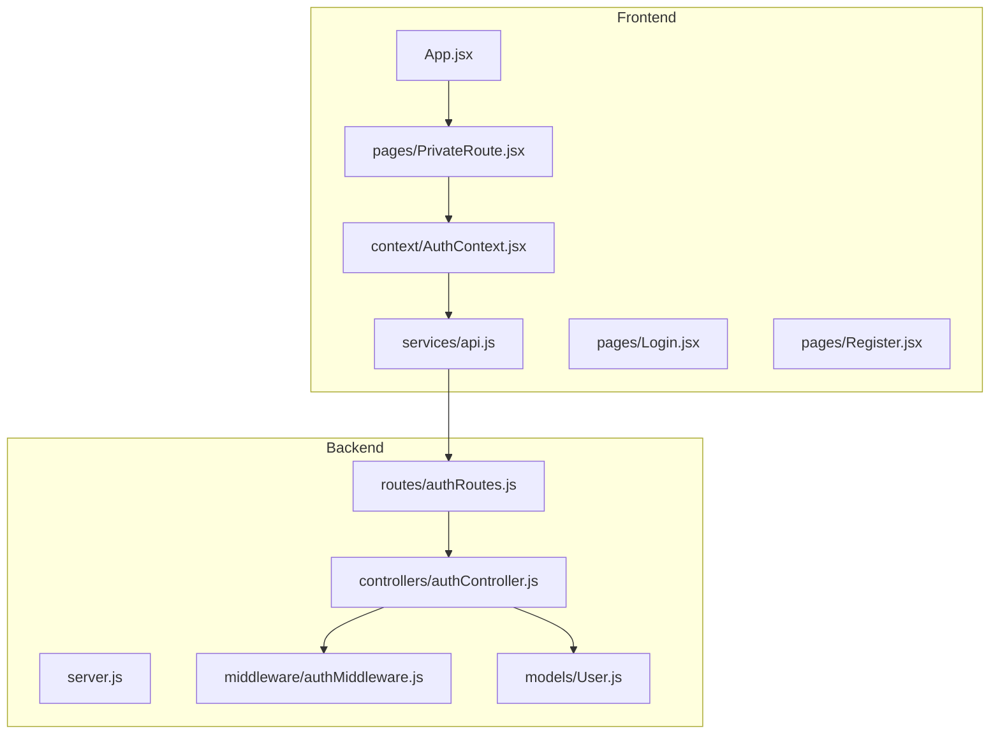
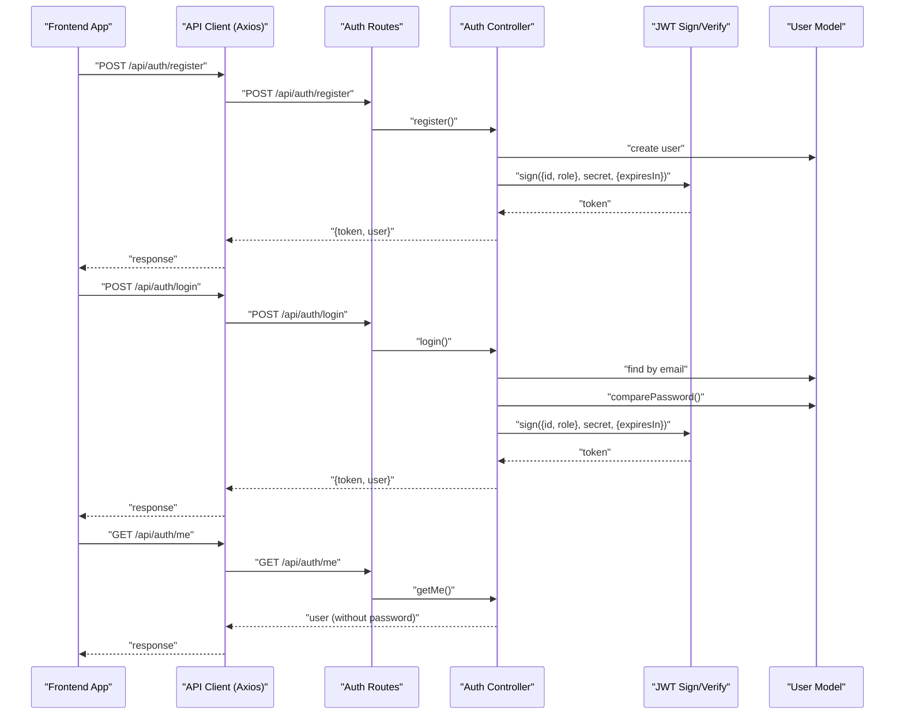
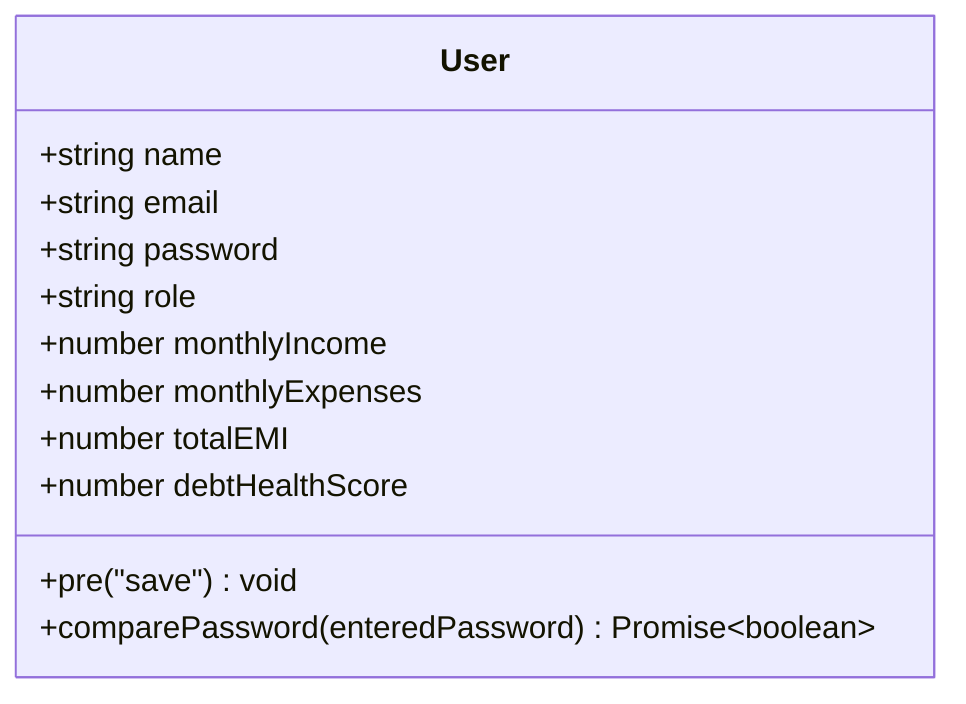
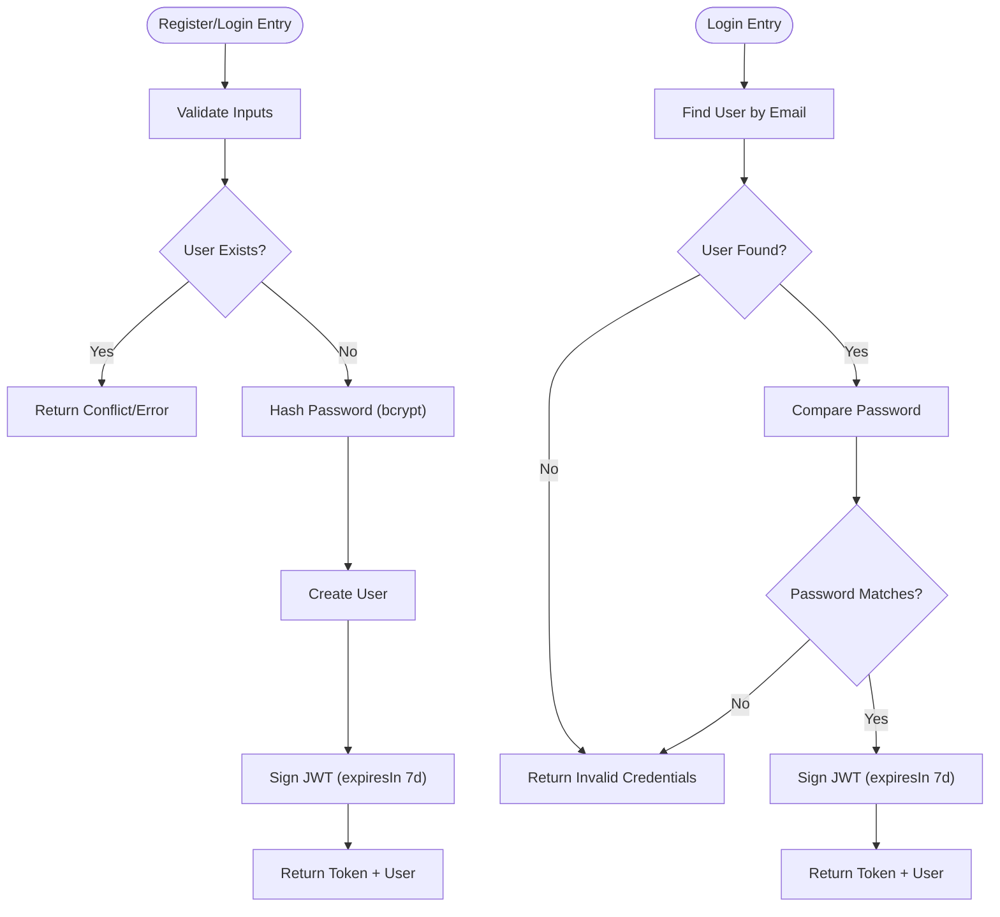
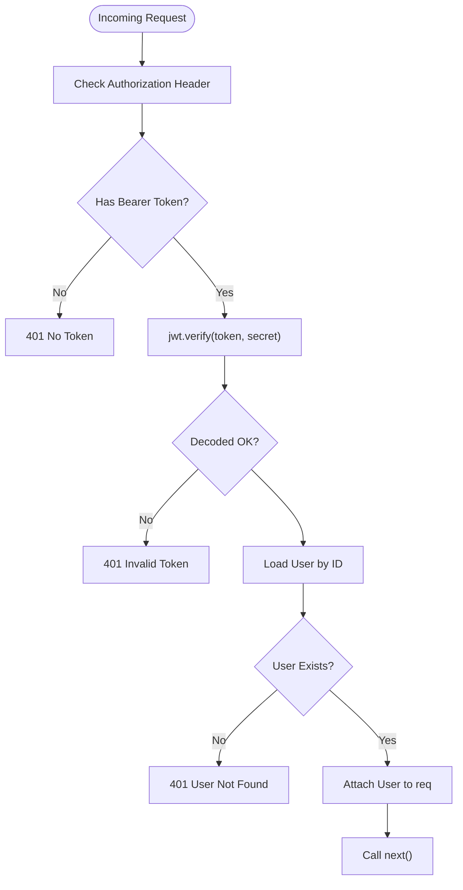
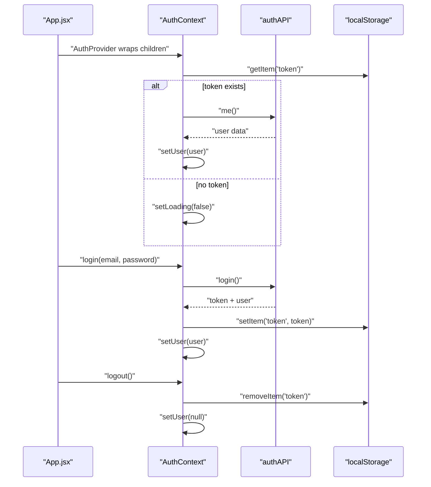
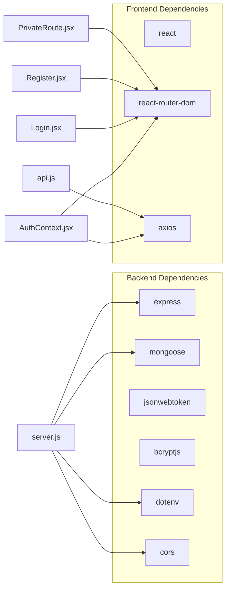

# User Management System

<cite>
**Referenced Files in This Document**
- [User.js](file://backend/models/User.js)
- [authController.js](file://backend/controllers/authController.js)
- [authMiddleware.js](file://backend/middleware/authMiddleware.js)
- [authRoutes.js](file://backend/routes/authRoutes.js)
- [server.js](file://backend/server.js)
- [AuthContext.jsx](file://frontend/src/context/AuthContext.jsx)
- [api.js](file://frontend/src/services/api.js)
- [Login.jsx](file://frontend/src/pages/Login.jsx)
- [Register.jsx](file://frontend/src/pages/Register.jsx)
- [PrivateRoute.jsx](file://frontend/src/pages/PrivateRoute.jsx)
- [App.jsx](file://frontend/src/App.jsx)
- [main.jsx](file://frontend/src/main.jsx)
- [package.json](file://backend/package.json)
</cite>

## Table of Contents
1. [Introduction](#introduction)
2. [Project Structure](#project-structure)
3. [Core Components](#core-components)
4. [Architecture Overview](#architecture-overview)
5. [Detailed Component Analysis](#detailed-component-analysis)
6. [Dependency Analysis](#dependency-analysis)
7. [Performance Considerations](#performance-considerations)
8. [Security Considerations](#security-considerations)
9. [Troubleshooting Guide](#troubleshooting-guide)
10. [Conclusion](#conclusion)

## Introduction
This document provides comprehensive documentation for the User Management System, focusing on authentication and authorization flows. It covers JWT-based authentication, user registration and login processes, session management, the User model schema, password hashing with bcryptjs, token generation and validation, middleware for route protection, frontend authentication context, protected routes, and user state management. It also includes security considerations, token expiration handling, role-based access control, practical examples for common authentication scenarios, and troubleshooting guidance.

## Project Structure
The system is split into two primary parts:
- Backend: Express server, authentication controller, JWT middleware, and MongoDB User model.
- Frontend: React application with authentication context, API client, login/register pages, and protected routing.

**Diagram sources**
- [server.js:95-118](file://backend/server.js#L95-L118)
- [authRoutes.js:1-20](file://backend/routes/authRoutes.js#L1-L20)
- [authController.js:1-41](file://backend/controllers/authController.js#L1-L41)
- [authMiddleware.js:1-35](file://backend/middleware/authMiddleware.js#L1-L35)
- [User.js:1-31](file://backend/models/User.js#L1-L31)
- [App.jsx:21-55](file://frontend/src/App.jsx#L21-L55)
- [PrivateRoute.jsx:1-26](file://frontend/src/pages/PrivateRoute.jsx#L1-L26)
- [AuthContext.jsx:1-67](file://frontend/src/context/AuthContext.jsx#L1-L67)
- [api.js:1-104](file://frontend/src/services/api.js#L1-L104)
- [Login.jsx:1-177](file://frontend/src/pages/Login.jsx#L1-L177)
- [Register.jsx:1-238](file://frontend/src/pages/Register.jsx#L1-L238)

**Section sources**
- [server.js:95-118](file://backend/server.js#L95-L118)
- [authRoutes.js:1-20](file://backend/routes/authRoutes.js#L1-L20)
- [App.jsx:21-55](file://frontend/src/App.jsx#L21-L55)

## Core Components
- User Model: Defines schema, password hashing lifecycle hook, and password comparison method.
- Authentication Controller: Handles registration, login, and fetching current user.
- Authentication Middleware: Validates JWT tokens and attaches user to request.
- Authentication Routes: Exposes endpoints for registration, login, and profile retrieval.
- Frontend Auth Context: Manages user state, persists token in local storage, and provides login/register/logout actions.
- API Client: Axios instance with automatic Authorization header injection and centralized service exports.
- Protected Routes: PrivateRoute wrapper that guards access based on authentication state.

**Section sources**
- [User.js:1-31](file://backend/models/User.js#L1-L31)
- [authController.js:1-41](file://backend/controllers/authController.js#L1-L41)
- [authMiddleware.js:1-35](file://backend/middleware/authMiddleware.js#L1-L35)
- [authRoutes.js:1-20](file://backend/routes/authRoutes.js#L1-L20)
- [AuthContext.jsx:1-67](file://frontend/src/context/AuthContext.jsx#L1-L67)
- [api.js:1-104](file://frontend/src/services/api.js#L1-L104)
- [PrivateRoute.jsx:1-26](file://frontend/src/pages/PrivateRoute.jsx#L1-L26)

## Architecture Overview
The authentication architecture follows a standard JWT pattern:
- Clients send credentials to backend endpoints.
- Backend validates credentials and issues a signed JWT.
- Clients persist the token and include it in subsequent requests.
- Middleware verifies the token and attaches the user to the request.
- Controllers expose protected endpoints.

**Diagram sources**
- [authRoutes.js:10-17](file://backend/routes/authRoutes.js#L10-L17)
- [authController.js:8-40](file://backend/controllers/authController.js#L8-L40)
- [User.js:19-28](file://backend/models/User.js#L19-L28)
- [api.js:21-26](file://frontend/src/services/api.js#L21-L26)

## Detailed Component Analysis

### Backend: User Model
- Schema fields include personal info and financial profile.
- Pre-save hook hashes passwords using bcryptjs.
- Instance method compares entered password with stored hash.

**Diagram sources**
- [User.js:4-28](file://backend/models/User.js#L4-L28)

**Section sources**
- [User.js:1-31](file://backend/models/User.js#L1-L31)

### Backend: Authentication Controller
- Registration endpoint validates inputs, checks uniqueness, creates user, and signs JWT.
- Login endpoint validates credentials, compares password, and signs JWT.
- Get current user endpoint returns user without password.

**Diagram sources**
- [authController.js:8-40](file://backend/controllers/authController.js#L8-L40)
- [User.js:19-28](file://backend/models/User.js#L19-L28)

**Section sources**
- [authController.js:1-41](file://backend/controllers/authController.js#L1-L41)

### Backend: Authentication Middleware
- Extracts Bearer token from Authorization header.
- Verifies JWT signature against environment secret.
- Loads user from database and attaches to request object.
- Returns 401 for missing or invalid tokens.

**Diagram sources**
- [authMiddleware.js:4-32](file://backend/middleware/authMiddleware.js#L4-L32)

**Section sources**
- [authMiddleware.js:1-35](file://backend/middleware/authMiddleware.js#L1-L35)

### Backend: Authentication Routes
- Exposes POST /api/auth/register, POST /api/auth/login, and GET /api/auth/me.
- GET /api/auth/me is protected by auth middleware.

**Section sources**
- [authRoutes.js:1-20](file://backend/routes/authRoutes.js#L1-L20)

### Backend: Server Bootstrap
- Configures CORS, JSON parsing, MongoDB connection with retry, and mounts routes.
- Provides health check and generic 404/500 handlers.

**Section sources**
- [server.js:8-150](file://backend/server.js#L8-L150)

### Frontend: Authentication Context
- Initializes session by verifying persisted token on startup.
- Provides login, register, and logout functions.
- Persists token in localStorage and updates user state.
- Triggers refresh mechanism via a key state.

**Diagram sources**
- [AuthContext.jsx:6-67](file://frontend/src/context/AuthContext.jsx#L6-L67)
- [api.js:21-26](file://frontend/src/services/api.js#L21-L26)

**Section sources**
- [AuthContext.jsx:1-67](file://frontend/src/context/AuthContext.jsx#L1-L67)

### Frontend: API Client
- Creates Axios instance with base URL and credentials support.
- Interceptor automatically attaches Authorization: Bearer token from localStorage.
- Exposes typed service modules for auth, dashboard, loans, finance, etc.

**Section sources**
- [api.js:1-104](file://frontend/src/services/api.js#L1-L104)

### Frontend: Login and Registration Pages
- Collect credentials, validate inputs, and call AuthContext actions.
- On success, redirect to dashboard; on failure, show user-friendly messages.

**Section sources**
- [Login.jsx:1-177](file://frontend/src/pages/Login.jsx#L1-L177)
- [Register.jsx:1-238](file://frontend/src/pages/Register.jsx#L1-L238)

### Frontend: Protected Routes
- PrivateRoute checks authentication state and either renders children or redirects to login.
- Uses location state to preserve redirect after login.

**Section sources**
- [PrivateRoute.jsx:1-26](file://frontend/src/pages/PrivateRoute.jsx#L1-L26)
- [App.jsx:33-45](file://frontend/src/App.jsx#L33-L45)

## Dependency Analysis
- Backend dependencies include Express, Mongoose, jsonwebtoken, bcryptjs, dotenv, and cors.
- Frontend depends on React, react-router-dom, and axios.
- Runtime dependencies are wired through server bootstrap and route mounting.

**Diagram sources**
- [package.json:12-24](file://backend/package.json#L12-L24)
- [server.js:1-150](file://backend/server.js#L1-L150)
- [AuthContext.jsx:1-67](file://frontend/src/context/AuthContext.jsx#L1-L67)
- [api.js:1-104](file://frontend/src/services/api.js#L1-L104)

**Section sources**
- [package.json:1-26](file://backend/package.json#L1-L26)

## Performance Considerations
- Token expiration is set to seven days; consider shorter expirations for higher security and refresh token strategies for better UX.
- Password hashing uses a moderate cost factor; monitor CPU usage during registration/login spikes.
- Middleware performs a single DB lookup per protected request; ensure indexes on user ID for optimal performance.
- Frontend caches user state and avoids unnecessary re-renders; consider memoization for heavy computations.

## Security Considerations
- JWT Secret: Ensure the JWT_SECRET environment variable is strong and rotated periodically.
- Token Storage: Tokens are stored in localStorage; prefer httpOnly cookies for production to mitigate XSS risks.
- Token Expiration: Current expiration is seven days; evaluate risk tolerance and adjust accordingly.
- Role-Based Access Control: The User model includes a role field; implement role checks in middleware for protected routes.
- Input Validation: Controllers validate presence of required fields; consider adding sanitization and rate limiting.
- CORS: Development allows all origins; tighten CORS policy for production.
- Password Hashing: bcryptjs is used; ensure consistent hashing and avoid storing plaintext passwords.

## Troubleshooting Guide
Common issues and resolutions:
- Invalid Credentials
  - Symptom: Login returns invalid credentials.
  - Causes: Incorrect email/password, user not found, or password mismatch.
  - Resolution: Verify credentials, ensure user exists, and check password hashing.
  - Section sources
    - [authController.js:22-35](file://backend/controllers/authController.js#L22-L35)
    - [User.js:26-28](file://backend/models/User.js#L26-L28)

- Missing or Invalid Token
  - Symptom: Protected route returns 401.
  - Causes: Missing Authorization header, malformed Bearer token, or invalid/expired token.
  - Resolution: Ensure Authorization header is present and formatted correctly; verify JWT_SECRET and expiration.
  - Section sources
    - [authMiddleware.js:4-32](file://backend/middleware/authMiddleware.js#L4-L32)

- User Not Found After Token Verification
  - Symptom: Token valid but user not found.
  - Causes: Deleted user or ID mismatch.
  - Resolution: Recreate user or revoke token.
  - Section sources
    - [authMiddleware.js:21-24](file://backend/middleware/authMiddleware.js#L21-L24)

- Frontend Session Not Persisted
  - Symptom: Reload clears login state.
  - Causes: Token not saved or localStorage errors.
  - Resolution: Check localStorage availability and AuthContext initialization flow.
  - Section sources
    - [AuthContext.jsx:11-34](file://frontend/src/context/AuthContext.jsx#L11-L34)

- CORS Errors
  - Symptom: Preflight or fetch failures.
  - Causes: Origin mismatch or credentials misconfiguration.
  - Resolution: Configure CORS properly for development and production.
  - Section sources
    - [server.js:9-18](file://backend/server.js#L9-L18)

- Environment Variables
  - Ensure JWT_SECRET and MONGO_URI are configured.
  - Section sources
    - [server.js:21](file://backend/server.js#L21)
    - [package.json:12-24](file://backend/package.json#L12-L24)

## Conclusion
The User Management System implements a robust JWT-based authentication flow with clear separation between backend and frontend concerns. The backend enforces token validation and user retrieval, while the frontend manages session persistence and protected routing. Security can be further strengthened with role-based access control, improved token storage, and stricter CORS policies. The provided troubleshooting guide and performance considerations help maintain reliability and scalability.