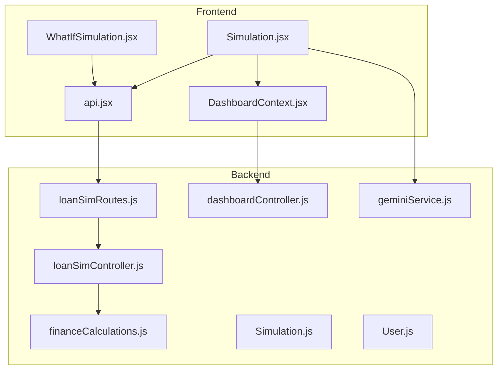
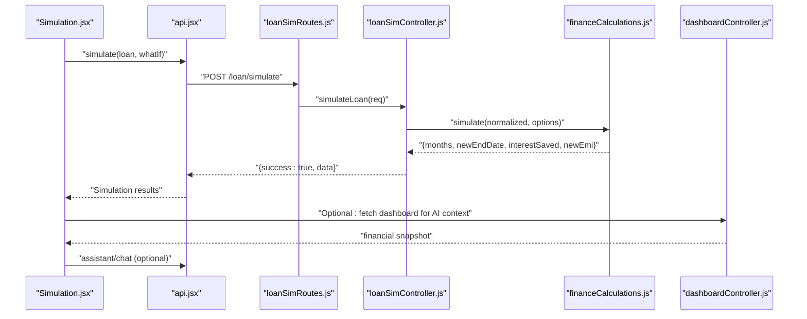
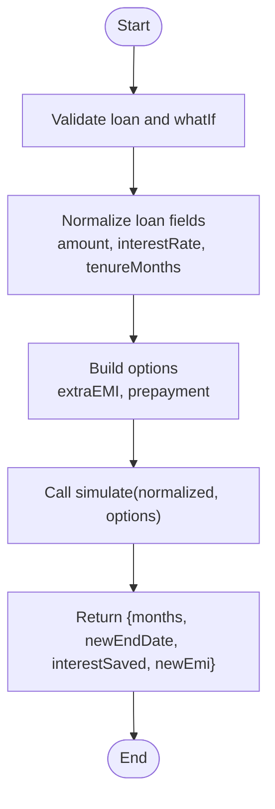
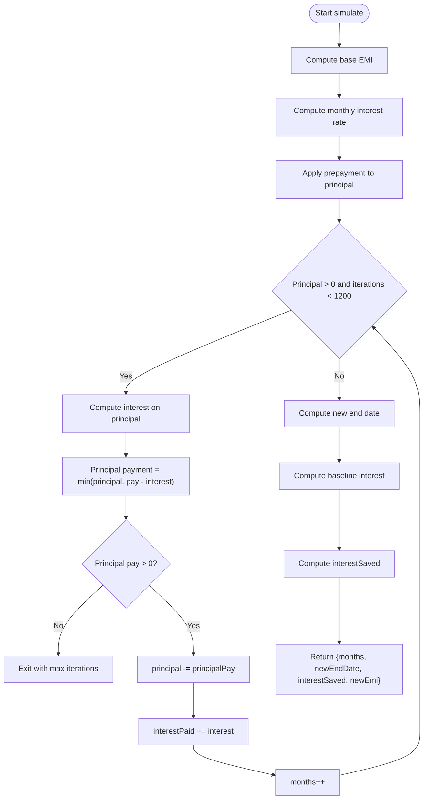
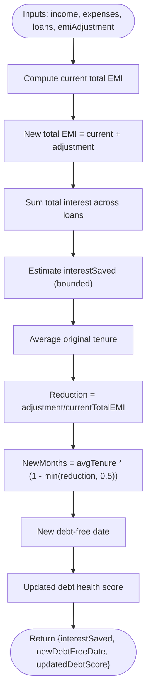
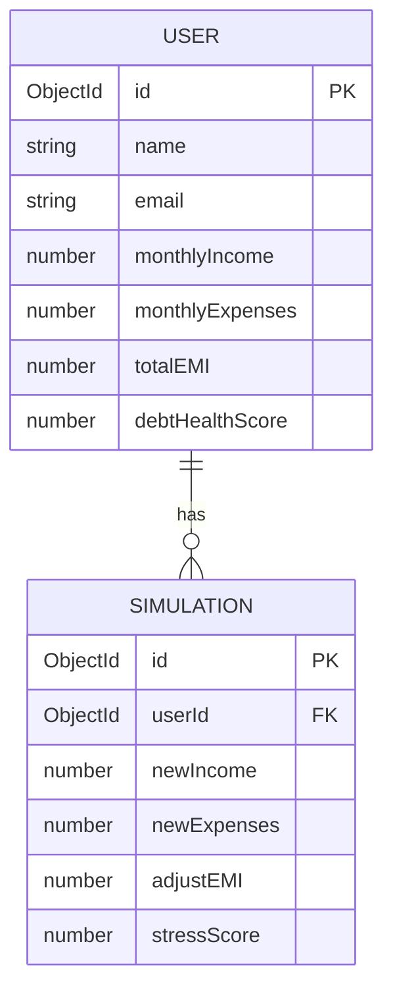
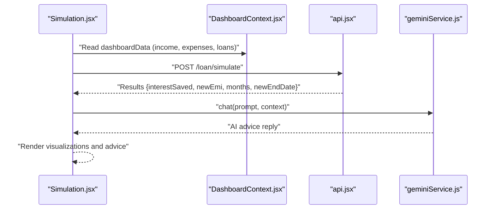
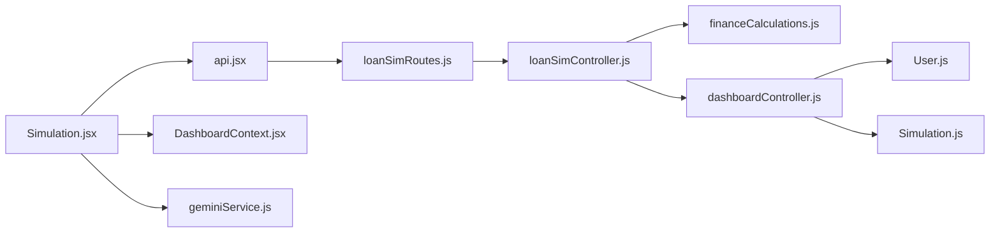

# What-If Simulation Engine

<cite>
**Referenced Files in This Document**
- [README.md](file://README.md)
- [backend/controllers/loanSimController.js](file://backend/controllers/loanSimController.js)
- [backend/routes/loanSimRoutes.js](file://backend/routes/loanSimRoutes.js)
- [backend/utils/financeCalculations.js](file://backend/utils/financeCalculations.js)
- [backend/utils/finance.js](file://backend/utils/finance.js)
- [backend/controllers/financeController.js](file://backend/controllers/financeController.js)
- [backend/controllers/dashboardController.js](file://backend/controllers/dashboardController.js)
- [backend/models/Simulation.js](file://backend/models/Simulation.js)
- [backend/models/User.js](file://backend/models/User.js)
- [backend/services/geminiService.js](file://backend/services/geminiService.js)
- [frontend/src/pages/Simulation.jsx](file://frontend/src/pages/Simulation.jsx)
- [frontend/src/components/WhatIfSimulation.jsx](file://frontend/src/components/WhatIfSimulation.jsx)
- [frontend/src/services/api.jsx](file://frontend/src/services/api.jsx)
- [frontend/src/services/geminiService.js](file://frontend/src/services/geminiService.js)
- [frontend/src/context/DashboardContext.jsx](file://frontend/src/context/DashboardContext.jsx)
</cite>

## Table of Contents
1. [Introduction](#introduction)
2. [Project Structure](#project-structure)
3. [Core Components](#core-components)
4. [Architecture Overview](#architecture-overview)
5. [Detailed Component Analysis](#detailed-component-analysis)
6. [Dependency Analysis](#dependency-analysis)
7. [Performance Considerations](#performance-considerations)
8. [Troubleshooting Guide](#troubleshooting-guide)
9. [Conclusion](#conclusion)
10. [Appendices](#appendices)

## Introduction
The What-If Simulation Engine enables users to model financial outcomes by adjusting loan parameters and personal finances. It supports:
- Scenario definition: Principal, interest rate, tenure, extra monthly EMI, and one-time prepayment
- Simulation calculation: Computes projected interest savings, new end date, and revised monthly EMI
- Impact analysis: Debt ratio, stress level, and risk score derived from disposable income and EMI
- Projection modeling: Visual payoff comparisons and AI-powered scenario advice
- Persistence: Simulation model schema for storing financial adjustments and stress metrics
- Frontend interface: Interactive sliders and inputs with real-time results and AI insights

## Project Structure
The simulation spans frontend and backend modules:
- Frontend pages and components render forms, collect inputs, and visualize results
- Backend controllers and routes expose endpoints for loan simulations and financial analysis
- Shared financial computation utilities encapsulate EMI, interest, and stress calculations
- Models define data schemas for user financial profiles and simulation records

**Diagram sources**
- [frontend/src/pages/Simulation.jsx:1-573](file://frontend/src/pages/Simulation.jsx#L1-L573)
- [frontend/src/components/WhatIfSimulation.jsx:1-124](file://frontend/src/components/WhatIfSimulation.jsx#L1-L124)
- [frontend/src/services/api.jsx:1-30](file://frontend/src/services/api.jsx#L1-L30)
- [frontend/src/context/DashboardContext.jsx:1-46](file://frontend/src/context/DashboardContext.jsx#L1-L46)
- [backend/routes/loanSimRoutes.js:1-9](file://backend/routes/loanSimRoutes.js#L1-L9)
- [backend/controllers/loanSimController.js:1-22](file://backend/controllers/loanSimController.js#L1-L22)
- [backend/utils/financeCalculations.js:1-132](file://backend/utils/financeCalculations.js#L1-L132)
- [backend/controllers/dashboardController.js:1-116](file://backend/controllers/dashboardController.js#L1-L116)
- [backend/models/Simulation.js:1-31](file://backend/models/Simulation.js#L1-L31)
- [backend/models/User.js:1-31](file://backend/models/User.js#L1-L31)
- [backend/services/geminiService.js:1-29](file://backend/services/geminiService.js#L1-L29)

**Section sources**
- [README.md:20-71](file://README.md#L20-L71)
- [backend/routes/loanSimRoutes.js:1-9](file://backend/routes/loanSimRoutes.js#L1-L9)
- [backend/controllers/loanSimController.js:1-22](file://backend/controllers/loanSimController.js#L1-L22)
- [backend/utils/financeCalculations.js:1-132](file://backend/utils/financeCalculations.js#L1-L132)
- [frontend/src/pages/Simulation.jsx:1-573](file://frontend/src/pages/Simulation.jsx#L1-L573)
- [frontend/src/components/WhatIfSimulation.jsx:1-124](file://frontend/src/components/WhatIfSimulation.jsx#L1-L124)

## Core Components
- Loan simulation endpoint: Validates inputs, normalizes loan and what-if parameters, and delegates to financial utilities
- Financial utilities: EMI calculation, total interest, loan end date, debt health scoring, loan prioritization, and simulation engine
- Dashboard integration: Provides current financial snapshot and stress metrics for AI-driven scenario advice
- Simulation model: Schema for storing financial adjustments and stress metrics
- Frontend pages and components: Interactive forms, sliders, and result visualization with AI insights

**Section sources**
- [backend/controllers/loanSimController.js:1-22](file://backend/controllers/loanSimController.js#L1-L22)
- [backend/utils/financeCalculations.js:1-132](file://backend/utils/financeCalculations.js#L1-L132)
- [backend/controllers/dashboardController.js:1-116](file://backend/controllers/dashboardController.js#L1-L116)
- [backend/models/Simulation.js:1-31](file://backend/models/Simulation.js#L1-L31)
- [frontend/src/pages/Simulation.jsx:1-573](file://frontend/src/pages/Simulation.jsx#L1-L573)
- [frontend/src/components/WhatIfSimulation.jsx:1-124](file://frontend/src/components/WhatIfSimulation.jsx#L1-L124)

## Architecture Overview
The simulation pipeline connects frontend inputs to backend computations and returns actionable results with optional AI assistance.

**Diagram sources**
- [frontend/src/pages/Simulation.jsx:74-110](file://frontend/src/pages/Simulation.jsx#L74-L110)
- [frontend/src/services/api.jsx:21-23](file://frontend/src/services/api.jsx#L21-L23)
- [backend/routes/loanSimRoutes.js:1-9](file://backend/routes/loanSimRoutes.js#L1-L9)
- [backend/controllers/loanSimController.js:1-22](file://backend/controllers/loanSimController.js#L1-L22)
- [backend/utils/financeCalculations.js:45-80](file://backend/utils/financeCalculations.js#L45-L80)
- [backend/controllers/dashboardController.js:7-84](file://backend/controllers/dashboardController.js#L7-L84)

## Detailed Component Analysis

### Scenario Definition and Simulation Framework
- Inputs:
  - Loan: amount, interestRate, tenureMonths (or duration)
  - What-if: extraEMI (monthly), prepayment (one-time)
- Normalization and validation:
  - Convert numeric fields and ensure required parameters are present
- Options:
  - extraEMI defaults to 0
  - prepayment defaults to 0

**Diagram sources**
- [backend/controllers/loanSimController.js:3-21](file://backend/controllers/loanSimController.js#L3-L21)
- [backend/utils/financeCalculations.js:45-80](file://backend/utils/financeCalculations.js#L45-L80)

**Section sources**
- [backend/controllers/loanSimController.js:1-22](file://backend/controllers/loanSimController.js#L1-L22)
- [backend/utils/financeCalculations.js:45-80](file://backend/utils/financeCalculations.js#L45-L80)

### Simulation Calculation Algorithms
- EMI calculation:
  - Uses the standard EMI formula with monthly interest rate
  - Handles zero interest edge-case
- Total interest:
  - Computes total paid minus principal
- Loan end date:
  - Adds tenureMonths to a start date
- Debt health score:
  - Derived from disposable income vs total EMI across loans
  - Penalizes multiple loans
- Loan priority:
  - Highest interest rate; tie-breaker by EMI impact
- Simulation engine:
  - Applies immediate prepayment to principal
  - Iteratively amortizes with fixed monthly payment (base EMI + extraEMI)
  - Tracks interest paid and estimated payoff months
  - Caps iterations at a safe upper bound
  - Computes new end date and interest saved vs baseline

**Diagram sources**
- [backend/utils/financeCalculations.js:45-80](file://backend/utils/financeCalculations.js#L45-L80)

**Section sources**
- [backend/utils/financeCalculations.js:1-132](file://backend/utils/financeCalculations.js#L1-L132)

### Impact Analysis Methods
- Debt ratio:
  - Total EMI divided by disposable income
- Stress level:
  - Categorized from debt ratio thresholds
- Risk score:
  - Derived from debt ratio and number of loans
- Portfolio simulation:
  - Estimates interest savings and new debt-free date based on aggregate loans and EMI adjustments

**Diagram sources**
- [backend/utils/financeCalculations.js:109-129](file://backend/utils/financeCalculations.js#L109-L129)

**Section sources**
- [backend/utils/financeCalculations.js:21-34](file://backend/utils/financeCalculations.js#L21-L34)
- [backend/utils/financeCalculations.js:109-129](file://backend/utils/financeCalculations.js#L109-L129)

### Projection Modeling Techniques
- Payoff horizon comparison:
  - Visual bars compare original and optimized timelines
- Timeline shortening:
  - Months remaining and new end date
- Interest savings:
  - Absolute savings projected from simulation

**Section sources**
- [frontend/src/pages/Simulation.jsx:485-521](file://frontend/src/pages/Simulation.jsx#L485-L521)
- [frontend/src/pages/Simulation.jsx:455-482](file://frontend/src/pages/Simulation.jsx#L455-L482)

### Simulation Model Schema and Data Persistence
- Simulation model:
  - userId (reference), newIncome, newExpenses, adjustEMI, stressScore
- User model:
  - Financial profile fields including monthlyIncome, monthlyExpenses, totalEMI, debtHealthScore
- Persistence:
  - Dashboard controller aggregates financial data and computes stress metrics
  - Simulation endpoint currently returns computed results; model can persist future simulation runs

**Diagram sources**
- [backend/models/User.js:1-31](file://backend/models/User.js#L1-L31)
- [backend/models/Simulation.js:1-31](file://backend/models/Simulation.js#L1-L31)
- [backend/controllers/dashboardController.js:13-84](file://backend/controllers/dashboardController.js#L13-L84)

**Section sources**
- [backend/models/Simulation.js:1-31](file://backend/models/Simulation.js#L1-L31)
- [backend/models/User.js:1-31](file://backend/models/User.js#L1-L31)
- [backend/controllers/dashboardController.js:1-116](file://backend/controllers/dashboardController.js#L1-L116)

### Frontend Simulation Interface and Real-Time Visualization
- Interactive form:
  - Sliders and numeric inputs for principal, interest rate, tenure, extra monthly EMI, and prepayment
- Real-time results:
  - Interest saved, new monthly EMI, remaining horizon, and optimized end date
  - Visual payoff comparison bars
- AI scenario advice:
  - On-demand or automatic advice leveraging Gemini via backend proxy
- What-If Simulation component:
  - Lightweight variant for quick stress-level checks with income, expense, and EMI fields

**Diagram sources**
- [frontend/src/pages/Simulation.jsx:42-63](file://frontend/src/pages/Simulation.jsx#L42-L63)
- [frontend/src/pages/Simulation.jsx:74-110](file://frontend/src/pages/Simulation.jsx#L74-L110)
- [frontend/src/pages/Simulation.jsx:112-160](file://frontend/src/pages/Simulation.jsx#L112-L160)
- [frontend/src/services/geminiService.js:1-99](file://frontend/src/services/geminiService.js#L1-L99)
- [frontend/src/context/DashboardContext.jsx:1-46](file://frontend/src/context/DashboardContext.jsx#L1-L46)

**Section sources**
- [frontend/src/pages/Simulation.jsx:1-573](file://frontend/src/pages/Simulation.jsx#L1-L573)
- [frontend/src/components/WhatIfSimulation.jsx:1-124](file://frontend/src/components/WhatIfSimulation.jsx#L1-L124)
- [frontend/src/services/api.jsx:1-30](file://frontend/src/services/api.jsx#L1-L30)
- [frontend/src/services/geminiService.js:1-99](file://frontend/src/services/geminiService.js#L1-L99)
- [frontend/src/context/DashboardContext.jsx:1-46](file://frontend/src/context/DashboardContext.jsx#L1-L46)

### Example Scenarios and Interpretation
- Scenario: Increase monthly EMI by a fixed amount
  - Expected outcome: Reduced months to payoff and higher interest savings
- Scenario: Make a one-time prepayment
  - Expected outcome: Immediate principal reduction and shorter timeline
- Scenario: Combine extra EMI and prepayment
  - Expected outcome: Maximum payoff acceleration and savings
- Interpretation:
  - Debt ratio and stress level inform affordability
  - Risk score indicates vulnerability to income shocks
  - AI advice contextualizes recommendations using personal financial data

**Section sources**
- [backend/utils/financeCalculations.js:45-80](file://backend/utils/financeCalculations.js#L45-L80)
- [backend/utils/financeCalculations.js:109-129](file://backend/utils/financeCalculations.js#L109-L129)
- [frontend/src/pages/Simulation.jsx:112-160](file://frontend/src/pages/Simulation.jsx#L112-L160)

## Dependency Analysis
- Frontend depends on:
  - API service for backend communication
  - Dashboard context for current financial snapshot
  - Gemini service for AI advice
- Backend depends on:
  - Finance utilities for calculations
  - Models for persistence
  - Middleware for authentication

**Diagram sources**
- [frontend/src/services/api.jsx:1-30](file://frontend/src/services/api.jsx#L1-L30)
- [backend/routes/loanSimRoutes.js:1-9](file://backend/routes/loanSimRoutes.js#L1-L9)
- [backend/controllers/loanSimController.js:1-22](file://backend/controllers/loanSimController.js#L1-L22)
- [backend/utils/financeCalculations.js:1-132](file://backend/utils/financeCalculations.js#L1-L132)
- [frontend/src/pages/Simulation.jsx:1-573](file://frontend/src/pages/Simulation.jsx#L1-L573)
- [frontend/src/context/DashboardContext.jsx:1-46](file://frontend/src/context/DashboardContext.jsx#L1-L46)
- [frontend/src/services/geminiService.js:1-99](file://frontend/src/services/geminiService.js#L1-L99)
- [backend/controllers/dashboardController.js:1-116](file://backend/controllers/dashboardController.js#L1-L116)
- [backend/models/User.js:1-31](file://backend/models/User.js#L1-L31)
- [backend/models/Simulation.js:1-31](file://backend/models/Simulation.js#L1-L31)

**Section sources**
- [frontend/src/services/api.jsx:1-30](file://frontend/src/services/api.jsx#L1-L30)
- [backend/routes/loanSimRoutes.js:1-9](file://backend/routes/loanSimRoutes.js#L1-L9)
- [backend/controllers/loanSimController.js:1-22](file://backend/controllers/loanSimController.js#L1-L22)
- [backend/utils/financeCalculations.js:1-132](file://backend/utils/financeCalculations.js#L1-L132)
- [frontend/src/pages/Simulation.jsx:1-573](file://frontend/src/pages/Simulation.jsx#L1-L573)
- [frontend/src/context/DashboardContext.jsx:1-46](file://frontend/src/context/DashboardContext.jsx#L1-L46)
- [frontend/src/services/geminiService.js:1-99](file://frontend/src/services/geminiService.js#L1-L99)
- [backend/controllers/dashboardController.js:1-116](file://backend/controllers/dashboardController.js#L1-L116)
- [backend/models/User.js:1-31](file://backend/models/User.js#L1-L31)
- [backend/models/Simulation.js:1-31](file://backend/models/Simulation.js#L1-L31)

## Performance Considerations
- Simulation iteration limit:
  - Guard against excessive loops by capping iterations at a high but finite number
- Numeric precision:
  - Round to two decimals consistently during calculations
- Input normalization:
  - Ensure numeric conversion and defaults to avoid runtime errors
- Frontend responsiveness:
  - Debounce or throttle slider updates if needed
  - Use skeleton loaders and transitions for smooth result rendering
- Backend scalability:
  - Offload AI calls to backend proxy to avoid exposing API keys and centralize rate limiting

[No sources needed since this section provides general guidance]

## Troubleshooting Guide
- Missing or invalid inputs:
  - Ensure loan and whatIf objects are provided and contain numeric fields
- Zero interest edge-case:
  - When interest rate is zero, payoff is simply principal divided by monthly payment
- Payment insufficient to cover interest:
  - Simulation exits early to prevent infinite loops
- API connectivity:
  - Verify backend route availability and authentication middleware
- Dashboard context:
  - Confirm dashboard data retrieval before invoking AI advice

**Section sources**
- [backend/controllers/loanSimController.js:3-21](file://backend/controllers/loanSimController.js#L3-L21)
- [backend/utils/financeCalculations.js:56-73](file://backend/utils/financeCalculations.js#L56-L73)
- [frontend/src/pages/Simulation.jsx:105-109](file://frontend/src/pages/Simulation.jsx#L105-L109)

## Conclusion
The What-If Simulation Engine integrates robust financial calculations with an intuitive frontend interface and optional AI insights. Users can experiment with different financial parameters to understand trade-offs between payoff speed, interest savings, and stress levels. The modular design allows for incremental enhancements, such as persisting simulation runs and expanding AI advisory capabilities.

[No sources needed since this section summarizes without analyzing specific files]

## Appendices

### API Definitions
- POST /api/loan/simulate
  - Request body: { loan: { amount, interestRate, tenureMonths|duration }, whatIf: { extraEMI, prepayment } }
  - Response: { success: boolean, data: { months, newEndDate, interestSaved, newEmi } }

**Section sources**
- [backend/routes/loanSimRoutes.js:1-9](file://backend/routes/loanSimRoutes.js#L1-L9)
- [backend/controllers/loanSimController.js:1-22](file://backend/controllers/loanSimController.js#L1-L22)
- [frontend/src/services/api.jsx:21-23](file://frontend/src/services/api.jsx#L21-L23)

### Calculation Accuracy Notes
- EMI and interest calculations follow standard formulas
- Debt health score and stress categorization are derived from ratios and penalties
- Simulation uses iterative amortization with safeguards to prevent infinite loops

**Section sources**
- [backend/utils/financeCalculations.js:2-13](file://backend/utils/financeCalculations.js#L2-L13)
- [backend/utils/financeCalculations.js:21-34](file://backend/utils/financeCalculations.js#L21-L34)
- [backend/utils/financeCalculations.js:45-80](file://backend/utils/financeCalculations.js#L45-L80)